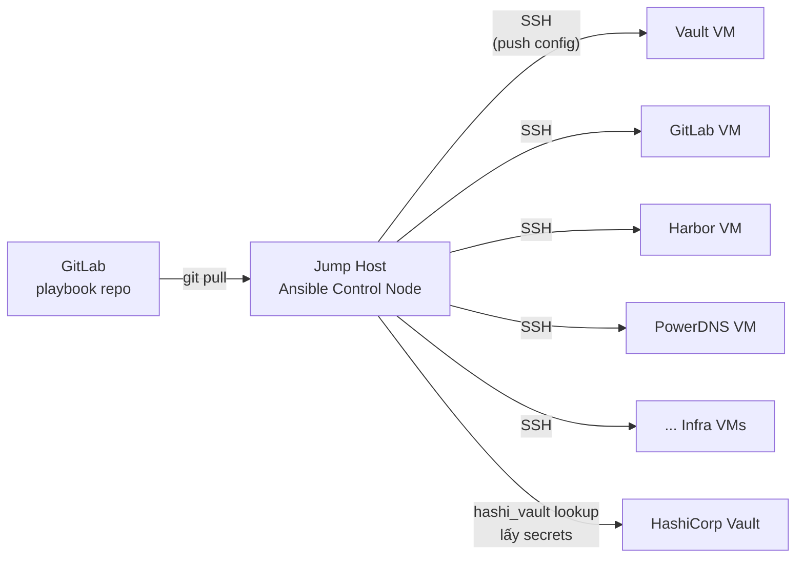

# Ansible

Ansible là công cụ configuration management agentless, dùng SSH để push cấu hình từ control node đến các managed host mà không cần cài agent trên từng server.

Trong hệ thống, Ansible chạy từ Jump Host để quản lý cấu hình đồng nhất trên toàn bộ infra VM — baseline OS (proxy, NTP, DNS, CA cert), SSH hardening, và cấu hình service-specific. Playbook lưu trên GitLab, credentials lấy từ Vault qua `community.hashi_vault` collection. Ansible bổ sung cho Terraform (Terraform provision VM, Ansible configure VM sau khi provision).

# Prerequisites

- Jump Host Ubuntu 24.04 đã hoạt động
- SSH key đã được copy tới tất cả infra VM
- Squid Proxy đã hoạt động — tải Ansible packages và collections
- Vault đã hoạt động — cung cấp secrets cho Ansible playbook
- GitLab đã hoạt động — lưu playbook repository
- Python 3.12+ trên Jump Host

# Diagram



---

# Cài đặt

## Cài đặt Ansible trên Jump Host

Cài Ansible trong Python virtualenv để tránh conflict với OS packages và dễ quản lý version:

```shell
sudo apt update
sudo apt install -y python3 python3-pip python3-venv git

# Tạo virtualenv cho Ansible
python3 -m venv /opt/ansible-venv
source /opt/ansible-venv/bin/activate

# Cài Ansible và các dependency
pip install ansible==10.5.0 hvac jmespath

# Tạo symlink để dùng không cần activate venv mỗi lần
sudo ln -sf /opt/ansible-venv/bin/ansible /usr/local/bin/ansible
sudo ln -sf /opt/ansible-venv/bin/ansible-playbook /usr/local/bin/ansible-playbook
sudo ln -sf /opt/ansible-venv/bin/ansible-inventory /usr/local/bin/ansible-inventory
sudo ln -sf /opt/ansible-venv/bin/ansible-vault /usr/local/bin/ansible-vault

ansible --version
```

## Cài đặt Ansible Collections

Collections cần thiết:

```shell
source /opt/ansible-venv/bin/activate

# community.general — các module thông dụng
# community.hashi_vault — lookup secrets từ Vault
# community.crypto — quản lý certificate và TLS
ansible-galaxy collection install \
  community.general:>=9.0.0 \
  community.hashi_vault:>=6.0.0 \
  community.crypto:>=2.0.0
```

Trong môi trường air-gap, tải collection offline qua Squid rồi cài từ file:

```shell
# Tải trước qua Squid (thực hiện nơi có internet hoặc qua Squid)
ansible-galaxy collection download \
  community.general \
  community.hashi_vault \
  community.crypto \
  -p /tmp/ansible-collections/

# Cài từ file local
ansible-galaxy collection install /tmp/ansible-collections/*.tar.gz
```

## Cấu hình Vault AppRole cho Ansible

```shell
# Trên Vault server
vault policy write ansible-policy - <<EOF
path "secret/data/ansible/*" {
  capabilities = ["read"]
}
path "secret/data/harbor/*" {
  capabilities = ["read"]
}
path "secret/data/monitoring/*" {
  capabilities = ["read"]
}
path "secret/data/argocd/*" {
  capabilities = ["read"]
}
EOF

vault write auth/approle/role/ansible \
  token_policies="ansible-policy" \
  token_ttl=1h \
  token_max_ttl=4h

# Lấy credentials
vault read auth/approle/role/ansible/role-id
vault write -f auth/approle/role/ansible/secret-id
```

Lưu AppRole credentials trên Jump Host:

```shell
sudo mkdir -p /etc/ansible/vault
sudo tee /etc/ansible/vault/approle.env <<EOF
VAULT_ADDR=https://vault.nghia.internal:8200
VAULT_ROLE_ID=<ANSIBLE_ROLE_ID>
VAULT_SECRET_ID=<ANSIBLE_SECRET_ID>
EOF
sudo chmod 600 /etc/ansible/vault/approle.env
```

---

## Cấu trúc Playbook Repository

Tạo Ansible repository trên GitLab và clone về Jump Host:

```shell
git clone https://gitlab.nghia.internal/<GROUP>/ansible.git /opt/ansible
cd /opt/ansible
```

Cấu trúc thư mục:

```
ansible/
├── ansible.cfg
├── inventory/
│   ├── hosts.ini              # Static inventory
│   └── group_vars/
│       ├── all.yml            # Variables chung cho tất cả host
│       ├── infra_vms.yml      # Variables cho infra VM
│       └── kubernetes.yml     # Variables cho K8s nodes
├── playbooks/
│   ├── common.yml             # Baseline OS config
│   ├── hardening.yml          # SSH hardening
│   └── site.yml               # Master playbook
└── roles/
    ├── common/                # Role: baseline config
    ├── hardening/             # Role: OS hardening
    └── node_exporter/         # Role: cài node_exporter
```

## Cấu hình `ansible.cfg`

```ini
[defaults]
inventory          = inventory/hosts.ini
remote_user        = ubuntu
private_key_file   = ~/.ssh/id_ed25519
host_key_checking  = False
stdout_callback    = yaml
callbacks_enabled  = timer, profile_tasks

# Chạy 5 host song song
forks              = 5

# Vault lookup qua hashi_vault collection
# Credentials inject qua environment variable khi chạy playbook

[privilege_escalation]
become             = True
become_method      = sudo
become_user        = root

[ssh_connection]
ssh_args           = -o ControlMaster=auto -o ControlPersist=60s
pipelining         = True
```

## Cấu hình Inventory

Tạo file `inventory/hosts.ini`:

```ini
[infra_vms]
squid       ansible_host=172.16.10.11
powerdns    ansible_host=172.16.10.12
ntpsec      ansible_host=172.16.10.13
aptly       ansible_host=172.16.10.14
vault       ansible_host=172.16.10.15
gitlab      ansible_host=172.16.10.16
harbor      ansible_host=172.16.10.17
jumphost    ansible_host=172.16.10.10

[kubernetes_control_plane]
k8s-cp1     ansible_host=172.16.10.21
k8s-cp2     ansible_host=172.16.10.22
k8s-cp3     ansible_host=172.16.10.23

[kubernetes_workers]
k8s-w1      ansible_host=172.16.10.31
k8s-w2      ansible_host=172.16.10.32
k8s-w3      ansible_host=172.16.10.33

[kubernetes:children]
kubernetes_control_plane
kubernetes_workers

[all_managed:children]
infra_vms
kubernetes
```

Tạo file `inventory/group_vars/all.yml`:

```yaml
# Proxy settings
proxy_url: "http://<USERNAME>:<PASSWORD>@172.16.10.11:3128"
no_proxy: "localhost,127.0.0.1,172.16.10.0/24,192.168.100.0/24,10.96.0.0/12,100.64.0.0/16"

# NTP server
ntp_server: "172.16.10.13"

# DNS server
dns_server: "172.16.10.12"

# Vault address
vault_addr: "https://vault.nghia.internal:8200"

# Harbor registry
harbor_registry: "registry.nghia.internal"

# Vault lookup config — dùng environment variable để tránh hardcode
vault_auth_method: approle
vault_role_id: "{{ lookup('env', 'VAULT_ROLE_ID') }}"
vault_secret_id: "{{ lookup('env', 'VAULT_SECRET_ID') }}"
```

---

## Playbook: Common Baseline

Tạo `playbooks/common.yml` — áp dụng baseline config cho tất cả managed host:

```yaml
- name: Common baseline configuration
  hosts: all_managed
  gather_facts: true

  tasks:
    - name: Cấu hình system-wide proxy
      ansible.builtin.copy:
        dest: /etc/environment
        content: |
          http_proxy="{{ proxy_url }}"
          https_proxy="{{ proxy_url }}"
          HTTP_PROXY="{{ proxy_url }}"
          HTTPS_PROXY="{{ proxy_url }}"
          no_proxy="{{ no_proxy }}"
          NO_PROXY="{{ no_proxy }}"
        owner: root
        group: root
        mode: "0644"

    - name: Cấu hình APT proxy
      ansible.builtin.copy:
        dest: /etc/apt/apt.conf.d/99proxy
        content: |
          Acquire::http::Proxy "{{ proxy_url }}";
          Acquire::https::Proxy "{{ proxy_url }}";
        owner: root
        group: root
        mode: "0644"

    - name: Cài gói cơ bản
      ansible.builtin.apt:
        name:
          - curl
          - wget
          - vim
          - htop
          - jq
          - unzip
          - ca-certificates
          - chrony
        state: present
        update_cache: true

    - name: Copy Vault Root CA certificate
      ansible.builtin.copy:
        src: files/nghia-internal-root-ca.crt
        dest: /usr/local/share/ca-certificates/nghia-internal-root-ca.crt
        owner: root
        mode: "0644"
      notify: Update CA certificates

    - name: Cấu hình NTP client (chrony)
      ansible.builtin.copy:
        dest: /etc/chrony/chrony.conf
        content: |
          server {{ ntp_server }} iburst
          driftfile /var/lib/chrony/drift
          makestep 1.0 3
          rtcsync
          logdir /var/log/chrony
        owner: root
        mode: "0644"
      notify: Restart chrony

    - name: Cấu hình DNS — resolv.conf
      ansible.builtin.copy:
        dest: /etc/resolv.conf
        content: |
          nameserver {{ dns_server }}
          search nghia.internal
        owner: root
        mode: "0644"

    - name: Set timezone về Asia/Ho_Chi_Minh
      community.general.timezone:
        name: Asia/Ho_Chi_Minh

    - name: Disable swap
      ansible.builtin.command: swapoff -a
      when: ansible_swaptotal_mb > 0
      changed_when: ansible_swaptotal_mb > 0

    - name: Xóa swap entry trong fstab
      ansible.builtin.replace:
        path: /etc/fstab
        regexp: '^([^#].*\s+swap\s+.*)$'
        replace: '# \1'

  handlers:
    - name: Update CA certificates
      ansible.builtin.command: update-ca-certificates
      changed_when: true

    - name: Restart chrony
      ansible.builtin.service:
        name: chrony
        state: restarted
        enabled: true
```

## Playbook: SSH Hardening

Tạo `playbooks/hardening.yml`:

```yaml
- name: SSH hardening
  hosts: all_managed
  gather_facts: false

  tasks:
    - name: Cấu hình sshd_config
      ansible.builtin.copy:
        dest: /etc/ssh/sshd_config.d/99-hardening.conf
        content: |
          # Tắt password auth — chỉ dùng SSH key
          PasswordAuthentication no
          ChallengeResponseAuthentication no

          # Tắt root login trực tiếp — dùng sudo
          PermitRootLogin prohibit-password

          # Tắt X11 forwarding không cần thiết
          X11Forwarding no
          # Giữ TCP forwarding — Teleport SSH proxy cần AllowTcpForwarding để tunnel kubectl
          AllowTcpForwarding yes

          # Timeout session không hoạt động
          ClientAliveInterval 300
          ClientAliveCountMax 2

          # Chỉ cho phép SSH protocol 2
          Protocol 2

          # Giới hạn login attempts
          MaxAuthTries 3
          MaxSessions 10

          # Log level cao hơn để audit
          LogLevel VERBOSE
        owner: root
        mode: "0600"
      notify: Restart sshd

    - name: Cấu hình UFW — cho phép SSH
      community.general.ufw:
        rule: allow
        port: "22"
        proto: tcp

    - name: Cấu hình UFW — cho phép Teleport node agent
      community.general.ufw:
        rule: allow
        port: "3022"
        proto: tcp
        src: "172.16.10.10"   # chỉ cho phép từ Jump Host (Teleport Proxy)

    - name: Bật UFW
      community.general.ufw:
        state: enabled
        policy: deny
        direction: incoming

  handlers:
    - name: Restart sshd
      ansible.builtin.service:
        name: ssh
        state: restarted
```

## Playbook: Cài node_exporter

Tạo `playbooks/node_exporter.yml` — cài node_exporter trên tất cả infra VM để Prometheus scrape:

```yaml
- name: Cài đặt node_exporter
  hosts: infra_vms
  gather_facts: false

  vars:
    node_exporter_version: "1.8.2"

  tasks:
    - name: Tải node_exporter binary
      ansible.builtin.get_url:
        url: "https://github.com/prometheus/node_exporter/releases/download/v{{ node_exporter_version }}/node_exporter-{{ node_exporter_version }}.linux-amd64.tar.gz"
        dest: "/tmp/node_exporter.tar.gz"
        mode: "0644"
      environment:
        https_proxy: "{{ proxy_url }}"

    - name: Giải nén node_exporter
      ansible.builtin.unarchive:
        src: /tmp/node_exporter.tar.gz
        dest: /tmp/
        remote_src: true

    - name: Copy binary
      ansible.builtin.copy:
        src: "/tmp/node_exporter-{{ node_exporter_version }}.linux-amd64/node_exporter"
        dest: /usr/local/bin/node_exporter
        owner: root
        mode: "0755"
        remote_src: true

    - name: Tạo systemd service
      ansible.builtin.copy:
        dest: /etc/systemd/system/node_exporter.service
        content: |
          [Unit]
          Description=Node Exporter
          After=network.target

          [Service]
          User=nobody
          ExecStart=/usr/local/bin/node_exporter
          Restart=on-failure

          [Install]
          WantedBy=multi-user.target
        owner: root
        mode: "0644"
      notify: Reload systemd

    - name: Bật và khởi động node_exporter
      ansible.builtin.service:
        name: node_exporter
        state: started
        enabled: true

    - name: Mở port 9100 trên UFW
      community.general.ufw:
        rule: allow
        port: "9100"
        src: "172.16.10.0/24"
        proto: tcp

  handlers:
    - name: Reload systemd
      ansible.builtin.systemd:
        daemon_reload: true
```

## Master Playbook

Tạo `playbooks/site.yml` — chạy toàn bộ theo thứ tự:

```yaml
- import_playbook: common.yml
- import_playbook: hardening.yml
- import_playbook: node_exporter.yml
```

---

## Chạy Playbook

Inject Vault credentials qua environment variable khi chạy:

```shell
# Load Vault AppRole credentials
source /etc/ansible/vault/approle.env

# Test connectivity trước
ansible all_managed -m ping

# Chạy baseline trên tất cả host
ansible-playbook playbooks/common.yml

# Chạy hardening
ansible-playbook playbooks/hardening.yml

# Chạy toàn bộ site
ansible-playbook playbooks/site.yml

# Chạy chỉ trên một host cụ thể
ansible-playbook playbooks/common.yml --limit vault

# Dry run — không thay đổi thực sự
ansible-playbook playbooks/site.yml --check --diff

# Chạy chỉ một số task theo tag
ansible-playbook playbooks/site.yml --tags ntp,dns
```

## Dùng Vault lookup trong playbook

Ví dụ lấy secret từ Vault trong task:

```yaml
- name: Lấy Grafana password từ Vault
  ansible.builtin.set_fact:
    grafana_password: "{{ lookup('community.hashi_vault.hashi_vault',
      'secret=secret/data/monitoring/grafana:admin_password
      auth_method=approle
      role_id=' + vault_role_id + '
      secret_id=' + vault_secret_id + '
      url=' + vault_addr) }}"
  no_log: true
```

---

## Lưu Playbook lên GitLab

```shell
cd /opt/ansible

git init
git remote add origin https://gitlab.nghia.internal/<GROUP>/ansible.git

git add .
git commit -m "Initial Ansible playbooks"
git push -u origin main
```

Để chạy Ansible từ GitLab CI (tùy chọn), tạo `.gitlab-ci.yml` trong repo:

```yaml
run-ansible:
  stage: deploy
  image: registry.nghia.internal/infra/ansible:10.5.0
  script:
    - source /etc/ansible/vault/approle.env
    - ansible-playbook playbooks/site.yml
  only:
    - main
  when: manual
```

---

## Kiểm tra hoạt động

```shell
# Kiểm tra inventory
ansible-inventory --list | jq '.all_managed'

# Kiểm tra connectivity
ansible all_managed -m ping

# Kiểm tra facts từ một host
ansible vault -m setup | grep ansible_distribution

# Kiểm tra node_exporter đang chạy
ansible infra_vms -m command -a "systemctl is-active node_exporter"
```
