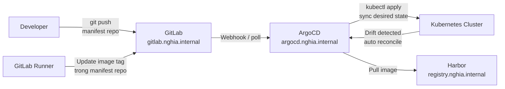

# ArgoCD

ArgoCD là GitOps Continuous Delivery tool, liên tục so sánh trạng thái thực tế của cluster với desired state được định nghĩa trong Git repository và tự động reconcile khi phát hiện drift.

Trong hệ thống, ArgoCD watch manifest repo trên GitLab, tự động sync mọi thay đổi vào Kubernetes cluster. GitLab Runner build và push image lên Harbor, cập nhật image tag trong manifest repo, ArgoCD phát hiện thay đổi và deploy phiên bản mới — toàn bộ pipeline không cần intervention thủ công.

# Prerequisites

- Kubernetes cluster đã hoạt động (cert-manager, ESO, Traefik đã cài)
- Vault PKI đã hoạt động — TLS cert cho `argocd.nghia.internal`
- GitLab đã hoạt động — ArgoCD cần connect để watch manifest repo
- Harbor đã hoạt động — pull ArgoCD images
- PowerDNS đã hoạt động — DNS record `argocd.nghia.internal`

# Diagram



---

# Cài đặt

## Pre-load ArgoCD images vào Harbor

```shell
ARGOCD_VERSION="v2.13.0"

for img in \
  quay.io/argoproj/argocd:${ARGOCD_VERSION} \
  redis:7.0-alpine; do
    img_name=$(echo $img | sed 's|.*/||' | cut -d: -f1)
    docker pull $img
    docker tag $img registry.nghia.internal/infra/${img_name}
    docker push registry.nghia.internal/infra/${img_name}
done
```

## Cài đặt ArgoCD qua Helm

```shell
helm repo add argo https://argoproj.github.io/argo-helm
helm repo update
```

Tạo file `argocd-values.yaml`:

```yaml
global:
  image:
    repository: registry.nghia.internal/infra/argocd
    tag: "v2.13.0"
  imagePullSecrets:
    - name: harbor-registry-secret

server:
  # Chạy insecure — Traefik xử lý TLS termination
  extraArgs:
    - --insecure
  ingress:
    enabled: false

  config:
    # URL public của ArgoCD — dùng trong webhook và notification
    url: https://argocd.nghia.internal

  # Mount Vault Root CA để ArgoCD trust GitLab TLS và Harbor TLS
  volumes:
    - name: vault-ca
      configMap:
        name: vault-root-ca
  volumeMounts:
    - name: vault-ca
      mountPath: /etc/ssl/certs/vault-root-ca.crt
      subPath: ca.crt

repoServer:
  image:
    repository: registry.nghia.internal/infra/argocd

applicationSet:
  image:
    repository: registry.nghia.internal/infra/argocd

notifications:
  image:
    repository: registry.nghia.internal/infra/argocd

dex:
  # Tắt Dex SSO — bật sau khi cần tích hợp GitLab OAuth
  enabled: false

redis:
  image:
    repository: registry.nghia.internal/infra/redis
    tag: "7.0-alpine"

configs:
  params:
    # Cho phép ArgoCD trust self-managed TLS (Vault CA)
    server.insecure: true

  # Cấu hình RBAC
  rbac:
    policy.default: role:readonly
    policy.csv: |
      p, role:admin, applications, *, */*, allow
      p, role:admin, clusters, *, *, allow
      p, role:admin, repositories, *, *, allow
      p, role:admin, projects, *, *, allow
      g, argocd-admins, role:admin
```

Trước khi cài, tạo ConfigMap chứa Vault Root CA để ArgoCD trust TLS của GitLab và Harbor:

```shell
kubectl create namespace argocd

kubectl create configmap vault-root-ca \
  --namespace argocd \
  --from-file=ca.crt=/usr/local/share/ca-certificates/nghia-internal-root-ca.crt
```

Tạo imagePullSecret cho Harbor (dùng robot$kubernetes token đã tạo ở Harbor guide):

```shell
kubectl create secret docker-registry harbor-registry-secret \
  --namespace argocd \
  --docker-server=registry.nghia.internal \
  --docker-username='robot$kubernetes' \
  --docker-password='<KUBERNETES_ROBOT_TOKEN>'
```

```shell
helm install argocd argo/argo-cd \
  --namespace argocd \
  --create-namespace \
  --version 7.7.0 \
  --values argocd-values.yaml

kubectl rollout status deployment/argocd-server -n argocd
```

## Tạo Ingress cho ArgoCD

ArgoCD server chạy insecure mode, Traefik terminate TLS và forward HTTP vào port 80 của argocd-server.

```shell
kubectl apply -f - <<EOF
apiVersion: networking.k8s.io/v1
kind: Ingress
metadata:
  name: argocd-server
  namespace: argocd
  annotations:
    cert-manager.io/cluster-issuer: vault-issuer
    traefik.ingress.kubernetes.io/router.entrypoints: websecure
    traefik.ingress.kubernetes.io/router.tls: "true"
spec:
  ingressClassName: traefik
  tls:
    - hosts:
        - argocd.nghia.internal
      secretName: argocd-tls
  rules:
    - host: argocd.nghia.internal
      http:
        paths:
          - path: /
            pathType: Prefix
            backend:
              service:
                name: argocd-server
                port:
                  number: 80
EOF
```

## Thêm DNS record vào PowerDNS

```shell
sudo pdnsutil add-record nghia.internal argocd A <TRAEFIK_LB_IP>
sudo pdnsutil rectify-zone nghia.internal

dig @<POWERDNS_IP> argocd.nghia.internal A
```

## Lấy initial admin password và đăng nhập

```shell
# Lấy password được auto-generate
kubectl get secret -n argocd argocd-initial-admin-secret \
  -o jsonpath='{.data.password}' | base64 -d && echo

# Cài ArgoCD CLI
curl -fsSL https://github.com/argoproj/argo-cd/releases/latest/download/argocd-linux-amd64 \
  -o /usr/local/bin/argocd
chmod +x /usr/local/bin/argocd

# Login
argocd login argocd.nghia.internal \
  --username admin \
  --password <INITIAL_PASSWORD>

# Đổi password ngay
argocd account update-password
```

Lưu password mới vào Vault:

```shell
vault kv put secret/argocd/admin \
  username="admin" \
  password="<NEW_PASSWORD>"
```

---

## Kết nối GitLab Repository

ArgoCD cần credential để pull manifest từ GitLab private repo.

### Tạo Deploy Token trên GitLab

Vào GitLab → **Group/Project** → **Settings** → **Repository** → **Deploy tokens**.

Tạo token với scope `read_repository`, đặt tên `argocd-read`.

### Lưu credential vào Vault

```shell
vault kv put secret/argocd/gitlab-deploy-token \
  username="argocd-read" \
  token="<DEPLOY_TOKEN>"
```

### Thêm repo vào ArgoCD

```shell
# ArgoCD trust GitLab TLS qua Vault CA — không cần skip verify
argocd repo add https://gitlab.nghia.internal/<GROUP>/<MANIFEST-REPO>.git \
  --username argocd-read \
  --password <DEPLOY_TOKEN>

# Kiểm tra kết nối
argocd repo list
```

---

## Cấu hình GitLab Webhook

Webhook cho phép GitLab push event đến ArgoCD ngay khi có commit mới, thay vì ArgoCD phải poll theo interval.

Vào GitLab repo → **Settings** → **Webhooks** → **Add new webhook**:

- URL: `https://argocd.nghia.internal/api/webhook`
- Secret Token: tạo một random secret
- Trigger: **Push events**, **Tag push events**

Cấu hình secret trong ArgoCD:

```shell
kubectl patch secret -n argocd argocd-secret \
  --type merge \
  -p '{"stringData": {"webhook.gitlab.secret": "<WEBHOOK_SECRET>"}}'
```

---

## Tạo AppProject

AppProject giới hạn phạm vi Application — repo nào được dùng, namespace nào được deploy, cluster nào được target.

```shell
kubectl apply -f - <<EOF
apiVersion: argoproj.io/v1alpha1
kind: AppProject
metadata:
  name: internal
  namespace: argocd
spec:
  description: Internal applications
  sourceRepos:
    - https://gitlab.nghia.internal/<GROUP>/*
  destinations:
    - namespace: "*"
      server: https://kubernetes.default.svc
  clusterResourceWhitelist:
    - group: "*"
      kind: "*"
  namespaceResourceWhitelist:
    - group: "*"
      kind: "*"
EOF
```

---

## App of Apps pattern

App of Apps là pattern chuẩn để quản lý nhiều Application bằng một root Application duy nhất. Root App watch một repo chứa các Application manifest, ArgoCD tự deploy và quản lý toàn bộ.

Cấu trúc manifest repo trên GitLab:

```
k8s-manifests/
├── apps/                        # Root App watch thư mục này
│   ├── monitoring.yaml          # Application cho Prometheus + Grafana + Loki
│   ├── falco.yaml               # Application cho Falco
│   ├── velero.yaml              # Application cho Velero
│   └── my-app.yaml             # Application cho workload
└── manifests/                   # Actual K8s manifests
    ├── monitoring/
    ├── falco/
    └── my-app/
```

Ví dụ file `apps/monitoring.yaml`:

```yaml
apiVersion: argoproj.io/v1alpha1
kind: Application
metadata:
  name: monitoring
  namespace: argocd
  finalizers:
    - resources-finalizer.argocd.io
spec:
  project: internal
  source:
    repoURL: https://gitlab.nghia.internal/<GROUP>/k8s-manifests.git
    targetRevision: main
    path: manifests/monitoring
  destination:
    server: https://kubernetes.default.svc
    namespace: monitoring
  syncPolicy:
    automated:
      prune: true
      selfHeal: true
    syncOptions:
      - CreateNamespace=true
```

Tạo Root Application:

```shell
kubectl apply -f - <<EOF
apiVersion: argoproj.io/v1alpha1
kind: Application
metadata:
  name: root-app
  namespace: argocd
  finalizers:
    - resources-finalizer.argocd.io
spec:
  project: internal
  source:
    repoURL: https://gitlab.nghia.internal/<GROUP>/k8s-manifests.git
    targetRevision: main
    path: apps
  destination:
    server: https://kubernetes.default.svc
    namespace: argocd
  syncPolicy:
    automated:
      prune: true
      selfHeal: true
EOF
```

Sync root app:

```shell
argocd app sync root-app
argocd app list
```

---

## Tích hợp với CI/CD pipeline

Sau khi GitLab Runner build và push image lên Harbor, pipeline cập nhật image tag trong manifest repo để ArgoCD tự động deploy phiên bản mới.

Ví dụ `.gitlab-ci.yml`:

```yaml
variables:
  REGISTRY: registry.nghia.internal
  IMAGE_NAME: internal/my-app
  MANIFEST_REPO: https://gitlab.nghia.internal/<GROUP>/k8s-manifests.git

stages:
  - build
  - update-manifest

build-image:
  stage: build
  script:
    - docker build -t ${REGISTRY}/${IMAGE_NAME}:${CI_COMMIT_SHORT_SHA} .
    - docker push ${REGISTRY}/${IMAGE_NAME}:${CI_COMMIT_SHORT_SHA}

update-manifest:
  stage: update-manifest
  image: registry.nghia.internal/infra/alpine-git
  script:
    - git clone ${MANIFEST_REPO} manifests
    - cd manifests
    - sed -i "s|image:.*${IMAGE_NAME}.*|image:\ ${REGISTRY}/${IMAGE_NAME}:${CI_COMMIT_SHORT_SHA}|" manifests/my-app/deployment.yaml
    - git config user.email "ci@nghia.internal"
    - git config user.name "GitLab CI"
    - git add -A
    - git commit -m "Update my-app image to ${CI_COMMIT_SHORT_SHA}"
    - git push
  only:
    - main
```

ArgoCD phát hiện commit mới trong manifest repo và tự động sync — không cần gọi ArgoCD API từ pipeline.

---

## Kiểm tra hoạt động

```shell
# Xem tất cả application và trạng thái
argocd app list

# Xem chi tiết một app
argocd app get root-app

# Force sync thủ công
argocd app sync <APP_NAME>

# Xem lịch sử deploy
argocd app history <APP_NAME>

# Rollback về revision trước
argocd app rollback <APP_NAME> <REVISION>
```
