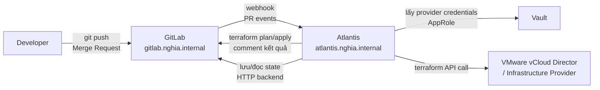

# Atlantis

Atlantis là GitOps automation tool cho Terraform, tự động chạy `terraform plan` khi có Merge Request trên GitLab và cho phép `terraform apply` qua comment trực tiếp trên MR — giữ toàn bộ Terraform operation có audit trail và không cần ai chạy `terraform` thủ công trên máy local.

Trong hệ thống, Atlantis chạy trên Kubernetes, lắng nghe webhook từ GitLab khi Terraform code thay đổi. Khi developer mở MR chứa `.tf` file, Atlantis tự động plan và comment kết quả vào MR. Sau khi được review và approve, comment `atlantis apply` sẽ trigger apply. Credentials cho Terraform provider được lấy từ Vault, Terraform state lưu trên GitLab HTTP backend.

# Prerequisites

- Kubernetes cluster đã hoạt động (Traefik, cert-manager, ESO đã cài)
- GitLab đã hoạt động — Atlantis cần webhook và bot user để tương tác với MR
- Vault đã hoạt động — cung cấp provider credentials cho Terraform
- Harbor đã hoạt động — pull Atlantis image
- PowerDNS đã hoạt động — DNS record `atlantis.nghia.internal`

# Diagram



---

# Cài đặt

## Pre-load images vào Harbor

```shell
docker pull ghcr.io/runatlantis/atlantis:v0.30.0
docker tag ghcr.io/runatlantis/atlantis:v0.30.0 \
  registry.nghia.internal/infra/atlantis:v0.30.0
docker push registry.nghia.internal/infra/atlantis:v0.30.0
```

## Tạo GitLab bot user cho Atlantis

Atlantis cần một GitLab user để comment vào MR và đọc repository. Tạo user `atlantis-bot` trên GitLab UI (Admin → Users → New User).

Sau khi tạo user, tạo Personal Access Token cho `atlantis-bot`:

GitLab → User Settings → Access Tokens → tạo token với scope `api`, đặt tên `atlantis`.

Lưu token vào Vault:

```shell
vault kv put secret/atlantis/gitlab \
  token="<ATLANTIS_BOT_TOKEN>" \
  webhook_secret="<RANDOM_WEBHOOK_SECRET>"
```

Thêm `atlantis-bot` vào Terraform repository với role `Developer` (cần đủ quyền để đọc code và comment vào MR).

## Tạo Vault AppRole cho Atlantis

Atlantis cần lấy provider credentials từ Vault khi chạy `terraform plan/apply`. Dùng AppRole mount mặc định tại `auth/approle` (không tạo mount riêng).

```shell
# Tạo policy cho Atlantis
vault policy write atlantis-policy - <<EOF
path "secret/data/terraform/*" {
  capabilities = ["read"]
}
EOF

# Tạo AppRole trên mount mặc định auth/approle
vault write auth/approle/role/atlantis \
  token_policies="atlantis-policy" \
  token_ttl=1h \
  token_max_ttl=4h \
  secret_id_ttl=0

# Lấy Role ID và Secret ID
vault read auth/approle/role/atlantis/role-id
vault write -f auth/approle/role/atlantis/secret-id

# Lưu vào Vault
vault kv put secret/atlantis/vault-approle \
  role_id="<ROLE_ID>" \
  secret_id="<SECRET_ID>"
```

Lưu provider credentials vào Vault (ví dụ vCloud Director):

```shell
vault kv put secret/terraform/vcd \
  url="https://vcloud.nghia.internal" \
  user="<VCD_USER>" \
  password="<VCD_PASSWORD>" \
  org="<VCD_ORG>"
```

## Cài đặt Atlantis trên Kubernetes

Trong môi trường air-gap, Atlantis không thể download Terraform binary từ internet. Cần copy binary vào một initContainer hoặc bake vào image. Cách đơn giản nhất là tạo ConfigMap chứa Terraform binary path thông qua một image riêng, hoặc dùng initContainer từ image Harbor đã có sẵn Terraform:

Pre-load Terraform binary image vào Harbor (thực hiện trên Jump Host):

```shell
# Tạo Dockerfile đơn giản nhúng Terraform binary vào image Atlantis
# Hoặc mount Terraform binary từ host volume nếu dùng nodeSelector cố định

# Cách đơn giản: copy terraform binary vào existing Atlantis image
docker pull ghcr.io/runatlantis/atlantis:v0.30.0

# Tạo Dockerfile
cat > /tmp/Dockerfile.atlantis <<'EOF'
FROM ghcr.io/runatlantis/atlantis:v0.30.0
COPY terraform /usr/local/bin/terraform
RUN chmod +x /usr/local/bin/terraform
EOF

# Copy terraform binary (đã tải ở bước cài Terraform)
cp /usr/local/bin/terraform /tmp/terraform

cd /tmp
docker build -f Dockerfile.atlantis -t registry.nghia.internal/infra/atlantis:v0.30.0 .
docker push registry.nghia.internal/infra/atlantis:v0.30.0
```

Tạo namespace, Secret, và ConfigMap cho Vault Root CA:

```shell
kubectl create namespace atlantis

# Secret chứa GitLab token và webhook secret
kubectl create secret generic atlantis-secrets \
  --namespace atlantis \
  --from-literal=gitlab_token="<ATLANTIS_BOT_TOKEN>" \
  --from-literal=gitlab_webhook_secret="<RANDOM_WEBHOOK_SECRET>" \
  --from-literal=vault_role_id="<VAULT_ROLE_ID>" \
  --from-literal=vault_secret_id="<VAULT_SECRET_ID>"

# ConfigMap chứa Vault Root CA để Atlantis trust TLS của Vault
kubectl create configmap vault-root-ca \
  --namespace atlantis \
  --from-file=ca.crt=/usr/local/share/ca-certificates/nghia-internal-root-ca.crt
```

Tạo ConfigMap `repos.yaml` — định nghĩa repo nào Atlantis được phép xử lý và workflow nào dùng:

```shell
kubectl apply -f - <<EOF
apiVersion: v1
kind: ConfigMap
metadata:
  name: atlantis-repos
  namespace: atlantis
data:
  repos.yaml: |
    repos:
      - id: gitlab.nghia.internal/<GROUP>/terraform
        apply_requirements:
          - approved
          - mergeable
        workflow: vault-workflow
        allowed_overrides:
          - workflow
        allow_custom_workflows: false

    workflows:
      vault-workflow:
        plan:
          steps:
            - env:
                name: VAULT_ADDR
                value: "https://vault.nghia.internal:8200"
            - run: >
                export VAULT_TOKEN=$(vault write -field=token auth/approle/login
                role_id=$VAULT_ROLE_ID secret_id=$VAULT_SECRET_ID) &&
                export TF_VAR_vcd_user=$(vault kv get -field=user secret/terraform/vcd) &&
                export TF_VAR_vcd_password=$(vault kv get -field=password secret/terraform/vcd)
            - init
            - plan
        apply:
          steps:
            - env:
                name: VAULT_ADDR
                value: "https://vault.nghia.internal:8200"
            - run: >
                export VAULT_TOKEN=$(vault write -field=token auth/approle/login
                role_id=$VAULT_ROLE_ID secret_id=$VAULT_SECRET_ID) &&
                export TF_VAR_vcd_user=$(vault kv get -field=user secret/terraform/vcd) &&
                export TF_VAR_vcd_password=$(vault kv get -field=password secret/terraform/vcd)
            - apply
EOF
```

Deploy Atlantis:

```shell
kubectl apply -f - <<EOF
apiVersion: apps/v1
kind: Deployment
metadata:
  name: atlantis
  namespace: atlantis
spec:
  replicas: 1
  selector:
    matchLabels:
      app: atlantis
  template:
    metadata:
      labels:
        app: atlantis
    spec:
      securityContext:
        fsGroup: 1000
        runAsUser: 100
      containers:
        - name: atlantis
          image: registry.nghia.internal/infra/atlantis:v0.30.0
          args:
            - server
            - --gitlab-hostname=gitlab.nghia.internal
            - --repo-allowlist=gitlab.nghia.internal/<GROUP>/*
            - --gitlab-user=atlantis-bot
            - --repo-config=/etc/atlantis/repos.yaml
            - --log-level=info
            - --port=4141
          env:
            - name: ATLANTIS_GITLAB_TOKEN
              valueFrom:
                secretKeyRef:
                  name: atlantis-secrets
                  key: gitlab_token
            - name: ATLANTIS_GITLAB_WEBHOOK_SECRET
              valueFrom:
                secretKeyRef:
                  name: atlantis-secrets
                  key: gitlab_webhook_secret
            - name: VAULT_ROLE_ID
              valueFrom:
                secretKeyRef:
                  name: atlantis-secrets
                  key: vault_role_id
            - name: VAULT_SECRET_ID
              valueFrom:
                secretKeyRef:
                  name: atlantis-secrets
                  key: vault_secret_id
            - name: VAULT_ADDR
              value: "https://vault.nghia.internal:8200"
            # Trust Vault Root CA — SSL_CERT_FILE trỏ vào bundle cert đã có CA
            - name: SSL_CERT_FILE
              value: /etc/ssl/custom-ca/ca-bundle.crt
          ports:
            - containerPort: 4141
          volumeMounts:
            - name: repos-config
              mountPath: /etc/atlantis
            - name: data
              mountPath: /atlantis
            - name: ca-bundle-out
              mountPath: /etc/ssl/custom-ca
          resources:
            requests:
              cpu: 100m
              memory: 256Mi
            limits:
              cpu: 500m
              memory: 512Mi
      initContainers:
        - name: ca-bundle
          image: registry.nghia.internal/infra/alpine:3.20
          command:
            - sh
            - -c
            - cat /etc/ssl/certs/ca-certificates.crt /vault-ca/ca.crt > /custom-ca/ca-bundle.crt
          volumeMounts:
            - name: vault-ca
              mountPath: /vault-ca
              readOnly: true
            - name: ca-bundle-out
              mountPath: /custom-ca
      volumes:
        - name: repos-config
          configMap:
            name: atlantis-repos
        - name: data
          persistentVolumeClaim:
            claimName: atlantis-data
        - name: vault-ca
          configMap:
            name: vault-root-ca
        - name: ca-bundle-out
          emptyDir: {}
          # volumeMounts của main container dùng ca-bundle-out thay vì vault-ca
---
apiVersion: v1
kind: PersistentVolumeClaim
metadata:
  name: atlantis-data
  namespace: atlantis
spec:
  storageClassName: longhorn
  accessModes:
    - ReadWriteOnce
  resources:
    requests:
      storage: 5Gi
---
apiVersion: v1
kind: Service
metadata:
  name: atlantis
  namespace: atlantis
spec:
  selector:
    app: atlantis
  ports:
    - port: 80
      targetPort: 4141
---
apiVersion: networking.k8s.io/v1
kind: Ingress
metadata:
  name: atlantis
  namespace: atlantis
  annotations:
    cert-manager.io/cluster-issuer: vault-issuer
    traefik.ingress.kubernetes.io/router.entrypoints: websecure
    traefik.ingress.kubernetes.io/router.tls: "true"
spec:
  ingressClassName: traefik
  tls:
    - hosts:
        - atlantis.nghia.internal
      secretName: atlantis-tls
  rules:
    - host: atlantis.nghia.internal
      http:
        paths:
          - path: /
            pathType: Prefix
            backend:
              service:
                name: atlantis
                port:
                  number: 80
EOF

kubectl rollout status deployment/atlantis -n atlantis
```

## Thêm DNS record

```shell
sudo pdnsutil add-record nghia.internal atlantis A <TRAEFIK_LB_IP>
sudo pdnsutil rectify-zone nghia.internal
```

## Cấu hình GitLab Webhook

Vào GitLab Terraform repository → **Settings** → **Webhooks** → **Add new webhook**:

- URL: `https://atlantis.nghia.internal/events`
- Secret Token: giá trị `<RANDOM_WEBHOOK_SECRET>` đã tạo ở trên
- Trigger: bật **Push events**, **Comments**, **Merge request events**
- SSL verification: bật (Vault CA đã được trust)

Kiểm tra webhook: GitLab → Webhooks → Test → Push events. Atlantis log phải nhận được event.

```shell
kubectl logs -n atlantis deployment/atlantis -f
```

---

## Cấu hình Terraform state trên GitLab

GitLab cung cấp HTTP backend để lưu Terraform state — không cần infrastructure thêm. Mỗi project có thể lưu nhiều state riêng biệt.

Tạo Personal Access Token cho Terraform state (dùng lại token của `atlantis-bot` hoặc tạo riêng với scope `api`).

Trong mỗi Terraform module, cấu hình backend:

```hcl
terraform {
  required_version = ">= 1.9"

  backend "http" {
    address        = "https://gitlab.nghia.internal/api/v4/projects/<PROJECT_ID>/terraform/state/<STATE_NAME>"
    lock_address   = "https://gitlab.nghia.internal/api/v4/projects/<PROJECT_ID>/terraform/state/<STATE_NAME>/lock"
    unlock_address = "https://gitlab.nghia.internal/api/v4/projects/<PROJECT_ID>/terraform/state/<STATE_NAME>/lock"
    username       = "atlantis-bot"
    password       = "<ATLANTIS_BOT_TOKEN>"
    lock_method    = "POST"
    unlock_method  = "DELETE"
    retry_wait_min = 5
  }
}
```

Lấy `<PROJECT_ID>` từ GitLab → Project → Settings → General → Project ID.

---

## Cấu hình `.atlantis.yaml` trong Terraform repository

File `.atlantis.yaml` ở root của Terraform repository định nghĩa các project và workflow:

```yaml
version: 3
automerge: false
delete_source_branch_on_merge: false

projects:
  - name: network
    dir: environments/production/network
    workspace: default
    workflow: vault-workflow
    autoplan:
      when_modified:
        - "*.tf"
        - "*.tfvars"
      enabled: true

  - name: compute
    dir: environments/production/compute
    workspace: default
    workflow: vault-workflow
    autoplan:
      when_modified:
        - "*.tf"
        - "*.tfvars"
      enabled: true
    apply_requirements:
      - approved
```

Cấu trúc Terraform repository khuyến nghị:

```
terraform/
├── .atlantis.yaml
├── modules/                    # Reusable modules
│   ├── vm/
│   └── network/
└── environments/
    └── production/
        ├── network/
        │   ├── main.tf
        │   ├── variables.tf
        │   └── terraform.tfvars
        └── compute/
            ├── main.tf
            ├── variables.tf
            └── terraform.tfvars
```

---

## Workflow sử dụng

Khi developer thay đổi Terraform code và mở Merge Request:

Atlantis tự động chạy `terraform plan` và comment kết quả vào MR. Developer review plan output ngay trên GitLab. Sau khi MR được approve, comment `atlantis apply` trên MR để Atlantis chạy apply. Atlantis comment kết quả apply và MR sẵn sàng để merge.

```
# Các comment Atlantis nhận trên MR
atlantis plan          # chạy lại plan (nếu muốn refresh)
atlantis apply         # apply tất cả project trong MR
atlantis apply -p network   # apply chỉ project "network"
atlantis unlock        # unlock state nếu bị stuck
```

Xem trạng thái và lock hiện tại tại `https://atlantis.nghia.internal`.

---

## Kiểm tra hoạt động

```shell
# Xem Atlantis log
kubectl logs -n atlantis deployment/atlantis -f

# Kiểm tra Atlantis API
curl https://atlantis.nghia.internal/healthz

# Xem các lock đang active
curl https://atlantis.nghia.internal/locks
```
