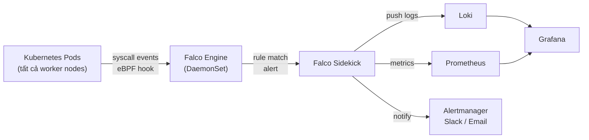

# Falco

Falco là runtime security engine mã nguồn mở của CNCF, sử dụng eBPF để hook vào Linux kernel syscall, phát hiện hành vi bất thường trong container và pod theo thời gian thực dựa trên rule engine.

Trong hệ thống, Falco chạy như DaemonSet trên tất cả worker node, liên tục theo dõi các syscall. Khi phát hiện hành vi vi phạm rule (shell trong container, privilege escalation, đọc file nhạy cảm...), alert được forward qua Falco Sidekick đến Loki để lưu log và Alertmanager để notify.

# Prerequisites

- Kubernetes cluster đã hoạt động
- Monitoring Stack (Prometheus + Grafana + Loki) đã cài — Falco Sidekick forward alert vào Loki
- Harbor đã hoạt động — pull Falco images
- Kernel Ubuntu 24.04 (>= 5.8) hỗ trợ BTF — required cho modern eBPF driver, không cần cài kernel headers hay kernel module

# Diagram



---

# Cài đặt

## Pre-load images vào Harbor

```shell
for img in \
  falcosecurity/falco-no-driver:0.39.2 \
  falcosecurity/falcosidekick:2.29.0 \
  falcosecurity/falcosidekick-ui:2.2.0; do
    img_name=$(echo $img | sed 's|.*/||' | cut -d: -f1)
    docker pull $img
    docker tag $img registry.nghia.internal/infra/${img_name}
    docker push registry.nghia.internal/infra/${img_name}
done
```

## Thêm Falco Helm repo

```shell
helm repo add falcosecurity https://falcosecurity.github.io/charts
helm repo update
```

## Cài đặt Falco

Tạo file `falco-values.yaml`:

```yaml
## Driver — modern eBPF không cần kernel headers hay kernel module
driver:
  kind: modern_ebpf

## Image từ Harbor
image:
  registry: registry.nghia.internal
  repository: infra/falco-no-driver
  tag: "0.39.2"

## Falco core config
falco:
  json_output: true
  json_include_output_property: true
  json_include_tags_property: true
  log_level: info
  # Report từ mức warning trở lên
  priority: warning
  # Buffered output cho hiệu năng tốt hơn
  buffered_outputs: true
  syscall_event_drops:
    actions:
      - log
      - alert
    rate: 0.03333
    max_burst: 10

## Falco Sidekick — forward alert đến các output
falcosidekick:
  enabled: true

  image:
    registry: registry.nghia.internal
    repository: infra/falcosidekick
    tag: "2.29.0"

  config:
    loki:
      hostport: "http://loki-gateway.monitoring.svc.cluster.local"
      minimumpriority: "warning"
      # Label để phân biệt với log thông thường
      customlabels: "app:falco,cluster:nghia-internal"

    prometheus:
      # Falco Sidekick expose /metrics để Prometheus scrape
      extralabels: "cluster:nghia-internal"

    # Alertmanager — forward alert critical lên Alertmanager
    alertmanager:
      hostport: "http://kube-prometheus-stack-alertmanager.monitoring.svc.cluster.local:9093"
      minimumpriority: "critical"
      # Tên alert để Alertmanager route đúng receiver
      customlabels: "source:falco"

  ## Falco Sidekick UI — web UI xem alert
  webui:
    enabled: true
    image:
      registry: registry.nghia.internal
      repository: infra/falcosidekick-ui
      tag: "2.2.0"
    ingress:
      enabled: true
      ingressClassName: traefik
      annotations:
        cert-manager.io/cluster-issuer: vault-issuer
        traefik.ingress.kubernetes.io/router.entrypoints: websecure
        traefik.ingress.kubernetes.io/router.tls: "true"
      hosts:
        - host: falco.nghia.internal
          paths:
            - path: /
              pathType: Prefix
      tls:
        - secretName: falco-tls
          hosts:
            - falco.nghia.internal

## ServiceMonitor để Prometheus scrape Falco Sidekick metrics
serviceMonitor:
  enabled: true
  namespace: monitoring
  labels:
    release: kube-prometheus-stack
```

```shell
helm install falco falcosecurity/falco \
  --namespace falco \
  --create-namespace \
  --version 4.11.0 \
  --values falco-values.yaml

# Kiểm tra DaemonSet — phải có pod trên tất cả worker node
kubectl rollout status daemonset/falco -n falco
kubectl get pods -n falco -o wide
```

## Thêm DNS record

```shell
sudo pdnsutil add-record nghia.internal falco A <TRAEFIK_LB_IP>
sudo pdnsutil rectify-zone nghia.internal
```

---

## Custom Rules

Falco đi kèm hàng trăm default rules. Phần này thêm các rule bổ sung phù hợp với môi trường này.

Tạo file `falco-custom-rules.yaml`:

```yaml
customRules:
  custom-rules.yaml: |-
    # Rule: Shell được spawn trong container
    # Falco đã có rule này mặc định, override để fine-tune
    - rule: Terminal shell in container
      desc: Phát hiện shell được spawn trong container đang chạy
      condition: >
        spawned_process
        and container
        and shell_procs
        and not container.image.repository in (
          registry.nghia.internal/infra/argocd,
          registry.nghia.internal/infra/falco-no-driver
        )
      output: >
        Shell spawned trong container
        (user=%user.name user_loginuid=%user.loginuid
        pod=%k8s.pod.name ns=%k8s.ns.name
        image=%container.image.repository
        shell=%proc.name parent=%proc.pname
        cmdline=%proc.cmdline)
      priority: WARNING
      tags: [container, shell, nghia-internal]

    # Rule: Đọc file secret nhạy cảm trong container
    - rule: Read sensitive file in container
      desc: Phát hiện đọc file chứa credential hoặc private key trong container
      condition: >
        open_read
        and container
        and sensitive_files
        and not proc.name in (falco, falco-driver)
      output: >
        File nhạy cảm bị đọc trong container
        (user=%user.name pod=%k8s.pod.name ns=%k8s.ns.name
        file=%fd.name image=%container.image.repository)
      priority: ERROR
      tags: [container, filesystem, secrets, nghia-internal]

    # Rule: Kết nối ra ngoài cluster bất thường
    - rule: Unexpected outbound network connection
      desc: Phát hiện pod kết nối ra ngoài cluster không qua Squid proxy
      condition: >
        outbound
        and container
        and not (
          fd.sip.net = "172.16.10.0/24"
          or fd.sip.net = "10.96.0.0/12"
          or fd.sip.net = "100.64.0.0/16"
        )
        and not k8s.ns.name in (
          falco,
          kube-system,
          monitoring,
          longhorn-system
        )
      output: >
        Outbound connection bất thường từ pod
        (user=%user.name pod=%k8s.pod.name ns=%k8s.ns.name
        connection=%fd.name image=%container.image.repository)
      priority: WARNING
      tags: [network, nghia-internal]

    # Rule: Privilege escalation — sudo hoặc su trong container
    - rule: Privilege escalation in container
      desc: Phát hiện sudo hoặc su được chạy trong container
      condition: >
        spawned_process
        and container
        and proc.name in (sudo, su)
      output: >
        Privilege escalation trong container
        (user=%user.name pod=%k8s.pod.name ns=%k8s.ns.name
        proc=%proc.name parent=%proc.pname
        image=%container.image.repository)
      priority: CRITICAL
      tags: [container, privilege, nghia-internal]

    # Rule: Package manager chạy trong container production
    - rule: Package manager in container
      desc: Phát hiện apt/yum/apk trong container — có thể là dấu hiệu bị xâm nhập
      condition: >
        spawned_process
        and container
        and proc.name in (apt, apt-get, yum, dnf, apk, pip, pip3, npm)
        and not k8s.ns.name in (falco, kube-system)
      output: >
        Package manager chạy trong container
        (user=%user.name pod=%k8s.pod.name ns=%k8s.ns.name
        proc=%proc.name image=%container.image.repository)
      priority: WARNING
      tags: [container, package-manager, nghia-internal]

    # Rule: Crypto mining — CPU-intensive process đáng ngờ
    - rule: Cryptomining activity
      desc: Phát hiện process liên quan đến crypto mining
      condition: >
        spawned_process
        and container
        and (
          proc.name in (xmrig, minerd, minergate, cgminer, ethminer)
          or proc.cmdline contains "--stratum"
          or proc.cmdline contains "pool.mining"
        )
      output: >
        Crypto mining phát hiện trong container
        (user=%user.name pod=%k8s.pod.name ns=%k8s.ns.name
        proc=%proc.name cmdline=%proc.cmdline
        image=%container.image.repository)
      priority: CRITICAL
      tags: [container, cryptomining, nghia-internal]
```

Apply custom rules:

```shell
helm upgrade falco falcosecurity/falco \
  --namespace falco \
  --version 4.11.0 \
  --values falco-values.yaml \
  --values falco-custom-rules.yaml
```

---

## Cấu hình ServiceMonitor cho Prometheus

Để Prometheus scrape metrics từ Falco Sidekick (đã enable trong values), kiểm tra ServiceMonitor được tạo:

```shell
kubectl get servicemonitor -n falco
kubectl get servicemonitor -n monitoring | grep falco
```

Nếu chưa có, tạo thủ công:

```shell
kubectl apply -f - <<EOF
apiVersion: monitoring.coreos.com/v1
kind: ServiceMonitor
metadata:
  name: falco-sidekick
  namespace: monitoring
  labels:
    release: kube-prometheus-stack
spec:
  namespaceSelector:
    matchNames:
      - falco
  selector:
    matchLabels:
      app.kubernetes.io/name: falcosidekick
  endpoints:
    - port: http
      path: /metrics
      interval: 30s
EOF
```

---

## Grafana Dashboard

Import Falco dashboard vào Grafana. Trong air-gap, download JSON từ Grafana community qua Squid rồi import thủ công:

| Dashboard | ID | Mô tả |
|---|---|---|
| Falco Alerts | `11914` | Alert count theo rule và severity |
| Falco Sidekick | `15578` | Sidekick output stats |

Vào Grafana → **Dashboards** → **Import** → upload JSON file.

---

## Test Falco hoạt động

Kiểm tra Falco phát hiện hành vi bất thường bằng cách trigger một rule có sẵn:

```shell
# Tạo pod test
kubectl run test-falco --image=registry.nghia.internal/infra/ubuntu:24.04 \
  --restart=Never -it --rm \
  -- bash -c "cat /etc/shadow"

# Falco phải log alert về việc đọc /etc/shadow
kubectl logs -n falco -l app.kubernetes.io/name=falco --tail=20 | grep shadow
```

Kiểm tra alert xuất hiện trong Loki (từ Grafana → Explore → Loki):

```
{app="falco"} | json | priority="ERROR" or priority="CRITICAL"
```

Kiểm tra Falco Sidekick UI tại `https://falco.nghia.internal` — alert vừa trigger phải xuất hiện.

---

## Xem log và alert

```shell
# Xem Falco log trực tiếp
kubectl logs -n falco -l app.kubernetes.io/name=falco -f

# Xem Falco Sidekick log
kubectl logs -n falco -l app.kubernetes.io/name=falcosidekick -f

# Đếm alert theo priority (qua Prometheus)
# Query: sum by (priority) (rate(falcosidekick_inputs_total[5m]))
```
