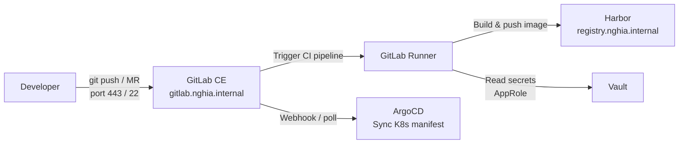

	# GitLab CE + GitLab Runner

GitLab CE là nền tảng DevSecOps mã nguồn mở, tích hợp Git repository, CI/CD pipeline, issue tracking và code review trong một platform duy nhất. GitLab Runner là agent thực thi CI/CD job trên infrastructure nội bộ.

Trong hệ thống, GitLab là single source of truth cho toàn bộ code, IaC (Terraform), configuration (Ansible), và Kubernetes manifest. GitLab Runner thực thi CI pipeline: build container image, push lên Harbor, cập nhật image tag trong manifest repo để ArgoCD sync vào Kubernetes.

# Prerequisites

- Ubuntu 24.04
- RAM tối thiểu 8GB 
- Disk tối thiểu 50GB
- User có quyền `sudo`
- Squid Proxy đã hoạt động — cần tải GitLab package
- Vault PKI đã hoạt động — lấy TLS cert cho `gitlab.nghia.internal`
- PowerDNS đã hoạt động — cần DNS record `gitlab.nghia.internal`
- Port `443` (HTTPS), `22` (Git SSH) không bị firewall block từ client

# Diagram



---

# Cài đặt

## Cấu hình proxy cho server

Thêm vào file `/etc/environment`:

```sh
http_proxy="http://<USERNAME>:<PASSWORD>@<SQUID_IP>:3128"
https_proxy="http://<USERNAME>:<PASSWORD>@<SQUID_IP>:3128"
no_proxy="localhost,127.0.0.1,172.16.10.0/24,192.168.100.0/24"
```

```shell
source /etc/environment
```

## Thêm domain GitLab vào Squid whitelist

GitLab cần tải package từ `packages.gitlab.com`. Thêm vào `acl allowed_domains` trong `/etc/squid/conf.d/debian.conf` trên Squid server:

```
.packages.gitlab.com \
.gitlab-runner.com \
```

```shell
# Reload Squid sau khi thêm
sudo squid -k reconfigure
```

## Cập nhật hệ thống

```shell
sudo apt update -y && sudo apt upgrade -y
sudo apt install -y curl gnupg jq
```

## Lấy TLS certificate từ Vault PKI

Thực hiện trên Vault server, lưu cert vào GitLab server:

```shell
# Trên Vault server — copy wildcard cert sang GitLab server
scp ~/nghia.internal/wildcard.crt <USER>@<GITLAB_IP>:/tmp/gitlab.nghia.internal.crt

scp ~/nghia.internal/wildcard.key <USER>@<GITLAB_IP>:/tmp/gitlab.nghia.internal.key

scp ~/nghia.internal/ca-chain.crt <USER>@<GITLAB_IP>:/tmp/

# Copy cert sang GitLab server
scp /tmp/gitlab.nghia.internal.crt <USER>@<GITLAB_IP>:/tmp/
scp /tmp/gitlab.nghia.internal.key <USER>@<GITLAB_IP>:/tmp/
```

```shell
# Trên GitLab server — đặt cert vào đúng thư mục
sudo mkdir -p /etc/gitlab/ssl
sudo mv /tmp/gitlab.nghia.internal.crt /etc/gitlab/ssl/
sudo mv /tmp/gitlab.nghia.internal.key /etc/gitlab/ssl/
sudo chmod 600 /etc/gitlab/ssl/gitlab.nghia.internal.key

# Trust CA chain — để GitLab nội bộ verify được các service khác (Vault, Harbor...) 
sudo cp /tmp/ca-chain.crt /usr/local/share/ca-certificates/nghia-internal-ca-chain.crt sudo update-ca-certificates
```

## Cài đặt GitLab CE

```shell
curl -fsSL https://packages.gitlab.com/install/repositories/gitlab/gitlab-ce/script.deb.sh \
  | sudo bash

sudo apt install -y gitlab-ce
```

## Cấu hình GitLab

Sửa file `/etc/gitlab/gitlab.rb`:

```ruby
## URL chính — GitLab tự cấu hình Nginx với cert bên dưới
external_url 'https://gitlab.nghia.internal'

## TLS — dùng cert từ Vault PKI
nginx['ssl_certificate']     = '/etc/gitlab/ssl/gitlab.nghia.internal.crt'
nginx['ssl_certificate_key'] = '/etc/gitlab/ssl/gitlab.nghia.internal.key'

## Tắt Let's Encrypt — air-gap environment
letsencrypt['enable'] = false

## Tắt container registry — dùng Harbor thay thế
registry['enable'] = false

## Tắt SMTP — bật sau nếu cần email notification
gitlab_rails['smtp_enable'] = false

## SSH port
gitlab_rails['gitlab_shell_ssh_port'] = 22

## Backup — giữ 7 ngày
gitlab_rails['backup_path']      = '/var/opt/gitlab/backups'
gitlab_rails['backup_keep_time'] = 604800

## Timezone
gitlab_rails['time_zone'] = 'Asia/Ho_Chi_Minh'
```

## Chạy reconfigure

```shell
sudo gitlab-ctl reconfigure
```

Lần đầu chạy mất khoảng 5-10 phút. GitLab sẽ khởi động tất cả service tự động sau khi xong.

```shell
# Kiểm tra tất cả service đang chạy
sudo gitlab-ctl status
```

## Thêm DNS record vào PowerDNS

```shell
sudo pdnsutil add-record nghia.internal gitlab A <GITLAB_IP>
sudo pdnsutil rectify-zone nghia.internal

dig @<POWERDNS_IP> gitlab.nghia.internal A
```

## Lấy root password và đăng nhập

```shell
sudo cat /etc/gitlab/initial_root_password
```

Truy cập `https://gitlab.nghia.internal`, đăng nhập với user `root` và password vừa lấy. Đổi password ngay sau khi đăng nhập lần đầu.

---

# Cài đặt GitLab Runner

GitLab Runner có thể cài trên cùng server với GitLab hoặc server riêng. Với lab, cài chung là đủ. Với production, nên tách ra server riêng để tránh CI job ảnh hưởng đến GitLab.

## Cài đặt Runner package

```shell
curl -fsSL https://packages.gitlab.com/install/repositories/runner/gitlab-runner/script.deb.sh \
  | sudo bash

sudo apt install -y gitlab-runner docker.io

sudo systemctl enable docker gitlab-runner
sudo systemctl start docker gitlab-runner

# Thêm gitlab-runner user vào docker group
sudo usermod -aG docker gitlab-runner
```

## Tạo Runner trên GitLab UI

Vào `https://gitlab.nghia.internal` → **Admin Area** → **CI/CD** → **Runners** → **New instance runner**.

Chọn:
- Platform: Linux
- Tags: `docker`, `internal` (tùy theo nhu cầu)
- Tick **Run untagged jobs** nếu muốn runner nhận job không có tag

Nhấn **Create runner** — GitLab sẽ trả về runner authentication token dạng `glrt-xxxxxxxxxxxx`.

## Đăng ký Runner

```shell
sudo gitlab-runner register \
  --non-interactive \
  --url "https://gitlab.nghia.internal" \
  --token "<RUNNER_AUTH_TOKEN>" \
  --executor "docker" \
  --docker-image "ubuntu:24.04" \
  --docker-privileged \
  --docker-volumes "/cache:/cache" \
  --tls-ca-file "/usr/local/share/ca-certificates/nghia-internal-root-ca.crt" \
  --name "gitlab-runner-01"
```

`--docker-privileged` cần thiết cho Docker-in-Docker (build container image trong CI job).

## Cấu hình Runner

Sau khi register, sửa file `/etc/gitlab-runner/config.toml` để thêm proxy và cấu hình pull policy:

```toml
concurrent = 1
check_interval = 0
connection_max_age = "15m0s"
shutdown_timeout = 0

[session_server]
  session_timeout = 1800

[[runners]]
  name = "gitlab-runner-01"
  url = "https://gitlab.nghia.internal"
  id = 1
  token = "<gitlab-token>"
  token_obtained_at = 2026-05-31T03:48:38Z
  token_expires_at = 0001-01-01T00:00:00Z
  tls-ca-file = "/usr/local/share/ca-certificates/nghia-internal-root-ca.crt"
  executor = "docker"
  [runners.cache]
    MaxUploadedArchiveSize = 0
    [runners.cache.s3]
      AssumeRoleMaxConcurrency = 0
    [runners.cache.gcs]
    [runners.cache.azure]
  [runners.docker]
    tls_verify = false
    image = "ubuntu:24.04"
    privileged = true
    disable_entrypoint_overwrite = false
    oom_kill_disable = false
    disable_cache = false
    volumes = ["/cache:/cache", "/certs/client"]
    volume_keep = false
    shm_size = 0
    network_mtu = 0
    pull_policy = ["if-not-present"]
    allowed_pull_policies = ["if-not-present", "never"]
    environment = [
      "http_proxy=http://<USERNAME>:<PASSWORD>@<SQUID_IP>:3128",
      "https_proxy=http://<USERNAME>:<PASSWORD>@<SQUID_IP>:3128",
      "no_proxy=localhost,127.0.0.1,172.16.10.0/24,192.168.100.0/24,gitlab.nghia.internal,registry.nghia.internal"
    ]
```

```shell
sudo gitlab-runner restart
sudo gitlab-runner verify
```

## Cấu hình Runner trust Vault Root CA

Runner cần trust Root CA để kết nối HTTPS đến GitLab và Harbor:

```shell
# Copy Root CA cert (đã lấy từ bước cài Vault)
sudo cp /tmp/root-ca.crt /usr/local/share/ca-certificates/nghia-internal-root-ca.crt
sudo update-ca-certificates
```

## Kiểm tra Runner hoạt động

Vào **Admin Area** → **CI/CD** → **Runners** — Runner vừa đăng ký sẽ hiển thị trạng thái **Online** 

Tạo project test và chạy pipeline đơn giản:

```yaml
# .gitlab-ci.yml
test-runner:
  script:
    - echo "Runner is working"
    - docker version
```

---

## Tích hợp GitLab với Vault (JWT Auth)

GitLab CI có thể authenticate với Vault thông qua JWT token để lấy secret trong pipeline, không cần hardcode credential.

Trên Vault server:

```shell
# Bật JWT auth method
vault auth enable jwt

# Cấu hình JWT với GitLab JWKS endpoint
vault write auth/jwt/config \
  jwks_url="https://gitlab.nghia.internal/-/jwks" \
  bound_issuer="https://gitlab.nghia.internal"

# Tạo role cho GitLab CI
vault write auth/jwt/role/gitlab-ci \
  role_type="jwt" \
  bound_claims='{"project_path": ["*"]}' \
  user_claim="sub" \
  policies="gitlab-ci-policy" \
  ttl=1h
```

Tạo policy `/tmp/gitlab-ci-policy.hcl`:

```hcl
path "secret/data/ci/*" {
  capabilities = ["read"]
}
path "pki_int/issue/nghia-internal" {
  capabilities = ["create", "update"]
}
```

```shell
vault policy write gitlab-ci-policy /tmp/gitlab-ci-policy.hcl
```

Dùng trong `.gitlab-ci.yml`:

```yaml
variables:
  VAULT_ADDR: "https://vault.nghia.internal:8200"

get-secret:
  image: hashicorp/vault:latest
  script:
    - export VAULT_TOKEN=$(vault write -field=token auth/jwt/login
        role=gitlab-ci jwt=$CI_JOB_JWT)
    - export MY_SECRET=$(vault kv get -field=value secret/ci/my-secret)
```

---

## Backup và restore

Chạy backup thủ công:

```shell
sudo gitlab-backup create
ls /var/opt/gitlab/backups/
```

Backup tự động — thêm vào crontab:

```shell
sudo crontab -e -u root
```

```
0 2 * * * /opt/gitlab/bin/gitlab-backup create CRON=1
```
