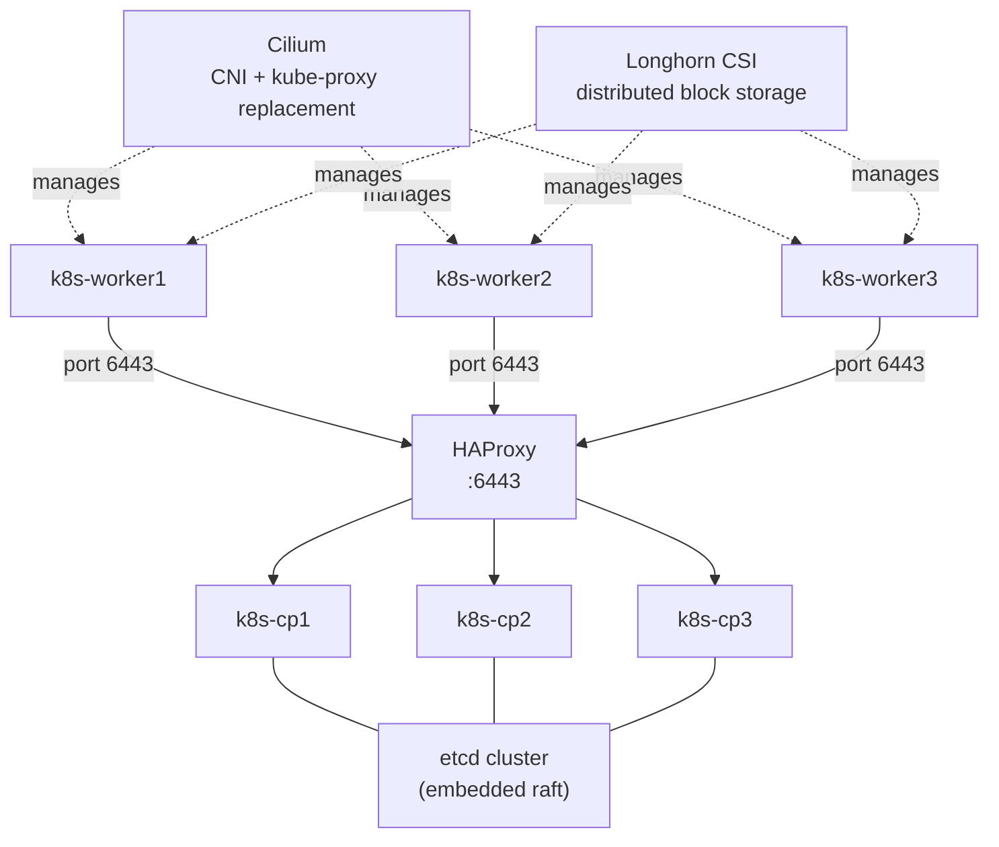

# Kubernetes Cluster

Kubernetes là nền tảng orchestration container mã nguồn mở, tự động hóa việc deploy, scale, và quản lý vòng đời container. Cluster được khởi tạo bằng kubeadm với mô hình HA 3 control-plane.

Trong hệ thống, Kubernetes là nền tảng chạy toàn bộ workload: ArgoCD, Prometheus, Grafana, Loki, Falco, Velero, và các ứng dụng nội bộ. Cilium thay thế kube-proxy và cung cấp NetworkPolicy, Longhorn cung cấp distributed block storage với snapshot và backup.

# Prerequisites

- 7 VM Ubuntu 24.04 (3 control-plane + 3 worker + 1 HAProxy)
- Control-plane: tối thiểu 4 vCPU, 8GB RAM, 50GB disk
- Worker: tối thiểu 4 vCPU, 16GB RAM, 50GB OS disk + disk riêng cho Longhorn
- HAProxy: 2 vCPU, 2GB RAM
- Squid Proxy đã hoạt động
- PowerDNS đã hoạt động
- Harbor đã hoạt động — pull image cho Cilium, Longhorn, và K8s components
- Vault PKI đã hoạt động — TLS cho API server
- Tất cả VM trên isolated network `172.16.10.0/24`
- Hostname của mỗi VM phải khác nhau và đã được resolve trong PowerDNS

# Diagram



---

# Cài đặt

## Thêm DNS records vào PowerDNS

Thực hiện trên PowerDNS server, thêm record cho tất cả node trước khi bắt đầu:

```shell
sudo pdnsutil add-record nghia.internal k8s-lb      A <HAPROXY_IP>
sudo pdnsutil add-record nghia.internal k8s-cp1     A <CP1_IP>
sudo pdnsutil add-record nghia.internal k8s-cp2     A <CP2_IP>
sudo pdnsutil add-record nghia.internal k8s-cp3     A <CP3_IP>
sudo pdnsutil add-record nghia.internal k8s-worker1 A <WORKER1_IP>
sudo pdnsutil add-record nghia.internal k8s-worker2 A <WORKER2_IP>
sudo pdnsutil add-record nghia.internal k8s-worker3 A <WORKER3_IP>
sudo pdnsutil rectify-zone nghia.internal
```

---

## Bước 1 — Cài đặt HAProxy (Load Balancer)

Thực hiện trên VM `k8s-lb`.

HAProxy đóng vai trò load balancer cho Kubernetes API server (port 6443). Client và worker node kết nối vào HAProxy, HAProxy phân tải đến 3 control-plane node.

```shell
sudo apt update -y && sudo apt install -y haproxy
```

Sửa file `/etc/haproxy/haproxy.cfg`, thêm vào cuối file:

```
frontend k8s-api
    bind *:6443
    mode tcp
    option tcplog
    default_backend k8s-controlplanes

backend k8s-controlplanes
    mode tcp
    option tcp-check
    balance roundrobin
    server k8s-cp1 <CP1_IP>:6443 check fall 3 rise 2
    server k8s-cp2 <CP2_IP>:6443 check fall 3 rise 2
    server k8s-cp3 <CP3_IP>:6443 check fall 3 rise 2
```

```shell
sudo systemctl enable haproxy
sudo systemctl restart haproxy

# Kiểm tra port 6443
sudo ss -tlnp | grep 6443
```

---

## Bước 2 — Chuẩn bị tất cả nodes

Thực hiện trên **tất cả 6 node** (3 control-plane + 3 worker).

### Cấu hình proxy

Thêm vào `/etc/environment`:

```sh
http_proxy="http://<USERNAME>:<PASSWORD>@<SQUID_IP>:3128"
https_proxy="http://<USERNAME>:<PASSWORD>@<SQUID_IP>:3128"
no_proxy="localhost,127.0.0.1,172.16.10.0/24,192.168.100.0/24,10.96.0.0/12,100.64.0.0/16"
```

```shell
source /etc/environment
```

`10.96.0.0/12` và `100.64.0.0/16` phải có trong `no_proxy` để traffic nội bộ cluster không đi qua proxy.

### Cập nhật hệ thống và set hostname

```shell
sudo apt update -y && sudo apt upgrade -y

# Đặt hostname đúng theo từng node
sudo hostnamectl set-hostname k8s-cp1        # hoặc cp2, cp3, worker1, worker2, worker3
```

### Tắt swap

Kubernetes yêu cầu swap phải tắt hoàn toàn.

```shell
sudo swapoff -a

# Tắt vĩnh viễn — comment dòng swap trong fstab
sudo sed -i '/swap/s/^/#/' /etc/fstab
sudo rm -f /swap.img

# Kiểm tra — cột Swap phải là 0
free -h
```

### Load kernel modules

```shell
cat <<EOF | sudo tee /etc/modules-load.d/k8s.conf
overlay
br_netfilter
EOF

sudo modprobe overlay
sudo modprobe br_netfilter
```

### Cấu hình sysctl

```shell
cat <<EOF | sudo tee /etc/sysctl.d/k8s.conf
net.bridge.bridge-nf-call-iptables  = 1
net.bridge.bridge-nf-call-ip6tables = 1
net.ipv4.ip_forward                 = 1
EOF

sudo sysctl --system
```

### Cài đặt containerd

Source: https://github.com/containerd/containerd/blob/main/docs/getting-started.md

Download containerd
```bash
wget https://github.com/containerd/containerd/releases/download/v2.3.0/containerd-2.3.0-linux-amd64.tar.gz
```
 
```bash
tar Cxzvf /usr/local containerd-2.3.0-linux-amd64.tar.gz

wget -P /usr/lib/systemd/system/ https://raw.githubusercontent.com/containerd/containerd/main/containerd.service 

systemctl daemon-reload
systemctl enable --now containerd
```


Tạo cấu hình mặc định và bật systemd cgroup driver:

```shell
sudo mkdir -p /etc/containerd
sudo containerd config default | sudo tee /etc/containerd/config.toml

# Bật systemd cgroup driver (bắt buộc với kubeadm)
sudo sed -i 's/SystemdCgroup = false/SystemdCgroup = true/' /etc/containerd/config.toml

# Đổi sandbox image về Harbor (thay Docker Hub)
sudo sed -i 's|registry.k8s.io/pause:.*|registry.nghia.internal/infra/pause:3.10"|' \
  /etc/containerd/config.toml
```

Cấu hình containerd dùng Harbor làm registry mirror, thêm vào cuối section `[plugins."io.containerd.grpc.v1.cri".registry]` trong `/etc/containerd/config.toml`:

```toml
    [plugins."io.containerd.grpc.v1.cri".registry.mirrors]
      [plugins."io.containerd.grpc.v1.cri".registry.mirrors."docker.io"]
        endpoint = ["https://registry.nghia.internal/v2/dockerhub-proxy"]
      [plugins."io.containerd.grpc.v1.cri".registry.mirrors."registry.k8s.io"]
        endpoint = ["https://registry.nghia.internal/v2/infra"]
      [plugins."io.containerd.grpc.v1.cri".registry.mirrors."quay.io"]
        endpoint = ["https://registry.nghia.internal/v2/quay-proxy"]

    [plugins."io.containerd.grpc.v1.cri".registry.configs]
      [plugins."io.containerd.grpc.v1.cri".registry.configs."registry.nghia.internal".tls]
        ca_file = "/etc/containerd/certs/ca.crt"
```

Distribute Root CA cert từ Vault cho containerd:

```shell
sudo mkdir -p /etc/containerd/certs
sudo cp /usr/local/share/ca-certificates/nghia-internal-root-ca.crt \
  /etc/containerd/certs/ca.crt
```

Cấu hình proxy cho containerd để pull image khi Harbor chưa có:

```shell
sudo mkdir -p /etc/systemd/system/containerd.service.d
sudo tee /etc/systemd/system/containerd.service.d/proxy.conf <<EOF
[Service]
Environment="HTTP_PROXY=http://<USERNAME>:<PASSWORD>@<SQUID_IP>:3128"
Environment="HTTPS_PROXY=http://<USERNAME>:<PASSWORD>@<SQUID_IP>:3128"
Environment="NO_PROXY=localhost,127.0.0.1,172.16.10.0/24,192.168.100.0/24,10.96.0.0/12,100.64.0.0/16,registry.nghia.internal"
EOF

sudo systemctl daemon-reload
sudo systemctl enable containerd
sudo systemctl restart containerd
```

### Cài đặt kubeadm, kubelet, kubectl

Sử dụng aptly mirror (Kubernetes repo đã được thêm trong bước cài aptly):

```shell
sudo apt install -y kubelet kubeadm kubectl

# Pin version — tránh auto-upgrade ngoài ý muốn
sudo apt-mark hold kubelet kubeadm kubectl

sudo systemctl enable kubelet
```

---

## Bước 3 — Khởi tạo Control Plane đầu tiên

Thực hiện chỉ trên `k8s-cp1`.

### Pre-pull images K8s vào Harbor

Bước này thực hiện trên **Jump Host hoặc Harbor server** có cài Docker (không phải K8s node vì K8s node chỉ có containerd, không có Docker daemon). Mục đích: pull images qua Squid rồi push lên Harbor để tất cả K8s node pull từ Harbor thay vì internet.

```shell
# Thực hiện trên Jump Host (có Docker)
# Pull pause image — required cho containerd sandbox_image
docker pull registry.k8s.io/pause:3.10
docker tag registry.k8s.io/pause:3.10 registry.nghia.internal/infra/pause:3.10
docker push registry.nghia.internal/infra/pause:3.10

# Pull tất cả K8s images
kubeadm config images list --kubernetes-version v1.31.0 | while read img; do
  img_name=$(echo $img | sed 's|.*/||')
  docker pull $img
  docker tag $img registry.nghia.internal/infra/$img_name
  docker push registry.nghia.internal/infra/$img_name
done
```

### Tạo kubeadm config file

Tạo file `/tmp/kubeadm-config.yaml`:

```yaml
apiVersion: kubeadm.k8s.io/v1beta3
kind: InitConfiguration
localAPIEndpoint:
  advertiseAddress: <CP1_IP>
  bindPort: 6443
---
apiVersion: kubeadm.k8s.io/v1beta3
kind: ClusterConfiguration
kubernetesVersion: v1.31.0
controlPlaneEndpoint: "<HAPROXY_IP>:6443"
imageRepository: "registry.nghia.internal/infra"
networking:
  podSubnet: "100.64.0.0/16"
  serviceSubnet: "10.96.0.0/12"
  dnsDomain: "cluster.local"
etcd:
  local:
    dataDir: /var/lib/etcd
---
apiVersion: kubelet.config.k8s.io/v1beta1
kind: KubeletConfiguration
cgroupDriver: systemd
```

### Khởi tạo cluster

```shell
sudo kubeadm init \
  --config /tmp/kubeadm-config.yaml \
  --upload-certs

# `--upload-certs` upload certificate lên cluster để CP2, CP3 join mà không cần copy thủ công
```

Output sẽ trả về 3 lệnh quan trọng — lưu lại:

```
# Dùng để join control-plane node
kubeadm join <HAPROXY_IP>:6443 --token <TOKEN> \
  --discovery-token-ca-cert-hash sha256:<HASH> \
  --control-plane --certificate-key <CERT_KEY>

# Dùng để join worker node
kubeadm join <HAPROXY_IP>:6443 --token <TOKEN> \
  --discovery-token-ca-cert-hash sha256:<HASH>
```

### Cài đặt kubeconfig

```shell
mkdir -p $HOME/.kube
sudo cp /etc/kubernetes/admin.conf $HOME/.kube/config
sudo chown $(id -u):$(id -g) $HOME/.kube/config
```

Kiểm tra — node CP1 sẽ ở trạng thái `NotReady` vì chưa có CNI:

```shell
kubectl get nodes
kubectl get pods -n kube-system
```

---

## Bước 4 — Join Control Plane 2 và 3

Thực hiện trên `k8s-cp2` và `k8s-cp3` (tuần tự, không song song).

```shell
sudo kubeadm join <HAPROXY_IP>:6443 \
  --token <TOKEN> \
  --discovery-token-ca-cert-hash sha256:<HASH> \
  --control-plane \
  --certificate-key <CERT_KEY> \
  --apiserver-advertise-address <CP2_IP>   # thay CP3_IP cho node thứ 3

mkdir -p $HOME/.kube
sudo cp /etc/kubernetes/admin.conf $HOME/.kube/config
sudo chown $(id -u):$(id -g) $HOME/.kube/config
```

Token hết hạn sau 24h. Nếu cần tạo lại:

```shell
# Trên CP1
kubeadm token create --print-join-command
kubeadm init phase upload-certs --upload-certs   # lấy certificate-key mới
```

---

## Bước 5 — Join Worker nodes

Thực hiện trên `k8s-worker1`, `k8s-worker2`, `k8s-worker3`:

```shell
sudo kubeadm join <HAPROXY_IP>:6443 \
  --token <TOKEN> \
  --discovery-token-ca-cert-hash sha256:<HASH>
```

Kiểm tra từ CP1 — tất cả node vẫn ở `NotReady` cho đến khi cài CNI:

```shell
kubectl get nodes -o wide
```

---

## Bước 6 — Cài đặt Cilium CNI

Thực hiện trên `k8s-cp1`.

Cilium thay thế hoàn toàn kube-proxy bằng eBPF, cung cấp NetworkPolicy và load balancing hiệu năng cao.

### Cài đặt Helm

```shell
curl -fsSL https://raw.githubusercontent.com/helm/helm/main/scripts/get-helm-3 | bash
```

### Thêm Cilium Helm repo

```shell
helm repo add cilium https://helm.cilium.io/
helm repo update
```

### Pre-load Cilium images vào Harbor

Thực hiện trên **Jump Host** có Docker (không phải K8s node):

```shell
for img in \
  quay.io/cilium/cilium:v1.16.0 \
  quay.io/cilium/operator-generic:v1.16.0 \
  quay.io/cilium/hubble-relay:v1.16.0 \
  quay.io/cilium/hubble-ui:v0.13.1 \
  quay.io/cilium/hubble-ui-backend:v0.13.1; do
    img_name=$(echo $img | sed 's|.*/||' | cut -d: -f1)
    img_tag=$(echo $img | cut -d: -f2)
    docker pull $img
    docker tag $img registry.nghia.internal/infra/${img_name}:${img_tag}
    docker push registry.nghia.internal/infra/${img_name}:${img_tag}
done
```

### Cài đặt Cilium

```shell
helm install cilium cilium/cilium \
  --version 1.16.0 \
  --namespace kube-system \
  --set kubeProxyReplacement=true \
  --set k8sServiceHost=<HAPROXY_IP> \
  --set k8sServicePort=6443 \
  --set ipam.mode=cluster-pool \
  --set ipam.operator.clusterPoolIPv4PodCIDRList="100.64.0.0/16" \
  --set ipam.operator.clusterPoolIPv4MaskSize=24 \
  --set image.repository=registry.nghia.internal/infra/cilium \
  --set operator.image.repository=registry.nghia.internal/infra/operator-generic \
  --set hubble.relay.image.repository=registry.nghia.internal/infra/hubble-relay \
  --set hubble.ui.frontend.image.repository=registry.nghia.internal/infra/hubble-ui \
  --set hubble.ui.backend.image.repository=registry.nghia.internal/infra/hubble-ui-backend \
  --set hubble.relay.enabled=true \
  --set hubble.ui.enabled=true
```

Kiểm tra Cilium và các node:

```shell
# Chờ Cilium sẵn sàng
kubectl rollout status daemonset/cilium -n kube-system

# Các node chuyển sang Ready
kubectl get nodes

# Kiểm tra chi tiết qua cilium-cli
curl -fsSL https://github.com/cilium/cilium-cli/releases/latest/download/cilium-linux-amd64.tar.gz \
  | sudo tar -xzC /usr/local/bin

cilium status --wait
```

---

## Bước 7 — Cài đặt Longhorn CSI

Longhorn cung cấp distributed block storage, tự động replicate dữ liệu giữa các worker node.

### Chuẩn bị trên tất cả Worker nodes

```shell
# Cài đặt dependency
sudo apt install -y open-iscsi nfs-common cryptsetup util-linux xfsprogs

# Bật iSCSI
sudo systemctl enable --now iscsid

# Load kernel modules
sudo modprobe iscsi_tcp dm_crypt nfs

cat <<EOF | sudo tee /etc/modules-load.d/longhorn.conf
iscsi_tcp
dm_crypt
nfs
EOF

# Tắt multipathd — gây xung đột với Longhorn
sudo systemctl disable --now multipathd multipathd.socket
sudo systemctl mask multipathd multipathd.socket
```

### Chuẩn bị disk riêng cho Longhorn trên Worker nodes

Longhorn lưu data tại `/var/lib/longhorn`. Nên dùng disk riêng (không phải OS disk) để tránh ảnh hưởng hệ thống.

```shell
# Format disk mới (giả sử /dev/sdb)
sudo parted /dev/sdb mklabel gpt
sudo parted /dev/sdb mkpart primary xfs 0% 100%
sudo mkfs.xfs -f /dev/sdb1

# Mount
sudo mkdir -p /var/lib/longhorn
sudo mount /dev/sdb1 /var/lib/longhorn

# Mount vĩnh viễn qua UUID
DISK_UUID=$(sudo blkid -s UUID -o value /dev/sdb1)
echo "UUID=${DISK_UUID} /var/lib/longhorn xfs defaults,noatime 0 0" \
  | sudo tee -a /etc/fstab

# Kiểm tra
sudo mount -a
df -h /var/lib/longhorn
```

### Pre-load Longhorn images vào Harbor

Thực hiện trên **Jump Host** có Docker:

```shell
LONGHORN_VERSION="v1.7.0"

for img in \
  longhornio/longhorn-manager:${LONGHORN_VERSION} \
  longhornio/longhorn-engine:${LONGHORN_VERSION} \
  longhornio/longhorn-ui:${LONGHORN_VERSION} \
  longhornio/longhorn-instance-manager:${LONGHORN_VERSION} \
  longhornio/longhorn-share-manager:${LONGHORN_VERSION} \
  longhornio/backing-image-manager:${LONGHORN_VERSION}; do
    img_name=$(echo $img | sed 's|.*/||' | cut -d: -f1)
    img_tag=$(echo $img | cut -d: -f2)
    docker pull $img
    docker tag $img registry.nghia.internal/infra/${img_name}:${img_tag}
    docker push registry.nghia.internal/infra/${img_name}:${img_tag}
done
```

### Kiểm tra preflight

```shell
# Trên CP1 — cài longhornctl
curl -fsSL https://github.com/longhorn/cli/releases/download/v1.7.0/longhornctl-linux-amd64 \
  -o /usr/local/bin/longhornctl
chmod +x /usr/local/bin/longhornctl

longhornctl check preflight
```

Sửa các lỗi preflight trước khi cài đặt.

### Cài đặt Longhorn qua Helm

```shell
helm repo add longhorn https://charts.longhorn.io
helm repo update

helm install longhorn longhorn/longhorn \
  --namespace longhorn-system \
  --create-namespace \
  --version 1.7.0 \
  --set defaultSettings.defaultDataPath="/var/lib/longhorn" \
  --set defaultSettings.replicaCount=3 \
  --set defaultSettings.storageMinimalAvailablePercentage=10 \
  --set image.longhorn.manager.repository=registry.nghia.internal/infra/longhorn-manager \
  --set image.longhorn.engine.repository=registry.nghia.internal/infra/longhorn-engine \
  --set image.longhorn.ui.repository=registry.nghia.internal/infra/longhorn-ui \
  --set image.longhorn.instanceManager.repository=registry.nghia.internal/infra/longhorn-instance-manager \
  --set image.longhorn.shareManager.repository=registry.nghia.internal/infra/longhorn-share-manager \
  --set image.longhorn.backingImageManager.repository=registry.nghia.internal/infra/longhorn-backing-image-manager \
  --set longhornUI.service.type=ClusterIP
```

Kiểm tra:

```shell
kubectl get pods -n longhorn-system
kubectl get storageclass
```

Longhorn tự tạo StorageClass `longhorn` và đặt làm default. Kiểm tra:

```shell
kubectl get storageclass longhorn -o yaml
```

### Test PVC

```shell
kubectl apply -f - <<EOF
apiVersion: v1
kind: PersistentVolumeClaim
metadata:
  name: test-pvc
spec:
  accessModes:
    - ReadWriteOnce
  storageClassName: longhorn
  resources:
    requests:
      storage: 1Gi
EOF

kubectl get pvc test-pvc

# Xoá sau khi test
kubectl delete pvc test-pvc
```

---

## Bước 8 — Cài đặt bổ sung

### Metrics Server

Cần thiết cho `kubectl top` và Horizontal Pod Autoscaler:

```shell
helm repo add metrics-server https://kubernetes-sigs.github.io/metrics-server/
helm install metrics-server metrics-server/metrics-server \
  --namespace kube-system \
  --set args="{--kubelet-insecure-tls,--kubelet-preferred-address-types=InternalIP}"
```

### Gateway API CRDs

Cần thiết cho Cilium Gateway API và Traefik:

```shell
kubectl apply --server-side -f \
  https://github.com/kubernetes-sigs/gateway-api/releases/download/v1.2.0/standard-install.yaml
```

### Cài đặt external-snapshotter

external-snapshotter cung cấp CRD `VolumeSnapshot` và snapshot-controller — bắt buộc để Longhorn tạo CSI snapshot và Velero backup qua CSI.

```shell
# Tải từ GitHub qua Squid, thực hiện trên CP1
SNAPSHOTTER_VERSION="v8.0.1"

# Cài CRDs trước
kubectl apply -f https://raw.githubusercontent.com/kubernetes-csi/external-snapshotter/${SNAPSHOTTER_VERSION}/client/config/crd/snapshot.storage.k8s.io_volumesnapshotclasses.yaml
kubectl apply -f https://raw.githubusercontent.com/kubernetes-csi/external-snapshotter/${SNAPSHOTTER_VERSION}/client/config/crd/snapshot.storage.k8s.io_volumesnapshotcontents.yaml
kubectl apply -f https://raw.githubusercontent.com/kubernetes-csi/external-snapshotter/${SNAPSHOTTER_VERSION}/client/config/crd/snapshot.storage.k8s.io_volumesnapshots.yaml

# Cài snapshot-controller
kubectl apply -f https://raw.githubusercontent.com/kubernetes-csi/external-snapshotter/${SNAPSHOTTER_VERSION}/deploy/kubernetes/snapshot-controller/rbac-snapshot-controller.yaml
kubectl apply -f https://raw.githubusercontent.com/kubernetes-csi/external-snapshotter/${SNAPSHOTTER_VERSION}/deploy/kubernetes/snapshot-controller/setup-snapshot-controller.yaml

kubectl rollout status deployment/snapshot-controller -n kube-system
```

### Tạo imagePullSecret cho Harbor

Kubernetes cần secret để pull image từ Harbor private registry:

```shell
kubectl create secret docker-registry harbor-pull-secret \
  --docker-server=registry.nghia.internal \
  --docker-username="robot\$kubernetes" \
  --docker-password="<HARBOR_ROBOT_TOKEN>" \
  --namespace default

# Tạo cho các namespace cần thiết
for ns in kube-system longhorn-system monitoring; do
  kubectl create secret docker-registry harbor-pull-secret \
    --docker-server=registry.nghia.internal \
    --docker-username="robot\$kubernetes" \
    --docker-password="<HARBOR_ROBOT_TOKEN>" \
    --namespace $ns
done
```

### Lưu kubeconfig vào Vault

```shell
vault kv put secret/kubernetes/admin-kubeconfig \
  kubeconfig="$(cat $HOME/.kube/config)"
```

---

## Bước 9 — Cilium LoadBalancer IP Pool

Cilium với `kubeProxyReplacement=true` có thể đảm nhận việc cấp IP cho LoadBalancer service thay thế MetalLB. Cần cấu hình IP pool trước khi cài Traefik.

Dành một dải IP trong isolated network cho LoadBalancer service (ví dụ `172.16.10.200/29` = 6 IP usable):

```shell
kubectl apply -f - <<EOF
apiVersion: cilium.io/v2
kind: CiliumLoadBalancerIPPool
metadata:
  name: internal-pool
spec:
  cidrs:
    - cidr: "172.16.10.200/29"
EOF
```

Cấu hình Cilium L2 announcement để các node broadcast IP LoadBalancer ra mạng nội bộ qua ARP:

```shell
kubectl apply -f - <<EOF
apiVersion: cilium.io/v2
kind: CiliumL2AnnouncementPolicy
metadata:
  name: default-l2-policy
spec:
  interfaces:
    - eth0
  externalIPs: true
  loadBalancerIPs: true
EOF
```

Kiểm tra IP pool:

```shell
kubectl get ciliumloadbalancerippool
kubectl get ciliuml2announcementpolicy
```

---

## Bước 10 — Traefik Ingress Controller

Traefik đóng vai trò Ingress Controller, nhận traffic từ bên ngoài và route vào các service bên trong cluster. Kết hợp với cert-manager để tự động TLS termination.

### Pre-load Traefik images vào Harbor

Thực hiện trên **Jump Host** có Docker:

```shell
for img in \
  traefik:v3.2 \
  traefik/whoami:latest; do
    img_name=$(echo $img | sed 's|.*/||' | cut -d: -f1)
    img_tag=$(echo $img | cut -d: -f2)
    docker pull $img
    docker tag $img registry.nghia.internal/infra/${img_name}:${img_tag}
    docker push registry.nghia.internal/infra/${img_name}:${img_tag}
done
```

### Cài đặt Traefik qua Helm

```shell
helm repo add traefik https://traefik.github.io/charts
helm repo update

helm install traefik traefik/traefik \
  --namespace traefik \
  --create-namespace \
  --version 32.0.0 \
  --set image.repository=registry.nghia.internal/infra/traefik \
  --set deployment.replicas=2 \
  --set service.type=LoadBalancer \
  --set ports.web.port=80 \
  --set ports.web.redirectTo.port=websecure \
  --set ports.websecure.port=443 \
  --set ports.websecure.tls.enabled=true \
  --set ingressClass.enabled=true \
  --set ingressClass.isDefaultClass=true \
  --set providers.kubernetesIngress.enabled=true \
  --set providers.kubernetesCRD.enabled=true \
  --set dashboard.enabled=true \
  --set api.insecure=false
```

Kiểm tra Traefik nhận được IP từ Cilium IP Pool:

```shell
kubectl get svc -n traefik

# External-IP phải là IP trong dải 172.16.10.200/29
# NAME      TYPE           CLUSTER-IP     EXTERNAL-IP      PORT(S)
# traefik   LoadBalancer   10.96.x.x      172.16.10.200    80:xxx/TCP,443:xxx/TCP
```

Thêm DNS record trỏ về Traefik LoadBalancer IP:

```shell
# Thêm wildcard record — tất cả *.nghia.internal sẽ vào Traefik
sudo pdnsutil add-record nghia.internal "*.apps" A 172.16.10.200
sudo pdnsutil add-record nghia.internal traefik  A 172.16.10.200
sudo pdnsutil rectify-zone nghia.internal
```

---

## Bước 11 — cert-manager + Vault PKI

cert-manager tự động hóa việc cấp và renew TLS certificate cho Ingress resource. Tích hợp với Vault PKI để cert được ký bởi internal CA.

### Cài đặt cert-manager

```shell
helm repo add jetstack https://charts.jetstack.io
helm repo update

helm install cert-manager jetstack/cert-manager \
  --namespace cert-manager \
  --create-namespace \
  --version v1.16.0 \
  --set crds.enabled=true \
  --set image.repository=registry.nghia.internal/infra/cert-manager-controller \
  --set webhook.image.repository=registry.nghia.internal/infra/cert-manager-webhook \
  --set cainjector.image.repository=registry.nghia.internal/infra/cert-manager-cainjector

kubectl rollout status deployment/cert-manager -n cert-manager
```

### Cấu hình Vault Kubernetes Auth

cert-manager authenticate với Vault bằng Kubernetes Service Account token — không cần hardcode credential.

Thực hiện trên Vault server:

```shell
export VAULT_ADDR="https://vault.nghia.internal:8200"
vault login <ROOT_TOKEN>

# Bật Kubernetes auth method
vault auth enable kubernetes

# Lấy K8s CA cert và API server URL
K8S_CA=$(kubectl config view --raw -o jsonpath='{.clusters[0].cluster.certificate-authority-data}' | base64 -d)

vault write auth/kubernetes/config \
  kubernetes_host="https://<HAPROXY_IP>:6443" \
  kubernetes_ca_cert="$K8S_CA"

# Tạo policy cho cert-manager
vault policy write cert-manager - <<EOF
path "pki_int/sign/nghia-internal" {
  capabilities = ["create", "update"]
}
path "pki_int/issue/nghia-internal" {
  capabilities = ["create", "update"]
}
EOF

# Tạo Kubernetes auth role cho cert-manager
vault write auth/kubernetes/role/cert-manager \
  bound_service_account_names=cert-manager \
  bound_service_account_namespaces=cert-manager \
  policies=cert-manager \
  ttl=1h
```

### Tạo ClusterIssuer

Lấy Vault Root CA cert ở dạng base64:

```shell
VAULT_CA_B64=$(kubectl get secret -n cert-manager \
  -o jsonpath='{.items[0].data.ca\.crt}' 2>/dev/null \
  || cat /usr/local/share/ca-certificates/nghia-internal-root-ca.crt | base64 -w0)
```

Tạo ClusterIssuer:

```shell
kubectl apply -f - <<EOF
apiVersion: cert-manager.io/v1
kind: ClusterIssuer
metadata:
  name: vault-issuer
spec:
  vault:
    server: https://vault.nghia.internal:8200
    path: pki_int/sign/nghia-internal
    caBundle: $(cat /usr/local/share/ca-certificates/nghia-internal-root-ca.crt | base64 -w0)
    auth:
      kubernetes:
        role: cert-manager
        mountPath: /v1/auth/kubernetes
        serviceAccountRef:
          name: cert-manager
EOF
```

Kiểm tra ClusterIssuer ready:

```shell
kubectl get clusterissuer vault-issuer
# STATUS phải là True / Ready
```

### Test — cấp certificate thử

```shell
kubectl apply -f - <<EOF
apiVersion: cert-manager.io/v1
kind: Certificate
metadata:
  name: test-cert
  namespace: default
spec:
  secretName: test-cert-tls
  issuerRef:
    name: vault-issuer
    kind: ClusterIssuer
  dnsNames:
    - test.nghia.internal
EOF

# Chờ cert được cấp
kubectl describe certificate test-cert
kubectl get secret test-cert-tls

# Xoá sau khi test
kubectl delete certificate test-cert
kubectl delete secret test-cert-tls
```

### Dùng cert-manager trong Ingress

Sau khi ClusterIssuer hoạt động, chỉ cần thêm annotation vào Ingress resource, cert-manager sẽ tự cấp TLS cert:

```yaml
apiVersion: networking.k8s.io/v1
kind: Ingress
metadata:
  name: my-app
  annotations:
    cert-manager.io/cluster-issuer: "vault-issuer"
spec:
  ingressClassName: traefik
  tls:
    - hosts:
        - myapp.nghia.internal
      secretName: myapp-tls
  rules:
    - host: myapp.nghia.internal
      http:
        paths:
          - path: /
            pathType: Prefix
            backend:
              service:
                name: my-app-svc
                port:
                  number: 80
```

---

## Bước 12 — External Secrets Operator

External Secrets Operator (ESO) sync secret từ Vault vào Kubernetes Secret. Pod không cần kết nối trực tiếp Vault — chỉ đọc K8s Secret thông thường.

### Cài đặt ESO

```shell
helm repo add external-secrets https://charts.external-secrets.io
helm repo update

helm install external-secrets external-secrets/external-secrets \
  --namespace external-secrets \
  --create-namespace \
  --version 0.10.0 \
  --set image.repository=registry.nghia.internal/infra/external-secrets \
  --set webhook.image.repository=registry.nghia.internal/infra/external-secrets \
  --set certController.image.repository=registry.nghia.internal/infra/external-secrets

kubectl rollout status deployment/external-secrets -n external-secrets
```

### Cấu hình Vault Kubernetes Auth cho ESO

Thực hiện trên Vault server:

```shell
# Policy cho ESO — read secret từ KV
vault policy write external-secrets - <<EOF
path "secret/data/*" {
  capabilities = ["read"]
}
path "secret/metadata/*" {
  capabilities = ["read", "list"]
}
EOF

# Kubernetes auth role cho ESO
vault write auth/kubernetes/role/external-secrets \
  bound_service_account_names=external-secrets \
  bound_service_account_namespaces=external-secrets \
  policies=external-secrets \
  ttl=1h
```

### Tạo ClusterSecretStore

ClusterSecretStore định nghĩa kết nối đến Vault, dùng được cho tất cả namespace:

```shell
kubectl apply -f - <<EOF
apiVersion: external-secrets.io/v1beta1
kind: ClusterSecretStore
metadata:
  name: vault-backend
spec:
  provider:
    vault:
      server: "https://vault.nghia.internal:8200"
      path: "secret"
      version: "v2"
      caBundle: $(cat /usr/local/share/ca-certificates/nghia-internal-root-ca.crt | base64 -w0)
      auth:
        kubernetes:
          mountPath: "kubernetes"
          role: "external-secrets"
          serviceAccountRef:
            name: "external-secrets"
            namespace: "external-secrets"
EOF
```

Kiểm tra SecretStore ready:

```shell
kubectl get clustersecretstore vault-backend
# STATUS phải là Valid
```

### Sử dụng ExternalSecret

Ví dụ sync Harbor robot token từ Vault vào Kubernetes Secret:

```shell
kubectl apply -f - <<EOF
apiVersion: external-secrets.io/v1beta1
kind: ExternalSecret
metadata:
  name: harbor-robot-secret
  namespace: default
spec:
  refreshInterval: 1h
  secretStoreRef:
    name: vault-backend
    kind: ClusterSecretStore
  target:
    name: harbor-robot-secret
    creationPolicy: Owner
    template:
      type: kubernetes.io/dockerconfigjson
      data:
        .dockerconfigjson: |
          {"auths":{"registry.nghia.internal":{"username":"{{ .username }}","password":"{{ .token }}"}}}
  data:
    - secretKey: username
      remoteRef:
        key: harbor/robot-accounts
        property: kubernetes_name
    - secretKey: token
      remoteRef:
        key: harbor/robot-accounts
        property: kubernetes_token
EOF

kubectl get externalsecret harbor-robot-secret
kubectl get secret harbor-robot-secret
```

Sau khi ESO hoạt động, không cần tạo imagePullSecret thủ công nữa — ESO tự sync và renew khi token thay đổi trong Vault.
