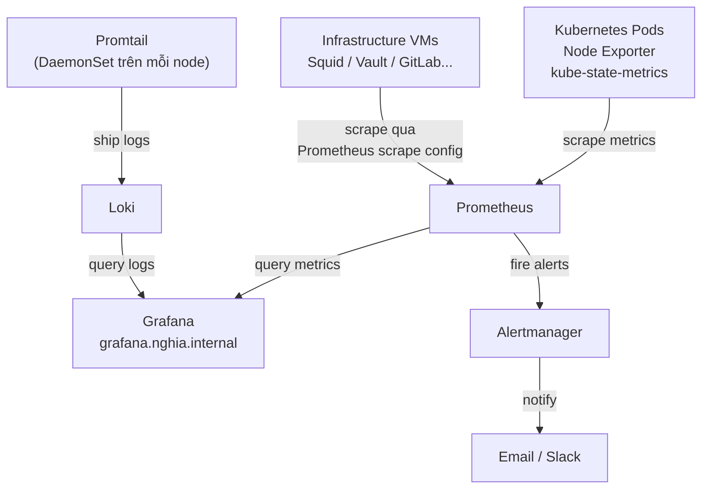

# Monitoring Stack — Prometheus + Grafana + Loki

Monitoring Stack gồm ba thành phần bổ trợ nhau: Prometheus thu thập và lưu trữ metrics, Grafana hiển thị dashboard và alerting, Loki tập hợp log từ toàn bộ pod và system. Cả ba được cài qua Helm chart `kube-prometheus-stack` và `loki-stack`.

Trong hệ thống, Monitoring Stack cung cấp observability toàn diện cho cluster Kubernetes và các infrastructure service bên ngoài (Squid, PowerDNS, NTPSec, Vault...). Mọi alert đều đi qua Alertmanager — có thể route đến email, Slack, hoặc PagerDuty. Log từ tất cả pod được ship vào Loki và query trực tiếp từ Grafana.

# Prerequisites

- Kubernetes cluster đã hoạt động (Longhorn, Traefik, cert-manager, ESO đã cài)
- Harbor đã hoạt động — pull monitoring images
- Vault PKI đã hoạt động — TLS cert cho `grafana.nghia.internal`
- PowerDNS đã hoạt động — DNS records cho Grafana và Alertmanager
- Longhorn StorageClass — Prometheus và Loki cần persistent volume

# Diagram



---

# Cài đặt

## Pre-load images vào Harbor

```shell
# Prometheus stack images
for img in \
  quay.io/prometheus/prometheus:v3.0.0 \
  quay.io/prometheus/alertmanager:v0.27.0 \
  quay.io/prometheus-operator/prometheus-operator:v0.78.0 \
  quay.io/prometheus-operator/prometheus-config-reloader:v0.78.0 \
  registry.k8s.io/kube-state-metrics/kube-state-metrics:v2.14.0 \
  quay.io/prometheus/node-exporter:v1.8.2 \
  grafana/grafana:11.4.0 \
  grafana/loki:3.3.0 \
  grafana/promtail:3.3.0; do
    img_name=$(echo $img | sed 's|.*/||' | cut -d: -f1)
    docker pull $img
    docker tag $img registry.nghia.internal/infra/${img_name}
    docker push registry.nghia.internal/infra/${img_name}
done
```

## Thêm Helm repos

```shell
helm repo add prometheus-community https://prometheus-community.github.io/helm-charts
helm repo add grafana https://grafana.github.io/helm-charts
helm repo update
```

## Cài đặt kube-prometheus-stack

`kube-prometheus-stack` bao gồm Prometheus Operator, Prometheus, Alertmanager, Grafana, node-exporter, và kube-state-metrics trong một chart duy nhất.

Tạo file `kube-prometheus-stack-values.yaml`:

```yaml
## Prometheus Operator
prometheusOperator:
  image:
    repository: registry.nghia.internal/infra/prometheus-operator
  prometheusConfigReloader:
    image:
      repository: registry.nghia.internal/infra/prometheus-config-reloader

## Prometheus
prometheus:
  prometheusSpec:
    image:
      repository: registry.nghia.internal/infra/prometheus
    retention: 30d
    retentionSize: "50GB"
    storageSpec:
      volumeClaimTemplate:
        spec:
          storageClassName: longhorn
          accessModes: ["ReadWriteOnce"]
          resources:
            requests:
              storage: 50Gi
    # Scrape tất cả ServiceMonitor trong mọi namespace
    serviceMonitorSelectorNilUsesHelmValues: false
    podMonitorSelectorNilUsesHelmValues: false
    ruleSelectorNilUsesHelmValues: false

## Alertmanager
alertmanager:
  alertmanagerSpec:
    image:
      repository: registry.nghia.internal/infra/alertmanager
    storage:
      volumeClaimTemplate:
        spec:
          storageClassName: longhorn
          accessModes: ["ReadWriteOnce"]
          resources:
            requests:
              storage: 5Gi
  config:
    global:
      resolve_timeout: 5m
    route:
      group_by: ["namespace", "alertname"]
      group_wait: 30s
      group_interval: 5m
      repeat_interval: 12h
      receiver: "default"
    receivers:
      - name: "default"
        # Cấu hình email hoặc Slack sau
        # slack_configs:
        #   - api_url: "<SLACK_WEBHOOK_URL>"
        #     channel: "#alerts"

## Grafana
grafana:
  image:
    repository: registry.nghia.internal/infra/grafana
  adminPassword: "<GRAFANA_ADMIN_PASSWORD>"
  persistence:
    enabled: true
    storageClassName: longhorn
    size: 10Gi
  ingress:
    enabled: true
    ingressClassName: traefik
    annotations:
      cert-manager.io/cluster-issuer: vault-issuer
      traefik.ingress.kubernetes.io/router.entrypoints: websecure
      traefik.ingress.kubernetes.io/router.tls: "true"
    hosts:
      - grafana.nghia.internal
    tls:
      - secretName: grafana-tls
        hosts:
          - grafana.nghia.internal
  # Datasource Loki tự động
  additionalDataSources:
    - name: Loki
      type: loki
      url: http://loki-gateway.monitoring.svc.cluster.local
      access: proxy
      isDefault: false

## Node Exporter
nodeExporter:
  image:
    repository: registry.nghia.internal/infra/node-exporter

## kube-state-metrics
kube-state-metrics:
  image:
    repository: registry.nghia.internal/infra/kube-state-metrics
```

```shell
helm install kube-prometheus-stack prometheus-community/kube-prometheus-stack \
  --namespace monitoring \
  --create-namespace \
  --version 67.0.0 \
  --values kube-prometheus-stack-values.yaml

kubectl rollout status deployment/kube-prometheus-stack-grafana -n monitoring
kubectl get pods -n monitoring
```

## Thêm DNS records

```shell
sudo pdnsutil add-record nghia.internal grafana      A <TRAEFIK_LB_IP>
sudo pdnsutil add-record nghia.internal alertmanager A <TRAEFIK_LB_IP>
sudo pdnsutil rectify-zone nghia.internal
```

## Ingress cho Alertmanager

```shell
kubectl apply -f - <<EOF
apiVersion: networking.k8s.io/v1
kind: Ingress
metadata:
  name: alertmanager
  namespace: monitoring
  annotations:
    cert-manager.io/cluster-issuer: vault-issuer
    traefik.ingress.kubernetes.io/router.entrypoints: websecure
    traefik.ingress.kubernetes.io/router.tls: "true"
spec:
  ingressClassName: traefik
  tls:
    - hosts:
        - alertmanager.nghia.internal
      secretName: alertmanager-tls
  rules:
    - host: alertmanager.nghia.internal
      http:
        paths:
          - path: /
            pathType: Prefix
            backend:
              service:
                name: kube-prometheus-stack-alertmanager
                port:
                  number: 9093
EOF
```

## Lưu Grafana password vào Vault

```shell
vault kv put secret/monitoring/grafana \
  admin_password="<GRAFANA_ADMIN_PASSWORD>"
```

---

## Cài đặt Loki

Loki lưu log theo dạng index nhỏ + compressed chunk, tiết kiệm storage hơn Elasticsearch. Promtail chạy như DaemonSet trên mỗi node, đọc log từ container và gửi vào Loki.

Tạo file `loki-values.yaml`:

```yaml
loki:
  image:
    repository: registry.nghia.internal/infra/loki
  auth_enabled: false
  commonConfig:
    replication_factor: 1
  storage:
    type: filesystem
  ingester:
    chunk_idle_period: 5m
    chunk_retain_period: 30s
  limits_config:
    retention_period: 30d
    ingestion_rate_mb: 16
    ingestion_burst_size_mb: 32

  persistence:
    enabled: true
    storageClassName: longhorn
    size: 50Gi

singleBinary:
  replicas: 1

gateway:
  enabled: true

promtail:
  enabled: true
  image:
    repository: registry.nghia.internal/infra/promtail
  config:
    clients:
      - url: http://loki-gateway.monitoring.svc.cluster.local/loki/api/v1/push
    snippets:
      # Thêm label cluster vào mọi log
      extraRelabelConfigs:
        - target_label: cluster
          replacement: nghia-internal
```

```shell
helm install loki grafana/loki \
  --namespace monitoring \
  --version 6.23.0 \
  --values loki-values.yaml

kubectl rollout status deployment/loki-gateway -n monitoring
```

---

## Scrape metrics từ Infrastructure VMs

Các VM ngoài cluster (Squid, Vault, PowerDNS, GitLab...) cần cài `node_exporter` để Prometheus scrape.

### Cài node_exporter trên Infrastructure VMs

Thực hiện trên mỗi VM cần monitor (Squid, Vault, GitLab, Harbor, PowerDNS, NTPSec):

```shell
# Tải node_exporter từ aptly mirror hoặc qua Squid
wget https://github.com/prometheus/node_exporter/releases/download/v1.8.2/node_exporter-1.8.2.linux-amd64.tar.gz

tar xzf node_exporter-1.8.2.linux-amd64.tar.gz
sudo cp node_exporter-1.8.2.linux-amd64/node_exporter /usr/local/bin/
sudo chmod +x /usr/local/bin/node_exporter

# Tạo systemd service
sudo tee /etc/systemd/system/node_exporter.service <<EOF
[Unit]
Description=Node Exporter
After=network.target

[Service]
User=nobody
ExecStart=/usr/local/bin/node_exporter
Restart=on-failure

[Install]
WantedBy=multi-user.target
EOF

sudo systemctl enable --now node_exporter

# Kiểm tra
curl -s http://localhost:9100/metrics | head -5
```

### Cấu hình Prometheus scrape ngoài cluster

Tạo Secret chứa config scrape cho VM ngoài cluster:

```shell
kubectl apply -f - <<EOF
apiVersion: v1
kind: Secret
metadata:
  name: additional-scrape-configs
  namespace: monitoring
stringData:
  additional-scrape-configs.yaml: |
    - job_name: 'infra-vms'
      static_configs:
        - targets:
            - '<SQUID_IP>:9100'
            - '<VAULT_IP>:9100'
            - '<GITLAB_IP>:9100'
            - '<HARBOR_IP>:9100'
            - '<POWERDNS_IP>:9100'
            - '<NTPSEC_IP>:9100'
          labels:
            environment: 'production'
            cluster: 'nghia-internal'
EOF
```

Patch Prometheus để dùng additional scrape config:

```shell
kubectl patch prometheus kube-prometheus-stack-prometheus \
  -n monitoring \
  --type merge \
  -p '{
    "spec": {
      "additionalScrapeConfigs": {
        "name": "additional-scrape-configs",
        "key": "additional-scrape-configs.yaml"
      }
    }
  }'
```

---

## Cấu hình Alerting Rules

Tạo PrometheusRule cho các alert cơ bản của infrastructure:

```shell
kubectl apply -f - <<EOF
apiVersion: monitoring.coreos.com/v1
kind: PrometheusRule
metadata:
  name: infra-alerts
  namespace: monitoring
  labels:
    release: kube-prometheus-stack
spec:
  groups:
    - name: infra.rules
      rules:
        - alert: NodeDown
          expr: up{job="infra-vms"} == 0
          for: 2m
          labels:
            severity: critical
          annotations:
            summary: "Node {{ \$labels.instance }} down"
            description: "Node exporter unreachable trên {{ \$labels.instance }} trong hơn 2 phút"

        - alert: HighCPUUsage
          expr: 100 - (avg by(instance) (rate(node_cpu_seconds_total{mode="idle"}[5m])) * 100) > 85
          for: 10m
          labels:
            severity: warning
          annotations:
            summary: "CPU cao trên {{ \$labels.instance }}"
            description: "CPU usage {{ \$value | printf \"%.1f\" }}% trên {{ \$labels.instance }}"

        - alert: HighMemoryUsage
          expr: (1 - node_memory_MemAvailable_bytes / node_memory_MemTotal_bytes) * 100 > 85
          for: 10m
          labels:
            severity: warning
          annotations:
            summary: "Memory cao trên {{ \$labels.instance }}"
            description: "Memory usage {{ \$value | printf \"%.1f\" }}% trên {{ \$labels.instance }}"

        - alert: DiskSpaceLow
          expr: (1 - node_filesystem_avail_bytes{fstype!="tmpfs"} / node_filesystem_size_bytes{fstype!="tmpfs"}) * 100 > 80
          for: 5m
          labels:
            severity: warning
          annotations:
            summary: "Disk thấp trên {{ \$labels.instance }}"
            description: "Disk {{ \$labels.mountpoint }} còn {{ \$value | printf \"%.1f\" }}% đã dùng trên {{ \$labels.instance }}"

        - alert: VaultSealed
          expr: vault_core_unsealed == 0
          for: 1m
          labels:
            severity: critical
          annotations:
            summary: "Vault đang sealed"
            description: "Vault instance bị sealed — cần unseal thủ công"
EOF
```

## Bật Vault Telemetry để Prometheus scrape

Alert `VaultSealed` dùng metric `vault_core_unsealed` — cần bật telemetry trong Vault config trước.

Trên Vault server, thêm vào `/opt/vault/config/vault.hcl`:

```hcl
telemetry {
  prometheus_retention_time = "30s"
  disable_hostname           = true
}
```

```shell
sudo systemctl reload vault
```

Thêm Vault vào `additional-scrape-configs` trong Prometheus:

```shell
kubectl patch secret additional-scrape-configs \
  -n monitoring \
  --type merge \
  -p '{
    "stringData": {
      "additional-scrape-configs.yaml": "- job_name: infra-vms\n  static_configs:\n  - targets:\n    - <SQUID_IP>:9100\n    - <VAULT_IP>:9100\n    - <GITLAB_IP>:9100\n    - <HARBOR_IP>:9100\n    - <POWERDNS_IP>:9100\n    - <NTPSEC_IP>:9100\n    labels:\n      environment: production\n      cluster: nghia-internal\n- job_name: vault\n  metrics_path: /v1/sys/metrics\n  params:\n    format: [prometheus]\n  bearer_token: <VAULT_PROMETHEUS_TOKEN>\n  static_configs:\n  - targets:\n    - <VAULT_IP>:8200\n    labels:\n      instance: vault\n      cluster: nghia-internal\n"
    }
  }'
```

Tạo Vault token riêng cho Prometheus scrape (chỉ cần `sys/metrics` read):

```shell
vault policy write prometheus-metrics - <<EOF
path "sys/metrics" {
  capabilities = ["read"]
}
EOF

vault token create \
  -policy=prometheus-metrics \
  -period=8760h \
  -display-name=prometheus-scrape
```

---

## Nhập Grafana Dashboards

Grafana community cung cấp sẵn dashboard cho hầu hết component. Import qua Dashboard ID.

Vào Grafana UI → **Dashboards** → **Import** → nhập ID:

| Dashboard | ID | Mô tả |
|---|---|---|
| Kubernetes Cluster | `7249` | Tổng quan toàn bộ cluster |
| Node Exporter Full | `1860` | Metrics từng node |
| Kubernetes Pods | `6417` | CPU/Memory từng pod |
| Longhorn | `16888` | Storage metrics |
| Loki Logs | `13639` | Log explorer |
| Traefik | `17346` | Ingress metrics |
| Cilium | `16611` | CNI metrics |

Trong môi trường air-gap, download JSON dashboard từ `https://grafana.com/grafana/dashboards/<ID>` qua Squid và import file thủ công.

---

## Kiểm tra hoạt động

```shell
# Kiểm tra tất cả pod monitoring
kubectl get pods -n monitoring

# Kiểm tra Prometheus scrape targets
kubectl port-forward -n monitoring svc/kube-prometheus-stack-prometheus 9090:9090 &
# Mở http://localhost:9090/targets — tất cả target phải UP

# Kiểm tra Loki nhận log
kubectl port-forward -n monitoring svc/loki-gateway 3100:80 &
curl -s "http://localhost:3100/loki/api/v1/labels" | jq .
```

Truy cập Grafana tại `https://grafana.nghia.internal`, đăng nhập với `admin` và password đã cấu hình.
