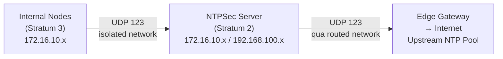

# NTPSec

NTPSec là bản hardened fork của ntpd, cung cấp NTP server với bảo mật được cải thiện, loại bỏ các code path không cần thiết và fix nhiều CVE lịch sử của ntpd gốc.

Trong hệ thống, NTPSec đóng vai trò Stratum 2 NTP server duy nhất cho toàn bộ mạng nội bộ. Tất cả các node (Kubernetes control plane, worker, GitLab, Vault...) đồng bộ thời gian từ NTPSec thay vì ra internet trực tiếp. Thời gian chính xác là yêu cầu bắt buộc cho TLS certificate validation, DNSSEC, Vault token TTL, và log correlation giữa các node.

# Prerequisites

- Ubuntu 24.04
- User có quyền `sudo`
- Squid Proxy đã hoạt động — dùng để tải package qua apt (qua NIC isolated network)
- NTPSec server cần có NIC trên routed network (`192.168.100.0/24`) để sync NTP ra internet — NTP dùng UDP port `123`, Squid không proxy được UDP
- Port `123/UDP` không bị block từ các node nội bộ đến NTPSec server

# Diagram



---

# Cài đặt

## Cấu hình proxy cho server

Squid proxy chỉ dùng cho apt package download, không dùng cho NTP sync (NTP dùng UDP, Squid chỉ proxy HTTP/HTTPS).

Thêm vào file `/etc/environment`:

```sh
http_proxy="http://<USERNAME>:<PASSWORD>@<SQUID_IP>:3128"
https_proxy="http://<USERNAME>:<PASSWORD>@<SQUID_IP>:3128"
no_proxy="localhost,127.0.0.1,172.16.10.0/24,192.168.100.0/24"
```

```shell
source /etc/environment
```

## Cập nhật hệ thống và cài đặt NTPSec

```shell
sudo apt update -y && sudo apt upgrade -y
sudo apt install ntpsec -y
```

## Cấu hình NTPSec server

Sửa file `/etc/ntpsec/ntp.conf`:

```conf
# === UPSTREAM NTP SOURCES ===
# Pool VN + Asia làm nguồn chính
pool vn.pool.ntp.org iburst minpoll 4 maxpoll 8
pool 0.asia.pool.ntp.org iburst
pool 1.asia.pool.ntp.org iburst

# Fallback: Google Public NTP
server time.google.com iburst prefer

# Yêu cầu tối thiểu 3 nguồn, ít nhất 1 nguồn hợp lệ trước khi sync
tos minclock 3 minsane 1

# === ACCESS CONTROL ===
# Deny tất cả by default
restrict default nomodify notrap nopeer noquery

# Localhost có full quyền
restrict 127.0.0.1
restrict ::1

# Cho phép client trong internal network query và sync, không cho phép modify
restrict 172.16.10.0 mask 255.255.255.0 nomodify notrap

# === LOGGING ===
logfile /var/log/ntpsec/ntp.log
logconfig =syncevents +peerevents +sysevents +allclock
```

## Khởi động NTPSec

```shell
sudo systemctl enable ntpsec
sudo systemctl restart ntpsec
sudo systemctl status ntpsec
```

## Kiểm tra đồng bộ

Sau khi khởi động, NTPSec cần vài phút để poll các upstream server và chọn nguồn tốt nhất.

```shell
# Xem danh sách peers và trạng thái sync
# * = peer đang được dùng, + = peer tốt, - = peer bị loại
sudo ntpq -p

# Xem thông tin đồng hồ hệ thống
sudo ntpq -c sysinfo

# Xem offset và jitter của kernel clock
sudo ntpq -c kern
```

## Cấu hình client với chrony

Thực hiện trên tất cả các node cần đồng bộ thời gian. `chrony` là NTP client mặc định trên Ubuntu 24.04, nhẹ hơn và hội tụ nhanh hơn ntpd.

```shell
sudo apt install chrony -y
```

Sửa file `/etc/chrony/chrony.conf`:

```conf
# Trỏ về NTPSec server nội bộ
server <NTPSEC_IP> iburst prefer

# Không fallback ra internet — air-gap environment
# Nếu NTPSec server không đạt được, giữ nguyên clock hiện tại

# Cho phép step lớn khi lần đầu sync (tránh bị reject vì lệch quá nhiều)
makestep 1.0 3

# Drift file — lưu frequency error để bù khi reboot
driftfile /var/lib/chrony/drift

# Logging
logdir /var/log/chrony
```

```shell
sudo systemctl enable chrony
sudo systemctl restart chrony

# Kiểm tra nguồn sync — * là nguồn đang dùng
chronyc sources -v

# Kiểm tra trạng thái đồng bộ tổng thể
chronyc tracking
```
