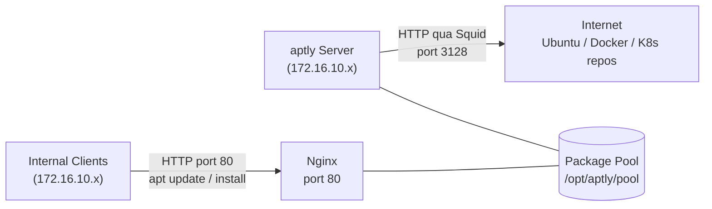

# aptly — APT Package Repository

aptly là công cụ quản lý APT mirror, cho phép snapshot và publish repository dưới dạng HTTP server nội bộ. Hỗ trợ GPG signing, versioned snapshot, và incremental sync.

Trong hệ thống, aptly đóng vai trò APT repository nội bộ duy nhất. Toàn bộ VM trong mạng air-gap cài đặt package từ aptly thay vì ra internet trực tiếp, đảm bảo kiểm soát version package, tính nhất quán giữa các node, và khả năng cài đặt khi mất kết nối internet.

# Prerequisites

- Ubuntu 24.04
- User có quyền `sudo`
- Squid Proxy đã hoạt động — aptly sync package từ upstream qua Squid
- PowerDNS đã hoạt động — cần thêm DNS record `aptly.nghia.internal`
- Nginx dùng để serve repository qua HTTP
- Disk trống tối thiểu 100GB tại `/opt/aptly` (Ubuntu full mirror ~80GB, Docker + K8s thêm ~20GB)

# Diagram



---

# Cài đặt

## Cấu hình proxy cho server

Thêm vào file `/etc/environment`:

```sh
http_proxy="http://<USERNAME>:<PASSWORD>@<SQUID_IP>:3128"
https_proxy="http://<USERNAME>:<PASSWORD>@<SQUID_IP>:3128"
no_proxy="localhost,127.0.0.1,172.16.10.0/24,192.168.100.0/24"
```

```shell
source /etc/environment
```

## Cập nhật hệ thống và cài đặt dependency

```shell
sudo apt update -y && sudo apt upgrade -y
sudo apt install -y gnupg curl nginx
```

## Thêm aptly repository và cài đặt

```shell
curl -fsSL https://www.aptly.info/pubkey.txt \
  | sudo gpg --dearmor -o /etc/apt/keyrings/aptly.asc

echo "deb [signed-by=/etc/apt/keyrings/aptly.asc] http://repo.aptly.info/release noble main" \
  | sudo tee /etc/apt/sources.list.d/aptly.list

sudo apt update && sudo apt install -y aptly aptly-api

aptly version
```

## Cấu hình aptly

Tạo file `~/.aptly.conf` với nội dung sau:

```shell
sudo mkdir -p /opt/aptly/public
sudo chown -R $USER:$USER /opt/aptly

cat > ~/.aptly.conf <<'EOF'
{
  "rootDir": "/opt/aptly",
  "downloadConcurrency": 4,
  "downloadSpeedLimit": 0,
  "architectures": ["amd64"],
  "dependencyFollowSuggests": false,
  "dependencyFollowRecommends": false,
  "dependencyFollowAllVariants": false,
  "dependencyFollowSource": false,
  "dependencyVerboseResolve": false,
  "gpgDisableSign": false,
  "gpgDisableVerify": false,
  "gpgProvider": "gpg",
  "downloadSourcePackages": false,
  "skipLegacyPool": true,
  "ppaDistributorID": "ubuntu",
  "ppaCodename": "",
  "skipContentsPublishing": false,
  "FileSystemPublishEndpoints": {
    "ubuntu-noble": {
      "rootDir": "/opt/aptly/public/ubuntu",
      "linkMethod": "hardlink",
      "verifyMethod": "md5"
    },
    "docker-ce": {
      "rootDir": "/opt/aptly/public/docker",
      "linkMethod": "hardlink",
      "verifyMethod": "md5"
    },
    "kubernetes": {
      "rootDir": "/opt/aptly/public/kubernetes",
      "linkMethod": "hardlink",
      "verifyMethod": "md5"
    }
  },
  "S3PublishEndpoints": {},
  "SwiftPublishEndpoints": {}
}
EOF
```

Các tham số quan trọng trong `~/.aptly.conf`:

| Tham số | Giá trị | Mô tả |
|---|---|---|
| `rootDir` | `/opt/aptly` | Thư mục lưu toàn bộ data |
| `architectures` | `["amd64"]` | Kiến trúc CPU cần mirror |
| `downloadConcurrency` | `4` | Số luồng download song song |
| `FileSystemPublishEndpoints` | như trên | Định nghĩa thư mục publish — path truy cập client sẽ là `/ubuntu`, `/docker`, `/kubernetes` |

## Tạo thư mục lưu trữ

```shell
sudo mkdir -p /opt/aptly
sudo chown $USER:$USER /opt/aptly
mkdir -p /opt/aptly/scripts
```

## Cấu hình Nginx

Nginx serve published repository qua HTTP cho client nội bộ.

Tạo file `/etc/nginx/sites-available/aptly`:

```nginx
server {
    listen 80;
    server_name aptly.nghia.internal;

    root /opt/aptly/public;
    autoindex on;

    access_log /var/log/nginx/aptly-access.log;
    error_log /var/log/nginx/aptly-error.log;

    location / {
        try_files $uri $uri/ =404;
    }
}
```

```shell
sudo ln -s /etc/nginx/sites-available/aptly /etc/nginx/sites-enabled/aptly
sudo nginx -t && sudo systemctl reload nginx
```

## Thêm DNS record vào PowerDNS

```shell
sudo pdnsutil add-record nghia.internal aptly A <APTLY_IP>
sudo pdnsutil rectify-zone nghia.internal

# Kiểm tra
dig @<POWERDNS_IP> aptly.nghia.internal A
```

## Thiết lập GPG key để ký repository

aptly cần GPG key để ký published repository. Client dùng public key để verify tính toàn vẹn của package.

```shell
# Tạo GPG key mới
gpg --batch --gen-key <<EOF
Key-Type: RSA
Key-Length: 4096
Subkey-Type: RSA
Subkey-Length: 4096
Name-Real: Internal APT Mirror
Name-Email: apt-mirror@nghia.internal
Expire-Date: 0
%no-protection
EOF

# Lấy Key ID
gpg --list-keys apt-mirror@nghia.internal

# Export public key để client download
gpg --export --armor apt-mirror@nghia.internal \
  > /opt/aptly/public/apt-mirror.gpg.key
```

## Tạo Mirror

### Ubuntu 24.04 (Noble)

```shell
# Import GPG key của Ubuntu
gpg --no-default-keyring --keyring trustedkeys.gpg \
  --keyserver keyserver.ubuntu.com \
  --recv-keys 871920D1991BC93C 3B4FE6ACC0B21F32
# Hoặc
# Import GPG key của Ubuntu từ keyserver không bị ratelimit
curl -fsSL "https://keyserver.ubuntu.com/pks/lookup?op=get&search=0x871920D1991BC93C" \
  | gpg --no-default-keyring --keyring trustedkeys.gpg --import

# Tạo mirror
aptly mirror create ubuntu-noble-main \
  https://archive.ubuntu.com/ubuntu noble \
  main restricted universe multiverse

aptly mirror create ubuntu-noble-security \
  https://security.ubuntu.com/ubuntu noble-security \
  main restricted universe multiverse

aptly mirror create ubuntu-noble-updates \
  https://archive.ubuntu.com/ubuntu noble-updates \
  main restricted universe multiverse
```

### Docker CE

```shell
curl -fsSL https://download.docker.com/linux/ubuntu/gpg | gpg --import

aptly mirror create docker-noble \
  https://download.docker.com/linux/ubuntu noble stable
```

### Kubernetes

```shell
curl -fsSL https://pkgs.k8s.io/core:/stable:/v1.31/deb/Release.key | gpg --import

aptly mirror create kubernetes-v1.31 \
  https://pkgs.k8s.io/core:/stable:/v1.31/deb/ /
```

```shell
# Kiểm tra danh sách mirror
aptly mirror list
```

## Sync mirror lần đầu

Sync lần đầu tốn nhiều thời gian và bandwidth. Các lần sau chỉ download package mới (incremental).

```shell
aptly mirror update ubuntu-noble-main
aptly mirror update ubuntu-noble-security
aptly mirror update ubuntu-noble-updates
aptly mirror update docker-noble
aptly mirror update kubernetes-v1.31
```

## Tạo Snapshot

Snapshot đóng băng trạng thái repository tại một thời điểm. Client được pin vào snapshot cụ thể, đảm bảo package nhất quán giữa các lần cài đặt.

```shell
DATE=$(date +%Y%m%d)

aptly snapshot create ubuntu-noble-main-${DATE} from mirror ubuntu-noble-main
aptly snapshot create ubuntu-noble-security-${DATE} from mirror ubuntu-noble-security
aptly snapshot create ubuntu-noble-updates-${DATE} from mirror ubuntu-noble-updates
aptly snapshot create docker-noble-${DATE} from mirror docker-noble
aptly snapshot create kubernetes-v1.31-${DATE} from mirror kubernetes-v1.31

# Merge các Ubuntu snapshot thành một
aptly snapshot merge ubuntu-noble-${DATE} \
  ubuntu-noble-main-${DATE} \
  ubuntu-noble-security-${DATE} \
  ubuntu-noble-updates-${DATE}
```

## Publish Snapshot

Publish snapshot ra thư mục `public` để Nginx serve.

```shell
GPG_KEY_ID=$(gpg --list-keys --with-colons apt-mirror@nghia.internal \
  | awk -F: '/^pub/ {print $5}')

# Ubuntu
aptly publish snapshot \
  -gpg-key="${GPG_KEY_ID}" \
  -distribution=noble \
  ubuntu-noble-${DATE} \
  filesystem:ubuntu-noble:

# Docker
aptly publish snapshot \
  -gpg-key="${GPG_KEY_ID}" \
  -distribution=noble \
  docker-noble-${DATE} \
  filesystem:docker:

# Kubernetes
aptly publish snapshot \
  -gpg-key="${GPG_KEY_ID}" \
  -distribution=/ \
  -component=main \
  kubernetes-v1.31-${DATE} \
  filesystem:kubernetes-v1.31:

aptly publish list
```

## Cấu hình Client

Thực hiện trên tất cả VM trong hệ thống.

Thêm GPG key của aptly server:

```shell
curl -fsSL http://aptly.nghia.internal/apt-mirror.gpg.key \
  | sudo gpg --dearmor -o /etc/apt/keyrings/apt-mirror.gpg
```

Backup và thay thế sources.list:

```shell
sudo mv /etc/apt/sources.list /etc/apt/sources.list.bak
```

Tạo file `/etc/apt/sources.list.d/internal-mirror.list`:

```
deb [signed-by=/etc/apt/keyrings/apt-mirror.gpg] http://aptly.nghia.internal/ubuntu noble main restricted universe multiverse
deb [signed-by=/etc/apt/keyrings/apt-mirror.gpg] http://aptly.nghia.internal/ubuntu noble-security main restricted universe multiverse
deb [signed-by=/etc/apt/keyrings/apt-mirror.gpg] http://aptly.nghia.internal/ubuntu noble-updates main restricted universe multiverse
```

Tạo file `/etc/apt/sources.list.d/docker.list`:

```
deb [signed-by=/etc/apt/keyrings/apt-mirror.gpg] http://aptly.nghia.internal/docker noble stable
```

Tạo file `/etc/apt/sources.list.d/kubernetes.list`:

```
deb [signed-by=/etc/apt/keyrings/apt-mirror.gpg] http://aptly.nghia.internal/kubernetes / main
```

```shell
sudo apt update
```

## Automation — Tự động sync và publish

Tạo script `/opt/aptly/scripts/sync-and-publish.sh`:

```bash
#!/usr/bin/env bash
set -euo pipefail

export http_proxy=http://<USERNAME>:<PASSWORD>@<SQUID_IP>:3128
export https_proxy=http://<USERNAME>:<PASSWORD>@<SQUID_IP>:3128
export no_proxy="localhost,127.0.0.1,172.16.10.0/24"

GPG_KEY_ID=$(gpg --list-keys --with-colons apt-mirror@nghia.internal \
  | awk -F: '/^pub/ {print $5}')
DATE=$(date +%Y%m%d)
LOG="/var/log/aptly/sync-${DATE}.log"

mkdir -p /var/log/aptly

log() { echo "[$(date '+%Y-%m-%d %H:%M:%S')] $*" | tee -a "${LOG}"; }

log "Starting sync"

for mirror in ubuntu-noble-main ubuntu-noble-security ubuntu-noble-updates docker-noble kubernetes-v1.31; do
    log "Updating mirror: ${mirror}"
    aptly mirror update "${mirror}" >> "${LOG}" 2>&1
done

log "Creating snapshots for ${DATE}"
for mirror in ubuntu-noble-main ubuntu-noble-security ubuntu-noble-updates docker-noble kubernetes-v1.31; do
    aptly snapshot create "${mirror}-${DATE}" from mirror "${mirror}" >> "${LOG}" 2>&1
done

aptly snapshot merge "ubuntu-noble-${DATE}" \
    "ubuntu-noble-main-${DATE}" \
    "ubuntu-noble-security-${DATE}" \
    "ubuntu-noble-updates-${DATE}" >> "${LOG}" 2>&1

log "Switching published snapshots"

aptly publish switch -gpg-key="${GPG_KEY_ID}" \
    noble filesystem:ubuntu-noble: "ubuntu-noble-${DATE}" >> "${LOG}" 2>&1

aptly publish switch -gpg-key="${GPG_KEY_ID}" \
    noble filesystem:docker: "docker-noble-${DATE}" >> "${LOG}" 2>&1

aptly publish switch -gpg-key="${GPG_KEY_ID}" \
    / filesystem:kubernetes-v1.31: "kubernetes-v1.31-${DATE}" >> "${LOG}" 2>&1

log "Sync complete"
```

```shell
chmod +x /opt/aptly/scripts/sync-and-publish.sh
```

Thêm vào crontab — sync mỗi tuần vào 2h sáng Chủ nhật:

```shell
crontab -e
```

```
0 2 * * 0 /opt/aptly/scripts/sync-and-publish.sh
```

## Dọn dẹp snapshot cũ

Snapshot cũ không tự xoá, cần xoá thủ công để giải phóng disk.

```shell
# Liệt kê tất cả snapshot
aptly snapshot list

# Xoá snapshot cụ thể
aptly snapshot drop ubuntu-noble-20250101

# Dọn package không còn được reference bởi bất kỳ snapshot nào
aptly db cleanup
```

## Troubleshooting

`apt update` báo lỗi `NO_PUBKEY` — client chưa có GPG key của aptly server, chạy lại bước thêm GPG key ở phần cấu hình client.

`aptly mirror update` thất bại — kiểm tra kết nối qua Squid:

```shell
curl -x http://<SQUID_IP>:3128 -I https://archive.ubuntu.com/ubuntu
```

Nếu Squid chặn domain, thêm domain vào `acl allowed_domains` trong `/etc/squid/conf.d/debian.conf` và reload Squid.

Nginx trả về 403 — kiểm tra quyền thư mục:

```shell
ls -la /opt/aptly/public
sudo chmod -R 755 /opt/aptly/public
```

Disk đầy khi sync — aptly download toàn bộ package trước khi commit vào database, cần đảm bảo đủ dung lượng:

```shell
df -h /opt/aptly
aptly mirror show ubuntu-noble-main | grep -i size
```
