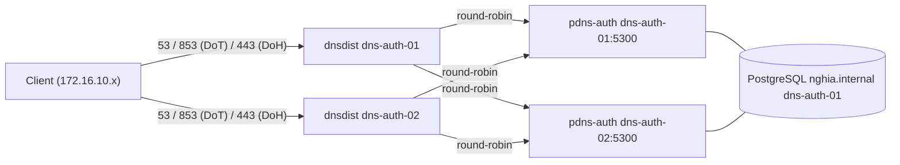

# PowerDNS Authoritative + dnsdist

- PowerDNS Authoritative Server là DNS server mã nguồn mở hiệu năng cao, phục vụ zone nội bộ `nghia.internal`. dnsdist đứng trước làm load balancer, đồng thời terminate DoT (DNS over TLS) và DoH (DNS over HTTPS) cho client.
- Đây là DNS server chính cho toàn bộ mạng nội bộ, triển khai theo mô hình HA 2 node: mỗi node chạy song song dnsdist + PowerDNS Authoritative, dnsdist trên mỗi node load balance query sang cả 2 backend (local và node còn lại). Nếu 1 node down (dnsdist hoặc pdns-auth), client vẫn resolve được qua node kia.
- DNSSEC cho zone này được xử lý ở bài lab riêng, xem [02-powerdns-dnssec.md](02-powerdns-dnssec.md). Việc forward zone nội bộ cho client kèm resolve internet được xử lý ở bài lab riêng, xem [03-powerdns-recursor.md](03-powerdns-recursor.md).

# Prerequisites

- 2 VM Ubuntu 24.04: `dns-auth-01` (`<DNS_AUTH_01_IP>`) và `dns-auth-02` (`<DNS_AUTH_02_IP>`)
- User `ubuntu` có quyền `sudo` trên cả 2 node
- Squid Proxy đã hoạt động — cần để tải package từ PowerDNS official repository
- Port `53` (DNS), `853` (DoT), `443` (DoH) không bị firewall block từ phía client đến cả 2 node
- Port `5300` (pdns-auth backend) mở giữa 2 node với nhau, chỉ cho phép nguồn là IP của node còn lại và `localhost` — pdns-auth không thể dùng port 53 vì port này đã bị dnsdist chiếm trên cùng VM
- Port `5432` (PostgreSQL) mở từ `dns-auth-02` đến `dns-auth-01`

# Diagram



---

# Cài đặt

## Cấu hình proxy cho server

Thực hiện trên cả 2 node. Cần cấu hình proxy để server có thể tải package từ PowerDNS official repository qua Squid.

Thêm vào file `/etc/environment`:

```sh
http_proxy="http://<USERNAME>:<PASSWORD>@<SQUID_IP>:3128"
https_proxy="http://<USERNAME>:<PASSWORD>@<SQUID_IP>:3128"
no_proxy="localhost,127.0.0.1,172.16.10.0/24,192.168.100.0/24"
```

```shell
source /etc/environment
```

## Disable systemd-resolved

Thực hiện trên cả 2 node. `systemd-resolved` mặc định chiếm port 53, cần disable trước khi cài PowerDNS.

```shell
sudo systemctl disable --now systemd-resolved
sudo rm /etc/resolv.conf

# Tạm thời dùng public DNS cho đến khi PowerDNS hoạt động
echo "nameserver 8.8.8.8" | sudo tee /etc/resolv.conf
```

## Thêm PowerDNS official repository

Thực hiện trên cả 2 node. Sử dụng official repository, bản stable mới nhất hiện tại: Authoritative 5.1 và dnsdist 2.1.

```shell
sudo apt install -y curl gnupg

sudo install -d /etc/apt/keyrings
curl https://repo.powerdns.com/FD380FBB-pub.asc | sudo tee /etc/apt/keyrings/auth-51-pub.asc
curl https://repo.powerdns.com/FD380FBB-pub.asc | sudo tee /etc/apt/keyrings/dnsdist-21-pub.asc

sudo chmod 755 /etc/apt/keyrings
chmod 644 /etc/apt/keyrings/auth-51-pub.asc /etc/apt/keyrings/dnsdist-21-pub.asc
sudo chmod 644 /etc/apt/sources.list.d/pdns.list /etc/apt/preferences.d/dnsdist /etc/apt/preferences.d/pdns

sudo tee /etc/apt/sources.list.d/pdns.list <<EOF
deb [signed-by=/etc/apt/keyrings/auth-51-pub.asc] http://repo.powerdns.com/ubuntu noble-auth-51 main
deb [signed-by=/etc/apt/keyrings/dnsdist-21-pub.asc] http://repo.powerdns.com/ubuntu noble-dnsdist-21 main
EOF

# Pin để ưu tiên package từ PowerDNS repo
sudo tee /etc/apt/preferences.d/pdns <<EOF
Package: pdns-server pdns-backend-*
Pin: origin repo.powerdns.com
Pin-Priority: 600
EOF

sudo tee /etc/apt/preferences.d/dnsdist <<EOF
Package: dnsdist
Pin: origin repo.powerdns.com
Pin-Priority: 600
EOF

sudo apt update
```

## Cài đặt PowerDNS Authoritative và dnsdist

Thực hiện trên cả 2 node.

```shell
sudo apt install -y pdns-server pdns-backend-pgsql dnsdist
```

## Cài đặt và cấu hình PostgreSQL

Chỉ thực hiện trên `dns-auth-01`. Cả 2 node dùng chung 1 PostgreSQL instance đặt trên `dns-auth-01` để zone data luôn đồng nhất tuyệt đối giữa 2 backend.

> Bản thân PostgreSQL trong bài lab này chưa có HA (single point of failure ở tầng DB) — nằm ngoài phạm vi bài lab này, chỉ tập trung vào HA ở tầng DNS service.

Cài đặt PostgreSQL bản stable mới nhất (18) qua official PGDG repository:

```shell
sudo apt install -y postgresql-common
sudo /usr/share/postgresql-common/pgdg/apt.postgresql.org.sh -y

sudo apt install -y postgresql-18 postgresql-contrib-18

sudo systemctl enable postgresql
sudo systemctl start postgresql
```

Tạo database user và database cho PowerDNS:

```shell
sudo -u postgres psql <<EOF
CREATE USER pdns WITH PASSWORD '<PDNS_DB_PASSWORD>';
CREATE DATABASE pdns OWNER pdns;
GRANT ALL PRIVILEGES ON DATABASE pdns TO pdns;
\c pdns
GRANT ALL ON SCHEMA public TO pdns;
EOF
```

Import schema vào database:

```shell
sudo -u postgres psql -d pdns \
  -f /usr/share/doc/pdns-backend-pgsql/schema.pgsql.sql

sudo -u postgres psql -d pdns <<EOF
GRANT ALL PRIVILEGES ON ALL TABLES IN SCHEMA public TO pdns;
GRANT ALL PRIVILEGES ON ALL SEQUENCES IN SCHEMA public TO pdns;
GRANT ALL PRIVILEGES ON ALL FUNCTIONS IN SCHEMA public TO pdns;
EOF

sudo -u postgres psql -d pdns -c "\dt"
```

Cho phép `dns-auth-02` kết nối remote vào PostgreSQL. Sửa `/etc/postgresql/18/main/postgresql.conf`:

```conf
listen_addresses = '<DNS_AUTH_01_IP>,127.0.0.1'
```

Thêm vào cuối `/etc/postgresql/18/main/pg_hba.conf`:

```conf
host    pdns    pdns    <DNS_AUTH_02_IP>/32    scram-sha-256
```

```shell
sudo systemctl restart postgresql

# Mở firewall cho dns-auth-02
sudo ufw allow from <DNS_AUTH_02_IP> to any port 5432 proto tcp
```

## Cấu hình PowerDNS Authoritative Server

Thực hiện trên cả 2 node. pdns-auth lắng nghe trên chính IP của node (không phải localhost) ở port `5300` — không dùng port 53 vì dnsdist đã chiếm port này trên cùng VM. dnsdist ở node còn lại cần forward query cross-node sang backend này nên không thể chỉ bind `127.0.0.1`.

Xoá file cấu hình bind mặc định:

```shell
sudo mv /etc/powerdns/pdns.d/bind.conf /etc/powerdns/pdns.d/bind.conf.bk
```

Sửa file `/etc/powerdns/pdns.conf` — trên `dns-auth-01`:

```conf
# Backend — cả 2 node cùng trỏ về PostgreSQL trên dns-auth-01
launch=gpgsql
gpgsql-host=127.0.0.1
gpgsql-port=5432
gpgsql-dbname=pdns
gpgsql-user=pdns
gpgsql-password=<PDNS_DB_PASSWORD>

# Chỉ dnsdist (local + peer node) mới forward vào đây, không expose ra client
# Port 5300 vì port 53 trên host này đã do dnsdist lắng nghe
local-address=<DNS_AUTH_01_IP>
local-port=5300

loglevel=4
log-dns-queries=yes
```

Trên `dns-auth-02`, chỉ khác `gpgsql-host` và `local-address`:

```conf
launch=gpgsql
gpgsql-host=<DNS_AUTH_01_IP>
gpgsql-port=5432
gpgsql-dbname=pdns
gpgsql-user=pdns
gpgsql-password=<PDNS_DB_PASSWORD>

local-address=<DNS_AUTH_02_IP>
local-port=5300

loglevel=4
log-dns-queries=yes
```

Giới hạn firewall cho port 5300 của pdns-auth chỉ nhận từ node còn lại và chính nó — client không được query thẳng vào đây, phải đi qua dnsdist:

```shell
# Trên dns-auth-01
sudo ufw allow from <DNS_AUTH_02_IP> to any port 5300 proto tcp
sudo ufw allow from <DNS_AUTH_02_IP> to any port 5300 proto udp

# Trên dns-auth-02
sudo ufw allow from <DNS_AUTH_01_IP> to any port 5300 proto tcp
sudo ufw allow from <DNS_AUTH_01_IP> to any port 5300 proto udp
```

```shell
sudo systemctl enable pdns
sudo systemctl start pdns

# Kiểm tra port 5300 đang listen trên IP của node — port 53 lúc này thuộc về dnsdist
sudo ss -tulnp | grep -E ':5300|:53'
```

## Tạo zone nghia.internal và DNS records

Chỉ cần chạy 1 lần, trên `dns-auth-01` — vì cả 2 node dùng chung PostgreSQL nên `dns-auth-02` thấy zone ngay lập tức.

```shell
# Tạo zone với 2 nameserver (HA)
sudo pdnsutil create-zone nghia.internal ns1.nghia.internal

# Thêm A record cho 2 nameserver
sudo pdnsutil add-record nghia.internal ns1 A <DNS_AUTH_01_IP>
sudo pdnsutil add-record nghia.internal ns2 A <DNS_AUTH_02_IP>
sudo pdnsutil add-record nghia.internal @ NS ns2.nghia.internal

# Thêm records cho các services đã cài đặt
sudo pdnsutil add-record nghia.internal squid A <SQUID_IP>

# Sửa SOA được tạo mặc định
sudo pdnsutil set-meta nghia.internal SOA-EDIT INCEPTION-INCREMENT

sudo pdnsutil replace-rrset nghia.internal @ SOA \
  "ns1.nghia.internal. hostmaster.nghia.internal. 2026071301 10800 3600 604800 3600"

# Kiểm tra zone
sudo pdnsutil list-zone nghia.internal
```

## Tạo self-signed SSL certificate cho DoT/DoH

Thực hiện trên cả 2 node, mỗi node dùng certificate riêng với SAN là IP của chính nó. Certificate này dùng tạm — sau khi Vault PKI được cài đặt, thay bằng certificate được ký bởi Vault CA.

Ví dụ trên `dns-auth-01` (đổi `<DNS_AUTH_01_IP>` thành `<DNS_AUTH_02_IP>` khi chạy trên node còn lại):

```shell
sudo mkdir -p /etc/dnsdist/ssl

sudo openssl req -x509 -newkey rsa:4096 \
  -keyout /etc/dnsdist/ssl/server.key \
  -out /etc/dnsdist/ssl/server.crt \
  -sha256 -days 365 -nodes \
  -subj "/CN=dns01.nghia.internal" \
  -addext "subjectAltName=DNS:dns01.nghia.internal,IP:<DNS_AUTH_01_IP>"

sudo chown _dnsdist:_dnsdist /etc/dnsdist/ssl/server.key /etc/dnsdist/ssl/server.crt
sudo chmod 600 /etc/dnsdist/ssl/server.key
```

## Cấu hình dnsdist — load balancer + DoT + DoH

Thực hiện trên cả 2 node, cùng nội dung — mỗi dnsdist đều biết cả 2 backend (local và peer) nên vẫn phục vụ được khi 1 backend chết.

Sửa file `/etc/dnsdist/dnsdist.conf`:

```lua
-- Frontend: DNS thường (UDP/TCP 53)
setLocal("0.0.0.0:53")

-- Frontend: DoT — DNS over TLS (RFC 7858)
addTLSLocal("0.0.0.0:853", "/etc/dnsdist/ssl/server.crt", "/etc/dnsdist/ssl/server.key")

-- Frontend: DoH — DNS over HTTPS (RFC 8484)
addDOHLocal("0.0.0.0:443", "/etc/dnsdist/ssl/server.crt", "/etc/dnsdist/ssl/server.key", "/dns-query")

-- Backend pool: pdns-auth trên cả 2 node, lắng nghe port 5300 (port 53 do dnsdist giữ)
newServer({address="<DNS_AUTH_01_IP>:5300", checkName="ns1.nghia.internal.", checkType="A", checkClass="IN"})
newServer({address="<DNS_AUTH_02_IP>:5300", checkName="ns1.nghia.internal.", checkType="A", checkClass="IN"})

-- Load balancing policy — round robin giữa các backend còn sống (health check tự động)
setServerPolicy(roundrobin)
```

> ACL mặc định của dnsdist chỉ chấp nhận query từ các dải RFC1918 (`10.0.0.0/8`, `172.16.0.0/12`, `192.168.0.0/16`) và loopback — nếu subnet client nằm ngoài các dải này, cần thêm `addACL("<CLIENT_SUBNET>")`.

```shell
sudo systemctl enable dnsdist
sudo systemctl start dnsdist

# Kiểm tra port 53, 853, 443
sudo ss -tulnp | grep -E ':53|:853|:443'
```

## Cập nhật DNS cho client

Trỏ client tới cả 2 dnsdist để có redundancy — nếu 1 node down, client tự chuyển sang node còn lại:

```shell
echo "nameserver <DNS_AUTH_01_IP>
nameserver <DNS_AUTH_02_IP>" | sudo tee /etc/resolv.conf
```

## Kiểm tra

Standard DNS:

```shell
dig @<DNS_AUTH_01_IP> ns1.nghia.internal A
dig @<DNS_AUTH_02_IP> squid.nghia.internal A
```

DoT:

```shell
kdig @<DNS_AUTH_01_IP> +tls -k ns1.nghia.internal
```

DoH:

```shell
curl -k -s -H "accept: application/dns-json" \
  "https://<DNS_AUTH_01_IP>/dns-query?name=ns1.nghia.internal&type=A" | jq .
```

Kiểm tra load balancing và HA — tắt pdns-auth trên `dns-auth-02`, query qua dnsdist của `dns-auth-01` vẫn phải trả kết quả đúng (tự động route hết sang `dns-auth-01`):

```shell
# Trên dns-auth-02
sudo systemctl stop pdns

# Từ client
dig @<DNS_AUTH_01_IP> ns1.nghia.internal A
```

## Cập nhật Squid để dùng PowerDNS

Sau khi dnsdist hoạt động trên cả 2 node, cập nhật `dns_nameservers` trong cấu hình Squid tại `/etc/squid/conf.d/debian.conf`:

```conf
dns_nameservers <DNS_AUTH_01_IP> <DNS_AUTH_02_IP>
```

```shell
sudo squid -k reconfigure
```
