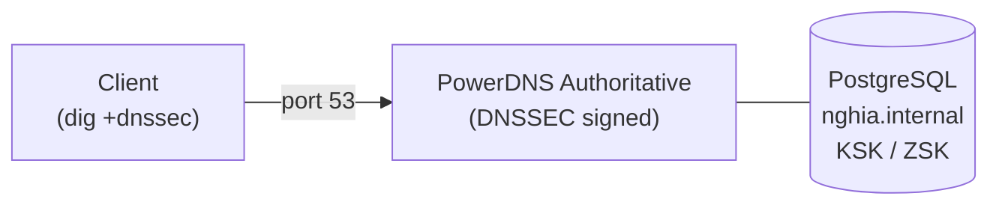

# PowerDNS DNSSEC

- DNSSEC (DNS Security Extensions) bổ sung chữ ký số vào DNS response, cho phép resolver xác thực tính toàn vẹn (integrity) và nguồn gốc (authenticity) của dữ liệu, chống lại tấn công giả mạo/cache poisoning.
- Bài lab này triển khai DNSSEC cho zone `nghia.internal` trên 1 PowerDNS Authoritative Server dùng PostgreSQL làm backend. Phần HA (2 node + dnsdist load balancer) đã được thực hiện ở bài lab trước nên không lặp lại ở đây, xem [01-powerdns-auth-dnsdist.md](01-powerdns-auth-dnsdist.md). Việc validate DNSSEC ở phía resolver được thực hiện ở bài lab sau, xem [03-powerdns-recursor.md](03-powerdns-recursor.md).

# Prerequisites

- Ubuntu 24.04
- User `ubuntu` có quyền `sudo`
- Squid Proxy đã hoạt động — cần để tải package từ PowerDNS official repository
- Port `53` (DNS) không bị firewall block từ phía client đến PowerDNS server

# Diagram



---

# Cài đặt

## Cấu hình proxy cho server

Cần cấu hình proxy để server có thể tải package từ PowerDNS official repository qua Squid.

Thêm vào file `/etc/environment`:

```sh
http_proxy="http://<USERNAME>:<PASSWORD>@<SQUID_IP>:3128"
https_proxy="http://<USERNAME>:<PASSWORD>@<SQUID_IP>:3128"
no_proxy="localhost,127.0.0.1,172.16.10.0/24,192.168.100.0/24"
```

```shell
source /etc/environment
```

## Disable systemd-resolved

`systemd-resolved` mặc định chiếm port 53, cần disable trước khi cài PowerDNS.

```shell
sudo systemctl disable --now systemd-resolved
sudo rm /etc/resolv.conf

# Tạm thời dùng public DNS cho đến khi PowerDNS hoạt động
echo "nameserver 8.8.8.8" | sudo tee /etc/resolv.conf
```

## Thêm PowerDNS official repository

Sử dụng official repository, bản Authoritative stable mới nhất hiện tại (5.1).

```shell
sudo apt install -y curl gnupg

sudo install -d /etc/apt/keyrings
curl https://repo.powerdns.com/FD380FBB-pub.asc | sudo tee /etc/apt/keyrings/auth-51-pub.asc

sudo tee /etc/apt/sources.list.d/pdns.list <<EOF
deb [signed-by=/etc/apt/keyrings/auth-51-pub.asc] http://repo.powerdns.com/ubuntu noble-auth-51 main
EOF

sudo tee /etc/apt/preferences.d/pdns <<EOF
Package: pdns-server pdns-backend-*
Pin: origin repo.powerdns.com
Pin-Priority: 600
EOF

sudo apt update
```

## Cài đặt PowerDNS Authoritative Server

```shell
sudo apt install -y pdns-server pdns-backend-pgsql
```

## Cài đặt và cấu hình PostgreSQL

```shell
sudo apt install -y postgresql-common
sudo /usr/share/postgresql-common/pgdg/apt.postgresql.org.sh -y

sudo apt install -y postgresql-18 postgresql-contrib-18

sudo systemctl enable postgresql
sudo systemctl start postgresql
```

Tạo database user và database cho PowerDNS:

```shell
sudo -u postgres psql <<EOF
CREATE USER pdns WITH PASSWORD '<PDNS_DB_PASSWORD>';
CREATE DATABASE pdns OWNER pdns;
GRANT ALL PRIVILEGES ON DATABASE pdns TO pdns;
\c pdns
GRANT ALL ON SCHEMA public TO pdns;
EOF
```

Import schema vào database:

```shell
sudo -u postgres psql -d pdns \
  -f /usr/share/doc/pdns-backend-pgsql/schema.pgsql.sql

sudo -u postgres psql -d pdns <<EOF
GRANT ALL PRIVILEGES ON ALL TABLES IN SCHEMA public TO pdns;
GRANT ALL PRIVILEGES ON ALL SEQUENCES IN SCHEMA public TO pdns;
GRANT ALL PRIVILEGES ON ALL FUNCTIONS IN SCHEMA public TO pdns;
EOF

sudo -u postgres psql -d pdns -c "\dt"
```

## Cấu hình PowerDNS Authoritative Server

Xoá file cấu hình bind mặc định:

```shell
sudo mv /etc/powerdns/pdns.d/bind.conf /etc/powerdns/pdns.d/bind.conf.bk
```

Sửa file `/etc/powerdns/pdns.conf`:

```conf
# Backend
launch=gpgsql
gpgsql-host=127.0.0.1
gpgsql-port=5432
gpgsql-dbname=pdns
gpgsql-user=pdns
gpgsql-password=<PDNS_DB_PASSWORD>

local-address=0.0.0.0
local-port=53

# DNSSEC — thuật toán ký ECDSA P-256, hỗ trợ DNSSEC ở tầng backend
default-ksk-algorithm=ecdsa256
default-zsk-algorithm=ecdsa256
gpgsql-dnssec=yes

loglevel=4
log-dns-queries=yes
```

```shell
sudo systemctl enable pdns
sudo systemctl start pdns

sudo ss -tulnp | grep :53
```

## Tạo zone nghia.internal và DNS records

```shell
sudo pdnsutil create-zone nghia.internal ns1.nghia.internal

sudo pdnsutil add-record nghia.internal ns1 A <POWERDNS_IP>
sudo pdnsutil add-record nghia.internal squid A <SQUID_IP>

sudo pdnsutil set-meta nghia.internal SOA-EDIT INCEPTION-INCREMENT

sudo pdnsutil replace-rrset nghia.internal @ SOA \
  "ns1.nghia.internal. hostmaster.nghia.internal. 2026071301 10800 3600 604800 3600"

sudo pdnsutil list-zone nghia.internal
```

## Cấu hình DNSSEC cho zone nghia.internal

```shell
# Ký zone — tự động tạo KSK (Key Signing Key) và ZSK (Zone Signing Key)
sudo pdnsutil secure-zone nghia.internal

# Cập nhật NSEC records sau khi ký
sudo pdnsutil rectify-zone nghia.internal

# Kiểm tra trạng thái
sudo pdnsutil show-zone nghia.internal

# Xem DS record — dùng để cấu hình trust anchor cho resolver validate
sudo pdnsutil export-zone-ds nghia.internal
```

Lưu lại output của `export-zone-ds`, sẽ dùng ở bài lab Recursor để cấu hình trust anchor.

> Zone `nghia.internal` là internal zone, không có parent zone để publish DS record lên. Resolver validate DNSSEC thông qua trust anchor được cấu hình thủ công, không qua chain-of-trust từ root zone.

## Kiểm tra

```shell
# Query internal record
dig @<POWERDNS_IP> ns1.nghia.internal A

# Query với DNSSEC — kiểm tra RRSIG record đi kèm response
dig @<POWERDNS_IP> ns1.nghia.internal A +dnssec

# Query DNSKEY của zone
dig @<POWERDNS_IP> nghia.internal DNSKEY +dnssec
```

> Ở bước này response đã có RRSIG nhưng flag `AD` (Authenticated Data) sẽ không xuất hiện vì PowerDNS Authoritative chỉ ký zone, không validate. Việc validate (và thấy flag `AD`) được thực hiện ở tầng resolver, xem [03-powerdns-recursor.md](03-powerdns-recursor.md).
