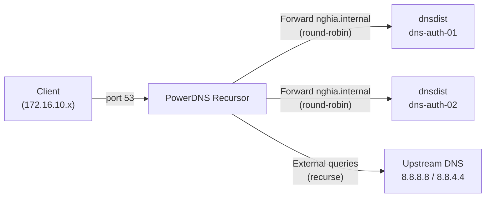

# PowerDNS Recursor

- PowerDNS Recursor là DNS resolver đứng phía client, đóng vai trò điểm DNS duy nhất mà toàn bộ node trong mạng nội bộ trỏ tới — thay vì client trỏ thẳng vào dnsdist hay pdns-auth.
- Recursor forward truy vấn zone `nghia.internal` về dnsdist (2 node HA đã cấu hình ở [01-powerdns-auth-dnsdist.md](01-powerdns-auth-dnsdist.md)), đồng thời resolve các domain internet còn lại thông qua upstream public DNS.
- Zone `nghia.internal` được forward ở đây là zone của bài lab 1 (chưa ký DNSSEC), nên Recursor trong bài lab này chỉ đóng vai trò forward + resolve internet, không cần cấu hình trust anchor.

# Prerequisites

- Ubuntu 24.04
- User `ubuntu` có quyền `sudo`
- Squid Proxy đã hoạt động — cần để tải package từ PowerDNS official repository
- Bài lab [01-powerdns-auth-dnsdist.md](01-powerdns-auth-dnsdist.md) đã hoàn tất, 2 node dnsdist (`<DNS_AUTH_01_IP>`, `<DNS_AUTH_02_IP>`) đang chạy
- Port `53` mở giữa Recursor và cả 2 node dnsdist

# Diagram



---

# Cài đặt

## Cấu hình proxy cho server

Cần cấu hình proxy để server có thể tải package từ PowerDNS official repository qua Squid.

Thêm vào file `/etc/environment`:

```sh
http_proxy="http://<USERNAME>:<PASSWORD>@<SQUID_IP>:3128"
https_proxy="http://<USERNAME>:<PASSWORD>@<SQUID_IP>:3128"
no_proxy="localhost,127.0.0.1,172.16.10.0/24,192.168.100.0/24"
```

```shell
source /etc/environment
```

## Disable systemd-resolved

`systemd-resolved` mặc định chiếm port 53, cần disable trước khi cài PowerDNS Recursor.

```shell
sudo systemctl disable --now systemd-resolved
sudo rm /etc/resolv.conf

# Tạm thời dùng public DNS cho đến khi Recursor hoạt động
echo "nameserver 8.8.8.8" | sudo tee /etc/resolv.conf
```

## Thêm PowerDNS official repository

Sử dụng official repository, bản Recursor stable mới nhất hiện tại (5.4).

```shell
sudo apt install -y curl gnupg

sudo install -d /etc/apt/keyrings
curl https://repo.powerdns.com/FD380FBB-pub.asc | sudo tee /etc/apt/keyrings/rec-54-pub.asc

sudo tee /etc/apt/sources.list.d/pdns.list <<EOF
deb [signed-by=/etc/apt/keyrings/rec-54-pub.asc] http://repo.powerdns.com/ubuntu noble-rec-54 main
EOF

sudo tee /etc/apt/preferences.d/pdns <<EOF
Package: pdns-recursor
Pin: origin repo.powerdns.com
Pin-Priority: 600
EOF

sudo apt update
```

## Cài đặt PowerDNS Recursor

```shell
sudo apt install -y pdns-recursor
```

## Cấu hình PowerDNS Recursor

Sửa file `/etc/powerdns/recursor.yml`:

```yaml
incoming:
  listen:
    - 0.0.0.0:53

recursor:
  # Internal zone → dnsdist (round-robin cả 2 node, tận dụng LB/HA đã có)
  forward_zones:
    - zone: nghia.internal
      forwarders:
        - <DNS_AUTH_01_IP>:53
        - <DNS_AUTH_02_IP>:53
      recurse: false       # Authoritative forward — KHÔNG recurse

  # External/default → upstream resolver
  forward_zones_recurse:
    - zone: "."
      forwarders:
        - 8.8.8.8
        - 8.8.4.4          # fallback, tránh single-point upstream
      recurse: true

logging:
  loglevel: 6          # 0=nothing, 6=info, 9=debug
  common_errors: true
```

```shell
sudo systemctl enable pdns-recursor
sudo systemctl start pdns-recursor

sudo ss -tulnp | grep :53
```

## Cập nhật DNS cho server

Sau khi Recursor hoạt động, trỏ `/etc/resolv.conf` về chính nó:

```shell
echo "nameserver 127.0.0.1" | sudo tee /etc/resolv.conf
```

## Kiểm tra

```shell
# Query internal record — forward qua dnsdist tới pdns-auth
dig @<RECURSOR_IP> ns1.nghia.internal A

# Query internal record với DNSSEC record đi kèm (zone lab 1 chưa ký nên không có RRSIG)
dig @<RECURSOR_IP> ns1.nghia.internal A +dnssec

# Query external domain — resolve qua upstream
dig @<RECURSOR_IP> www.google.com A
```

Kiểm tra HA — tắt dnsdist trên `dns-auth-01`, Recursor vẫn phải forward được sang `dns-auth-02`:

```shell
# Trên dns-auth-01
sudo systemctl stop dnsdist

# Từ client
dig @<RECURSOR_IP> ns1.nghia.internal A
```

## Cập nhật Squid để dùng PowerDNS Recursor

Cập nhật `dns_nameservers` trong cấu hình Squid tại `/etc/squid/conf.d/debian.conf` để trỏ về Recursor thay vì trỏ thẳng vào dnsdist:

```conf
dns_nameservers <RECURSOR_IP>
```

```shell
sudo squid -k reconfigure
```

## Cập nhật DNS cho các client khác trong mạng nội bộ

Toàn bộ node còn lại (Kubernetes, GitLab, Harbor...) trỏ `/etc/resolv.conf` về Recursor thay vì dnsdist trực tiếp:

```shell
echo "nameserver <RECURSOR_IP>" | sudo tee /etc/resolv.conf
```
