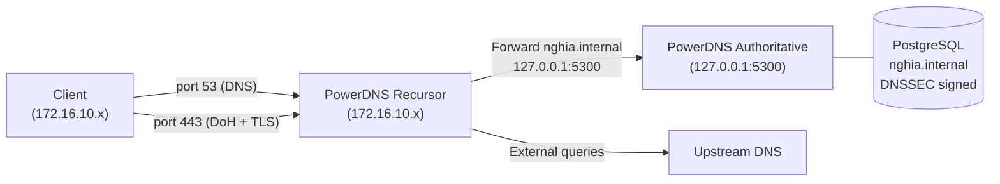

# PowerDNS

PowerDNS là DNS server mã nguồn mở hiệu năng cao, gồm hai thành phần tách biệt: Authoritative Server (phục vụ zone nội bộ) và Recursor (xử lý recursive resolution cho client). Hỗ trợ DNSSEC và DNS over HTTPS (DoH).

Trong hệ thống, PowerDNS là DNS server duy nhất cho toàn bộ mạng nội bộ. Tất cả các node (Kubernetes, GitLab, Harbor, Squid...) dùng PowerDNS Recursor để resolve DNS. Zone `nghia.internal` chứa records cho tất cả internal services và được ký bằng DNSSEC.

# Prerequisites

- Ubuntu 24.04
- User ubuntu có quyền `sudo`
- Squid Proxy đã hoạt động — cần để tải package từ PowerDNS official repository
- Port `53` (DNS) và `443` (DoH) không bị firewall block từ phía client đến PowerDNS server

# Diagram



---

# Cài đặt

## Cấu hình proxy cho server

Cần cấu hình proxy để server có thể tải package từ PowerDNS official repository qua Squid.

Thêm vào file `/etc/environment`:

```sh
http_proxy="http://<USERNAME>:<PASSWORD>@<SQUID_IP>:3128"
https_proxy="http://<USERNAME>:<PASSWORD>@<SQUID_IP>:3128"
no_proxy="localhost,127.0.0.1,172.16.10.0/24,192.168.100.0/24"
```

```shell
source /etc/environment
```

## Disable systemd-resolved

`systemd-resolved` mặc định chiếm port 53, cần disable trước khi cài PowerDNS.

```shell
sudo systemctl disable --now systemd-resolved
sudo rm /etc/resolv.conf

# Tạm thời dùng public DNS cho đến khi PowerDNS hoạt động
echo "nameserver 8.8.8.8" | sudo tee /etc/resolv.conf
```

## Thêm PowerDNS official repository

Sử dụng official repository để đảm bảo version có hỗ trợ DoH (yêu cầu pdns-recursor >= 4.8).

```shell
sudo apt install -y curl gnupg

# Thêm repository cho Authoritative 5.0 và Recursor 5.0
echo "deb [signed-by=/etc/apt/keyrings/auth-50-pub.asc] http://repo.powerdns.com/ubuntu noble-auth-50 main" > /etc/apt/sources.list.d/pdns.list

echo "deb [signed-by=/etc/apt/keyrings/rec-54-pub.asc] http://repo.powerdns.com/ubuntu noble-rec-54 main" > /etc/apt/sources.list.d/pdns.list

# Pin để ưu tiên package từ PowerDNS repo
sudo tee /etc/apt/preferences.d/pdns <<EOF
Package: pdns-*
Pin: origin repo.powerdns.com
Pin-Priority: 600
EOF

sudo tee /etc/apt/preferences.d/rec-54 <<EOF
Package: pdns-*
Pin: origin repo.powerdns.com
Pin-Priority: 600
EOF

# Thêm signing key
sudo install -d /etc/apt/keyrings
curl https://repo.powerdns.com/FD380FBB-pub.asc | sudo tee /etc/apt/keyrings/auth-50-pub.asc

sudo install -d /etc/apt/keyrings
curl https://repo.powerdns.com/FD380FBB-pub.asc | sudo tee /etc/apt/keyrings/rec-54-pub.asc

sudo apt update

```

## Cài đặt PowerDNS

```shell
sudo apt install -y pdns-server pdns-backend-pgsql pdns-recursor
```

## Cài đặt và cấu hình PostgreSQL

```shell
sudo apt install -y postgresql postgresql-contrib

sudo systemctl enable postgresql
sudo systemctl start postgresql
```

Tạo database user và database cho PowerDNS:

```shell
sudo -u postgres psql <<EOF
CREATE USER pdns WITH PASSWORD '<PDNS_DB_PASSWORD>';
CREATE DATABASE pdns OWNER pdns;
GRANT ALL PRIVILEGES ON DATABASE pdns TO pdns;
\c pdns
GRANT ALL ON SCHEMA public TO pdns;
EOF
```

Import schema vào database:

```shell
sudo -u postgres psql -d pdns \
  -f /usr/share/doc/pdns-backend-pgsql/schema.pgsql.sql

# Rồi reassign ownership
sudo -u postgres psql -d pdns <<EOF
GRANT ALL PRIVILEGES ON ALL TABLES IN SCHEMA public TO pdns;
GRANT ALL PRIVILEGES ON ALL SEQUENCES IN SCHEMA public TO pdns;
GRANT ALL PRIVILEGES ON ALL FUNCTIONS IN SCHEMA public TO pdns;
EOF

# Kiểm tra lại
sudo -u postgres psql -d pdns -c "\dt"
```

## Cấu hình PowerDNS Authoritative Server

Authoritative Server chỉ lắng nghe trên localhost port 5300 — client không kết nối trực tiếp, toàn bộ query đi qua Recursor.

Xoá file cấu hình bind mặc định:
```shell
mv /etc/powerdns/pdns.d/bind.conf /etc/powerdns/pdns.d/bind.conf.bk
```

Sửa file `/etc/powerdns/pdns.conf`:

```conf
# Backend
launch=gpgsql
gpgsql-host=127.0.0.1
gpgsql-port=5432
gpgsql-dbname=pdns
gpgsql-user=pdns
gpgsql-password=<PDNS_DB_PASSWORD>

# Chỉ listen trên localhost, Recursor sẽ forward vào đây
local-address=127.0.0.1
local-port=5300

# DNSSEC
default-ksk-algorithm=ecdsa256
default-zsk-algorithm=ecdsa256
gpgsql-dnssec=yes

# Logging
loglevel=4
log-dns-queries=yes
```


```shell
sudo systemctl enable pdns
sudo systemctl start pdns

# Kiểm tra port 5300
sudo ss -ulnp | grep 5300
```

## Tạo zone nghia.internal và DNS records

```shell
# Tạo zone với nameserver
sudo pdnsutil create-zone nghia.internal ns1.nghia.internal

# Thêm A record cho nameserver
sudo pdnsutil add-record nghia.internal ns1 A <POWERDNS_IP>

# Thêm records cho các services đã cài đặt
sudo pdnsutil add-record nghia.internal squid A <SQUID_IP>

# Sửa SOA được tạo mặc định
pdnsutil set-meta nghia.internal SOA-EDIT INCEPTION-INCREMENT

pdnsutil replace-rrset nghia.internal @ SOA \
  "ns1.nghia.internal. hostmaster.nghia.internal. 2026052601 10800 3600 604800 3600"

# Kiểm tra zone
sudo pdnsutil list-zone nghia.internal
```

## Cấu hình DNSSEC cho zone nghia.internal

```shell
# Ký zone — tự động tạo KSK (Key Signing Key) và ZSK (Zone Signing Key)
sudo pdnsutil secure-zone nghia.internal

# Cập nhật NSEC records sau khi ký
sudo pdnsutil rectify-zone nghia.internal

# Kiểm tra trạng thái
sudo pdnsutil show-zone nghia.internal

# Xem DS record — dùng để cấu hình trust anchor cho Recursor
sudo pdnsutil export-zone-ds nghia.internal
```

Lưu lại output của `export-zone-ds`, sẽ dùng ở bước cấu hình Recursor.

> Zone `nghia.internal` là internal zone, không có parent zone để publish DS record lên. Client validate DNSSEC thông qua trust anchor được cấu hình trực tiếp trên Recursor.

## Tạo self-signed SSL certificate cho DoH

Certificate này dùng tạm cho DoH. Sau khi Vault PKI được cài đặt (Phase 2), thay bằng certificate được ký bởi Vault CA.

```shell
sudo mkdir -p /etc/pdns-recursor/ssl

sudo openssl req -x509 -newkey rsa:4096 \
  -keyout /etc/pdns-recursor/ssl/server.key \
  -out /etc/pdns-recursor/ssl/server.crt \
  -sha256 -days 365 -nodes \
  -subj "/CN=dns.nghia.internal" \
  -addext "subjectAltName=DNS:dns.nghia.internal,IP:<POWERDNS_IP>"

sudo chown pdns:pdns /etc/pdns-recursor/ssl/server.key /etc/pdns-recursor/ssl/server.crt
sudo chmod 600 /etc/pdns-recursor/ssl/server.key
```

## Cấu hình PowerDNS Recursor với DoH

Sửa file `/etc/powerdns/recursor.conf`:

```conf
# /etc/pdns-recursor/recursor.yml
# PowerDNS Recursor >= 5.0 — YAML format

incoming:
  listen:
    - 0.0.0.0:53       # IPv4 DNS standard
    # - '[::]:53'      # Uncomment nếu cần IPv6

  # DoH — DNS over HTTPS (RFC 8484)
  # NOTE: incoming.doh_*  chưa có stable YAML key ở 5.0
  # Nếu dùng DoH thực sự, nên đặt trước dnsdist và để recursor bind port nội bộ
  # Tạm giữ comment để track:
  # doh_listen_addresses: ['0.0.0.0:443']
  # doh_server_tls_certificate: /etc/pdns-recursor/ssl/server.crt
  # doh_server_tls_key:         /etc/pdns-recursor/ssl/server.key

recursor:
  # Internal zone → PowerDNS Authoritative
  forward_zones:
    - zone: nghia.internal
      forwarders:
        - 127.0.0.1:5300
      recurse: false       # Authoritative forward — KHÔNG recurse

  # External/default → upstream resolver
  # recurse: true = tương đương forward-zones-recurse
  forward_zones_recurse:
    - zone: "."
      forwarders:
        - 8.8.8.8
        - 8.8.4.4          # Always thêm fallback, đừng single-point upstream
      recurse: true

# ─── DNSSEC ──────────────────────────────────────────────────────────────────
dnssec:
  # 'process' = xử lý DNSSEC records, validate nếu có trust anchor
  # Options: off | process-no-validate | process | log-fail | validate
  validation: off

  # Trust anchor cho nghia.internal (nếu zone đã ký DNSSEC)
  # Lấy từ: pdnsutil export-zone-ds nghia.internal
  # Format YAML: name + dsrecords (algorithm, digest_type, digest, key_tag)
  # Ví dụ khi đã có DS record:
  # trustanchors:
  #   - name: nghia.internal
  #     dsrecords:
  #       - key_tag: 12345
  #         algorithm: 13    # ECDSAP256SHA256
  #         digest_type: 2   # SHA-256
  #         digest: "abcdef1234..."

logging:
  loglevel: 6          # 0=nothing, 6=info, 9=debug
  common_errors: true  # tương đương log-common-errors=yes
```

Thêm trust anchor để Recursor validate DNSSEC cho zone `nghia.internal`:

```shell
# Lấy DS record từ Authoritative
DS_RECORD=$(sudo pdnsutil export-zone-ds nghia.internal | head -1)
echo $DS_RECORD

# Thêm trust anchor vào recursor
# Cú pháp: pdnsutil --config-dir=/etc/pdns-recursor add-ta <zone> <ds-record>
sudo rec_control add-ta nghia.internal "$DS_RECORD"
```

```shell
sudo systemctl enable pdns-recursor
sudo systemctl start pdns-recursor

# Kiểm tra port 53 và 443
sudo ss -tlnp | grep -E '53|443'
sudo ss -ulnp | grep 53
```

## Cập nhật DNS cho server

Sau khi Recursor hoạt động, trỏ `/etc/resolv.conf` về chính nó:

```shell
echo "nameserver 127.0.0.1" | sudo tee /etc/resolv.conf
```

## Kiểm tra

Standard DNS:

```shell
# Query internal record
dig @<POWERDNS_IP> ns1.nghia.internal A

# Query với DNSSEC — kiểm tra AD flag (Authenticated Data)
dig @<POWERDNS_IP> ns1.nghia.internal A +dnssec
```

DoH:

```shell
# Query qua DoH — dùng -k vì đang dùng self-signed certificate
curl -k -s -H "accept: application/dns-json" \
  "https://<POWERDNS_IP>/dns-query?name=ns1.nghia.internal&type=A" | jq .

# Hoặc dùng kdig (từ package knot-dnsutils)
kdig @<POWERDNS_IP> +https +tls-ca=/etc/pdns-recursor/ssl/server.crt ns1.nghia.internal
```

## Cập nhật Squid để dùng PowerDNS

Sau khi PowerDNS hoạt động, cập nhật `dns_nameservers` trong cấu hình Squid tại `/etc/squid/conf.d/debian.conf`:

```conf
dns_nameservers <POWERDNS_IP>
```

```shell
sudo squid -k reconfigure
```
