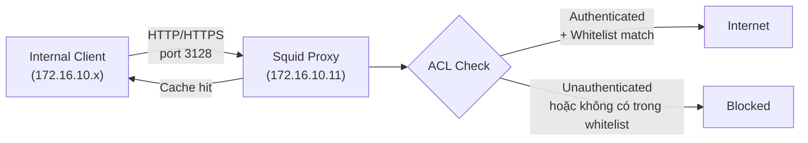

# Squid Proxy

Squid là HTTP/HTTPS forward proxy mã nguồn mở, kiểm soát và lọc toàn bộ outbound traffic từ mạng nội bộ ra internet thông qua whitelist-based ACL và basic authentication.

Trong hệ thống, Squid là thành phần duy nhất có quyền kết nối internet, tất cả các node khác (Kubernetes, GitLab, Harbor...) phải đi qua Squid để tải package, image, hoặc liên lạc với dịch vụ bên ngoài.

# Prerequisites

- Ubuntu 24.04
- User có quyền `sudo`
- Squid VM phải có **hai NIC**: NIC thứ nhất trên isolated network (`172.16.10.0/24`), NIC thứ hai trên routed network (`192.168.100.0/24`) — routed network có Edge Gateway với SNAT ra internet
- Port `3128` không bị firewall block từ phía client đến Squid server

# Diagram



---

# Cài đặt

## Cấu hình network interface

Squid cần hai NIC. Cấu hình netplan cho cả hai interface — tên interface (`eth0`, `eth1`) có thể khác nhau tuỳ VM, kiểm tra bằng `ip link`.

Tạo hoặc sửa file `/etc/netplan/50-cloud-init.yaml`:

```yaml
network:
  version: 2
  ethernets:
    eth0:
      dhcp4: false
      addresses:
        - 172.16.10.11/24
      nameservers:
        addresses:
          - 8.8.8.8    # tạm dùng trước khi PowerDNS hoạt động
    eth1:
      dhcp4: false
      addresses:
        - 192.168.100.11/24
      routes:
        - to: default
          via: 192.168.100.254   # Edge Gateway — route mặc định ra internet
```

```shell
sudo netplan apply
# Kiểm tra route
ip route show
# Phải có: default via 192.168.100.254 dev eth1
```

## Cập nhật hệ thống

```shell
sudo apt update -y && sudo apt upgrade -y
```

## Cài đặt Squid và apache2-utils

`apache2-utils` cung cấp công cụ `htpasswd` để tạo file password cho basic authentication.

```shell
sudo apt install squid apache2-utils -y
```

## Kiểm tra trạng thái và bật autostart

```shell
systemctl status squid
systemctl enable squid
```

## Tạo user cho authentication

```shell
# Tạo file passwd và user đầu tiên (flag -c chỉ dùng một lần)
sudo htpasswd -c /etc/squid/passwd <USERNAME>

# Để thêm user tiếp theo, bỏ flag -c
# sudo htpasswd /etc/squid/passwd <OTHER_USERNAME>

sudo chown proxy:proxy /etc/squid/passwd
sudo chmod 640 /etc/squid/passwd
```

## Cấu hình Squid

Thêm cấu hình vào file `/etc/squid/conf.d/debian.conf`:

```config
http_port 3128
visible_hostname squid-proxy

# Dùng PowerDNS internal sau khi hoàn thành Phase 1
dns_nameservers <POWERDNS_IP>

# --- Authentication ---
auth_param basic program /usr/lib/squid/basic_ncsa_auth /etc/squid/passwd
auth_param basic realm "Squid Proxy - Authenticate to proceed"
auth_param basic credentialsttl 2 hours
auth_param basic casesensitive off
acl authenticated_users proxy_auth REQUIRED

# --- Network ---
acl localnet src 172.16.10.0/24

acl SSL_ports port 443
acl SSL_ports port 8200
acl Safe_ports port 80
acl Safe_ports port 443
acl Safe_ports port 6443
acl Safe_ports port 8080
acl Safe_ports port 8200
acl CONNECT method CONNECT

# --- Whitelist (chỉ cho phép các domain cần thiết) ---
acl allowed_domains dstdomain \
    .ubuntu.com \
    .debian.org \
    .docker.io \
    .ghcr.io \
    .github.com \
    .githubusercontent.com \
    .quay.io \
    .k8s.io \
    .gcr.io \
    .pypi.org \
    .npmjs.com \
    .powerdns.com \
    repo.powerdns.com \
    releases.hashicorp.com \
    apt.releases.hashicorp.com \
    packages.gitlab.com \
    keyserver.ubuntu.com \
    .cdn.teleport.dev \
    cdn.teleport.dev \
    .falcosecurity.github.io \
    .helm.sh \
    .argoproj.github.io \
    .grafana.github.io \
    .prometheus-community.github.io \
    .vmware-tanzu.github.io \
    .grafana.com \
    .pkgs.k8s.io

# --- Blacklist ---
acl social_media dstdomain \
    .facebook.com \
    .instagram.com \
    .tiktok.com \
    .twitter.com \
    .x.com

# --- Access Control ---
http_access deny !Safe_ports
http_access deny CONNECT !SSL_ports
http_access allow localhost manager
http_access deny manager
http_access deny !authenticated_users
http_access deny social_media
http_access allow localnet allowed_domains
http_access deny all

# --- Cache Storage ---
cache_dir ufs /var/spool/squid 2048 16 256
cache_mem 256 MB
maximum_object_size_in_memory 512 KB

acl static_content urlpath_regex -i \
    \.(css|js|jpg|jpeg|png|gif|ico|svg|woff|woff2|ttf|eot)(\?.*)?$

cache allow static_content
cache deny all

# --- Refresh Patterns ---
refresh_pattern ^ftp:                              1440  20%  10080
refresh_pattern ^gopher:                           1440   0%   1440
refresh_pattern -i \.(jpg|jpeg|png|gif|ico|svg)$ 10080  50%  43200 ignore-no-cache
refresh_pattern -i \.(css|js)$                    1440  50%  10080
refresh_pattern -i \.(woff|woff2|ttf|eot)$      43200  80% 129600
refresh_pattern .                                     0  20%   4320

# --- Logging ---
access_log /var/log/squid/access.log squid
cache_log /var/log/squid/cache.log
cache_store_log none

# --- Tuning ---
max_filedescriptors 65536
connect_timeout 30 seconds
read_timeout 60 seconds
request_timeout 60 seconds
```

## Áp dụng cấu hình

```shell
# Kiểm tra syntax config trước
sudo squid -k parse

# Stop service, khởi tạo cache directory, rồi start lại
sudo systemctl stop squid
sudo squid -z
sudo systemctl start squid
```

## Kiểm tra kết nối

```shell
curl -x http://<USERNAME>:<PASSWORD>@<SQUID_IP>:3128 https://example.com -v
```

## Cấu hình proxy cho client Linux

Thêm vào file `/etc/environment` trên các máy client:

```sh
http_proxy="http://<USERNAME>:<PASSWORD>@<SQUID_IP>:3128"
https_proxy="http://<USERNAME>:<PASSWORD>@<SQUID_IP>:3128"
no_proxy="localhost,127.0.0.1,172.16.10.0/24,192.168.100.0/24"
```
