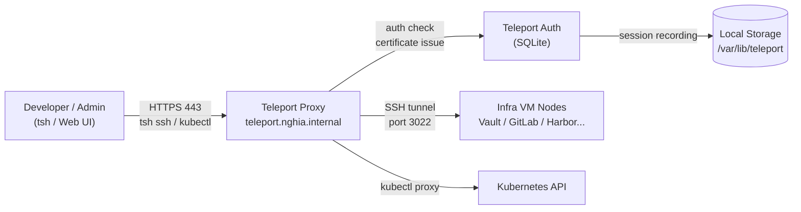

# Teleport

Teleport là nền tảng quản lý privileged access mã nguồn mở, thay thế SSH bastion truyền thống bằng certificate-based authentication, session recording, và audit log tập trung.

Trong hệ thống, Teleport là điểm truy cập duy nhất vào toàn bộ infrastructure — developer và admin SSH vào server qua Teleport thay vì kết nối trực tiếp. Mọi session đều được ghi lại và audit. Teleport cũng proxy `kubectl` vào Kubernetes cluster, loại bỏ nhu cầu expose API server ra ngoài. Tất cả infra VM đều cài Teleport Node agent để đăng ký vào Teleport cluster.

# Prerequisites

- Ubuntu 24.04 (Jump Host VM tại `172.16.10.x`)
- RAM tối thiểu 2GB, disk tối thiểu 20GB (tăng lên nếu lưu session recording lâu dài)
- Squid Proxy đã hoạt động — tải Teleport binary
- Vault PKI đã hoạt động — TLS cert cho `teleport.nghia.internal`
- PowerDNS đã hoạt động — DNS record `teleport.nghia.internal`
- Port `443` và `3022` phải accessible từ các infra VM và dev machine

# Diagram



---

# Cài đặt

## Tải và cài đặt Teleport

Thực hiện trên Jump Host VM — đây là node chạy cả Auth Server và Proxy Server.

```shell
# Tải Teleport binary qua Squid
curl -fL "https://cdn.teleport.dev/teleport-v16.4.0-linux-amd64-bin.tar.gz" \
  -o /tmp/teleport.tar.gz

tar xzf /tmp/teleport.tar.gz -C /tmp/

sudo mv /tmp/teleport/teleport /usr/local/bin/
sudo mv /tmp/teleport/tctl /usr/local/bin/
sudo mv /tmp/teleport/tsh /usr/local/bin/
sudo mv /tmp/teleport/tbot /usr/local/bin/

teleport version
```

## Lấy TLS certificate từ Vault PKI

Thực hiện trên Vault server:

```shell
export VAULT_ADDR="https://vault.nghia.internal:8200"
vault login <ROOT_TOKEN>

vault write -format=json pki_int/issue/nghia-internal \
  common_name="teleport.nghia.internal" \
  alt_names="teleport.nghia.internal" \
  ip_sans="<JUMP_HOST_IP>" \
  ttl=8760h > /tmp/teleport-cert.json

jq -r '.data.certificate' /tmp/teleport-cert.json > /tmp/teleport.nghia.internal.crt
jq -r '.data.private_key' /tmp/teleport-cert.json > /tmp/teleport.nghia.internal.key
jq -r '.data.issuing_ca' /tmp/teleport-cert.json >> /tmp/teleport.nghia.internal.crt

scp /tmp/teleport.nghia.internal.crt <USER>@<JUMP_HOST_IP>:/tmp/
scp /tmp/teleport.nghia.internal.key <USER>@<JUMP_HOST_IP>:/tmp/
```

```shell
# Trên Jump Host
sudo mkdir -p /etc/teleport/certs
sudo mv /tmp/teleport.nghia.internal.crt /etc/teleport/certs/
sudo mv /tmp/teleport.nghia.internal.key /etc/teleport/certs/
sudo chmod 600 /etc/teleport/certs/teleport.nghia.internal.key
```

## Cấu hình Teleport

Tạo file cấu hình `/etc/teleport/teleport.yaml`:

```yaml
teleport:
  nodename: teleport.nghia.internal
  data_dir: /var/lib/teleport
  log:
    output: /var/log/teleport/teleport.log
    severity: INFO

auth_service:
  enabled: true
  listen_addr: 0.0.0.0:3025
  cluster_name: nghia-internal

  # SQLite cho lab — dùng PostgreSQL cho production HA
  storage:
    type: sqlite

  # Token để Node agent và Kubernetes join
  tokens:
    - "node,kube:<JOIN_TOKEN>"

proxy_service:
  enabled: true
  # Proxy nghe HTTPS trên 443 — web UI và tsh
  web_listen_addr: 0.0.0.0:443
  public_addr: teleport.nghia.internal:443

  # SSH proxy cho node
  listen_addr: 0.0.0.0:3023
  tunnel_listen_addr: 0.0.0.0:3024

  https_keypairs:
    - key_file: /etc/teleport/certs/teleport.nghia.internal.key
      cert_file: /etc/teleport/certs/teleport.nghia.internal.crt

  # Kubernetes proxy — kubectl đi qua Teleport
  kube_listen_addr: 0.0.0.0:3026
  kube_public_addr: teleport.nghia.internal:443

ssh_service:
  # Jump Host cũng là một SSH node
  enabled: true
  labels:
    env: infra
    role: jump-host
```

Tạo thư mục và khởi động Teleport:

```shell
sudo mkdir -p /var/lib/teleport /var/log/teleport

# Validate config
sudo teleport configure check --config=/etc/teleport/teleport.yaml

# Tạo systemd service
sudo tee /etc/systemd/system/teleport.service <<EOF
[Unit]
Description=Teleport Service
After=network.target

[Service]
Type=simple
User=root
ExecStart=/usr/local/bin/teleport start --config=/etc/teleport/teleport.yaml
Restart=on-failure
RestartSec=5
LimitNOFILE=65536

[Install]
WantedBy=multi-user.target
EOF

sudo systemctl enable --now teleport
sudo systemctl status teleport
```

## Thêm DNS record

```shell
sudo pdnsutil add-record nghia.internal teleport A <JUMP_HOST_IP>
sudo pdnsutil rectify-zone nghia.internal

dig @<POWERDNS_IP> teleport.nghia.internal A
```

---

## Tạo admin user

```shell
# Tạo user admin với role editor và access
sudo tctl users add admin \
  --roles=editor,access \
  --logins=root,ubuntu

# Lệnh trên in ra một invite URL — mở trên browser để set password
# URL dạng: https://teleport.nghia.internal/web/invite/<TOKEN>
```

Sau khi set password, đăng nhập bằng tsh:

```shell
tsh login --proxy=teleport.nghia.internal --user=admin

# Kiểm tra
tsh status
```

---

## Cài đặt Teleport Node agent trên Infra VMs

Teleport Node agent cài trên mỗi infra VM để đăng ký SSH access qua Teleport. Thực hiện trên từng VM: Vault, GitLab, Harbor, PowerDNS, NTPSec, aptly, GitLab Runner.

```shell
# Tải Teleport binary (chỉ cần teleport và tsh)
curl -fL "https://cdn.teleport.dev/teleport-v16.4.0-linux-amd64-bin.tar.gz" \
  -o /tmp/teleport.tar.gz

tar xzf /tmp/teleport.tar.gz -C /tmp/
sudo mv /tmp/teleport/teleport /usr/local/bin/
```

Tạo file cấu hình Node agent `/etc/teleport/teleport.yaml` trên mỗi VM (thay `<NODE_NAME>`, `<VM_ROLE>`):

```yaml
teleport:
  nodename: <NODE_NAME>.nghia.internal
  data_dir: /var/lib/teleport
  log:
    output: stderr
    severity: INFO
  # Teleport v13+ dùng proxy_server thay cho auth_servers
  proxy_server: teleport.nghia.internal:443

auth_service:
  enabled: false

proxy_service:
  enabled: false

ssh_service:
  enabled: true
  listen_addr: 0.0.0.0:3022
  labels:
    env: infra
    role: <VM_ROLE>

# Join token — lấy từ lệnh tctl tokens add
join_params:
  token_name: "<JOIN_TOKEN>"
  method: token
```

Ví dụ label cho từng VM:

| VM | nodename | role |
|---|---|---|
| Vault | `vault.nghia.internal` | `vault` |
| GitLab | `gitlab.nghia.internal` | `gitlab` |
| Harbor | `harbor.nghia.internal` | `harbor` |
| PowerDNS | `powerdns.nghia.internal` | `powerdns` |
| aptly | `aptly.nghia.internal` | `aptly` |

```shell
sudo mkdir -p /var/lib/teleport

sudo tee /etc/systemd/system/teleport.service <<EOF
[Unit]
Description=Teleport Service
After=network.target

[Service]
Type=simple
User=root
ExecStart=/usr/local/bin/teleport start --config=/etc/teleport/teleport.yaml
Restart=on-failure
RestartSec=5
LimitNOFILE=65536

[Install]
WantedBy=multi-user.target
EOF

sudo systemctl enable --now teleport
```

Kiểm tra node đã join Teleport cluster:

```shell
# Trên Jump Host
sudo tctl nodes ls
```

---

## Đăng ký Kubernetes cluster

Teleport proxy `kubectl` vào cluster — admin dùng `tsh kube login` thay vì expose Kubernetes API server ra ngoài.

Pre-load Teleport image vào Harbor **trước** khi deploy Helm chart:

```shell
docker pull public.ecr.aws/gravitational/teleport:16.4.0
docker tag public.ecr.aws/gravitational/teleport:16.4.0 \
  registry.nghia.internal/infra/teleport:16.4.0
docker push registry.nghia.internal/infra/teleport:16.4.0
```

Trên Jump Host có kubeconfig:

```shell
# Tạo Kubernetes join token
sudo tctl tokens add --type=kube --ttl=1h

# Thêm Teleport Helm repo
helm repo add teleport https://charts.releases.teleport.dev
helm repo update

helm install teleport-agent teleport/teleport-kube-agent \
  --namespace teleport-agent \
  --create-namespace \
  --set roles="kube" \
  --set proxyAddr="teleport.nghia.internal:443" \
  --set authToken="<JOIN_TOKEN>" \
  --set kubeClusterName="nghia-internal" \
  --set image.repository="registry.nghia.internal/infra/teleport" \
  --set image.tag="16.4.0"
```

Kiểm tra cluster đã đăng ký:

```shell
sudo tctl kube ls
```

---

## Cấu hình RBAC

Tạo role cho infra admin — truy cập tất cả node và Kubernetes cluster:

```shell
sudo tctl create -f - <<EOF
kind: role
version: v7
metadata:
  name: infra-admin
spec:
  allow:
    logins:
      - root
      - ubuntu
    node_labels:
      env: infra
    kubernetes_groups:
      - system:masters
    kubernetes_labels:
      "*": "*"
    rules:
      - resources:
          - event
          - session
        verbs:
          - list
          - read
EOF
```

Tạo role cho developer — chỉ truy cập Kubernetes, không SSH vào server:

```shell
sudo tctl create -f - <<EOF
kind: role
version: v7
metadata:
  name: developer
spec:
  allow:
    kubernetes_groups:
      - developers
    kubernetes_labels:
      "*": "*"
  deny:
    node_labels:
      "*": "*"
EOF
```

Gán role cho user:

```shell
# Gán role infra-admin cho admin user
sudo tctl users update admin --set-roles=infra-admin,editor,access
```

---

## Sử dụng Teleport

### SSH vào infra VM

```shell
# Login vào Teleport
tsh login --proxy=teleport.nghia.internal --user=admin

# Xem danh sách node
tsh ls

# SSH vào Vault server
tsh ssh root@vault.nghia.internal

# SSH vào GitLab server
tsh ssh root@gitlab.nghia.internal
```

### Truy cập Kubernetes

```shell
# Login và lấy kubeconfig
tsh kube login nghia-internal

# Xác nhận context
kubectl config current-context

# Chạy kubectl bình thường — Teleport proxy ngầm
kubectl get pods -A
```

### Xem session recording

Truy cập Teleport Web UI tại `https://teleport.nghia.internal` → **Activity** → **Session Recordings** để replay lại mọi SSH session và kubectl exec đã thực hiện.

Hoặc qua CLI:

```shell
# Liệt kê session đã ghi
tsh recordings ls

# Play lại session
tsh play <SESSION_ID>
```

---

## Gia hạn TLS certificate

TLS cert từ Vault PKI có TTL 1 năm. Khi gần hết hạn, lấy cert mới và reload:

```shell
# Lấy cert mới từ Vault
vault write -format=json pki_int/issue/nghia-internal \
  common_name="teleport.nghia.internal" \
  ttl=8760h > /tmp/teleport-cert-new.json

jq -r '.data.certificate' /tmp/teleport-cert-new.json > /etc/teleport/certs/teleport.nghia.internal.crt
jq -r '.data.private_key' /tmp/teleport-cert-new.json > /etc/teleport/certs/teleport.nghia.internal.key
jq -r '.data.issuing_ca' /tmp/teleport-cert-new.json >> /etc/teleport/certs/teleport.nghia.internal.crt

sudo systemctl reload teleport
```
