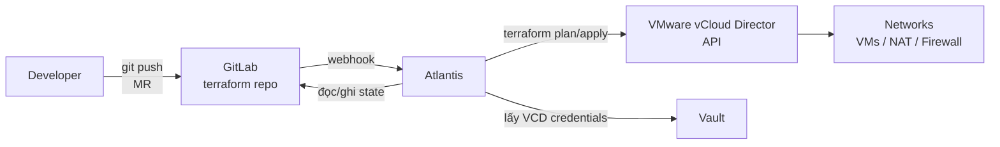

# Terraform

Terraform là Infrastructure as Code tool, định nghĩa toàn bộ infrastructure dưới dạng HCL file — VM, network, firewall rule, NAT rule — và quản lý lifecycle qua `plan/apply`.

Trong hệ thống, Terraform provision toàn bộ infrastructure trên VMware vCloud Director: isolated network, routed network, Edge Gateway, NAT rule, và các VM. Terraform state lưu trên GitLab HTTP backend. Credentials lấy từ Vault. Mọi thay đổi infrastructure đều đi qua Merge Request trên GitLab và được Atlantis tự động plan/apply — không ai chạy `terraform apply` thủ công.

# Prerequisites

- Jump Host Ubuntu 24.04 đã hoạt động
- Squid Proxy đã hoạt động — tải Terraform binary
- Vault đã hoạt động — lưu VCD credentials
- GitLab đã hoạt động — lưu Terraform code và state
- Atlantis đã cài — GitOps workflow cho plan/apply
- VMware vCloud Director account có quyền manage VDC

# Diagram



---

# Cài đặt

## Cài đặt Terraform trên Jump Host

```shell
# Tải Terraform binary qua Squid
curl -fL "https://releases.hashicorp.com/terraform/1.9.8/terraform_1.9.8_linux_amd64.zip" \
  -o /tmp/terraform.zip

sudo apt install -y unzip
unzip /tmp/terraform.zip -d /tmp/
sudo mv /tmp/terraform /usr/local/bin/
sudo chmod +x /usr/local/bin/terraform

terraform version
```

## Cấu trúc Terraform Repository

Clone hoặc tạo mới Terraform repo trên GitLab:

```shell
git clone https://gitlab.nghia.internal/<GROUP>/terraform.git /opt/terraform
cd /opt/terraform
```

Cấu trúc thư mục:

```
terraform/
├── .atlantis.yaml
├── .gitignore
├── environments/
│   └── production/
│       ├── network/            # Network và Edge Gateway
│       │   ├── main.tf
│       │   ├── variables.tf
│       │   ├── outputs.tf
│       │   ├── terraform.tfvars
│       │   └── backend.tf
│       └── compute/            # VMs và vApps
│           ├── main.tf
│           ├── variables.tf
│           ├── outputs.tf
│           ├── terraform.tfvars
│           └── backend.tf
└── modules/
    ├── vm/                     # Reusable VM module
    └── network/                # Reusable network module
```

Tạo `.gitignore`:

```
# Thư mục provider cache — không commit
.terraform/
# State file local — state lưu trên GitLab backend, không commit local
*.tfstate
*.tfstate.backup
# tfvars có credentials — dùng biến môi trường thay
*.tfvars.local
crash.log
# .terraform.lock.hcl KHÔNG có trong gitignore — phải commit để đảm bảo reproducible builds
```

## Cấu hình Terraform Provider Mirror cho air-gap

Trong môi trường air-gap, `terraform init` không thể download provider từ `registry.terraform.io`. Cần tạo local mirror trước:

```shell
# Thực hiện trên Jump Host có kết nối qua Squid proxy
mkdir -p /opt/terraform-providers

# Download provider vào thư mục mirror
terraform providers mirror \
  -platform=linux_amd64 \
  /opt/terraform-providers

# Lệnh này cần file backend.tf và main.tf đã có provider block
# Chạy từ thư mục environments/production/network hoặc compute
```

Cấu hình Terraform dùng local mirror — tạo file `~/.terraformrc` trên Jump Host:

```hcl
provider_installation {
  filesystem_mirror {
    path    = "/opt/terraform-providers"
    include = ["registry.terraform.io/*/*"]
  }
  direct {
    exclude = ["registry.terraform.io/*/*"]
  }
}
```

Đối với Atlantis container (cũng cần provider), mount `/opt/terraform-providers` vào pod hoặc bake vào image. Cách đơn giản nhất là thêm vào Dockerfile của Atlantis custom image:

```dockerfile
FROM ghcr.io/runatlantis/atlantis:v0.30.0
COPY terraform /usr/local/bin/terraform
COPY terraform-providers /opt/terraform-providers
COPY terraformrc /root/.terraformrc
RUN chmod +x /usr/local/bin/terraform
```

## Lưu VCD Credentials vào Vault

```shell
vault kv put secret/terraform/vcd \
  url="https://vcloud.nghia.internal" \
  user="<VCD_USER>@<VCD_ORG>" \
  password="<VCD_PASSWORD>" \
  org="<VCD_ORG>" \
  vdc="<VCD_VDC_NAME>"
```

---

## Cấu hình Provider và Backend

### `environments/production/network/backend.tf`

```hcl
terraform {
  required_version = ">= 1.9"

  required_providers {
    vcd = {
      source  = "vmware/vcd"
      version = "~> 3.14"
    }
  }

  backend "http" {
    address        = "https://gitlab.nghia.internal/api/v4/projects/<PROJECT_ID>/terraform/state/network"
    lock_address   = "https://gitlab.nghia.internal/api/v4/projects/<PROJECT_ID>/terraform/state/network/lock"
    unlock_address = "https://gitlab.nghia.internal/api/v4/projects/<PROJECT_ID>/terraform/state/network/lock"
    username       = "atlantis-bot"
    password       = "<ATLANTIS_BOT_TOKEN>"
    lock_method    = "POST"
    unlock_method  = "DELETE"
    retry_wait_min = 5
  }
}
```

### `environments/production/network/variables.tf`

```hcl
variable "vcd_url" {
  description = "vCloud Director API URL"
  type        = string
}

variable "vcd_user" {
  description = "vCloud Director user"
  type        = string
}

variable "vcd_password" {
  description = "vCloud Director password"
  type        = string
  sensitive   = true
}

variable "vcd_org" {
  description = "vCloud Director Organization"
  type        = string
}

variable "vcd_vdc" {
  description = "vCloud Director Virtual Datacenter"
  type        = string
}
```

### `environments/production/network/main.tf`

```hcl
provider "vcd" {
  url                  = var.vcd_url
  user                 = var.vcd_user
  password             = var.vcd_password
  org                  = var.vcd_org
  vdc                  = var.vcd_vdc
  allow_unverified_ssl = false
  max_retry_timeout    = 60
}

# Isolated network — internal VMs (172.16.10.0/24)
resource "vcd_network_isolated_v2" "internal" {
  org  = var.vcd_org
  vdc  = var.vcd_vdc
  name = "net-isolated-internal"

  gateway       = "172.16.10.254"
  prefix_length = 24

  static_ip_pool {
    start_address = "172.16.10.10"
    end_address   = "172.16.10.100"
  }
}

# Routed network — kết nối với Edge Gateway (192.168.100.0/24)
resource "vcd_network_routed_v2" "routed" {
  org             = var.vcd_org
  vdc             = var.vcd_vdc
  name            = "net-routed-external"
  edge_gateway_id = data.vcd_nsxt_edgegateway.edge_gw.id

  gateway       = "192.168.100.254"
  prefix_length = 24

  static_ip_pool {
    start_address = "192.168.100.10"
    end_address   = "192.168.100.50"
  }
}

# Data source — Edge Gateway đã tồn tại trên VCD
data "vcd_nsxt_edgegateway" "edge_gw" {
  org  = var.vcd_org
  vdc  = var.vcd_vdc
  name = "<EDGE_GATEWAY_NAME>"
}

# SNAT rule — cho phép isolated network đi ra internet qua Squid
resource "vcd_nsxt_nat_rule" "squid_snat" {
  org             = var.vcd_org
  edge_gateway_id = data.vcd_nsxt_edgegateway.edge_gw.id

  name      = "snat-routed-to-internet"
  rule_type = "SNAT"

  external_address = "<PUBLIC_IP>"
  internal_address = "192.168.100.0/24"

  logging = false
}
```

### `environments/production/network/terraform.tfvars`

Credentials inject bởi Atlantis từ Vault — không commit file này chứa secret. Tạo `terraform.tfvars` chỉ với các variable không nhạy cảm:

```hcl
vcd_org = "<VCD_ORG>"
vcd_vdc = "<VCD_VDC_NAME>"
vcd_url = "https://vcloud.nghia.internal"
# vcd_user và vcd_password được inject từ Vault qua TF_VAR_ environment variable
```

---

## Cấu hình Compute — VMs

### `environments/production/compute/main.tf`

```hcl
provider "vcd" {
  url                  = var.vcd_url
  user                 = var.vcd_user
  password             = var.vcd_password
  org                  = var.vcd_org
  vdc                  = var.vcd_vdc
  allow_unverified_ssl = false
}

# Data source lấy network đã tạo ở module network
data "vcd_network_isolated_v2" "internal" {
  org  = var.vcd_org
  vdc  = var.vcd_vdc
  name = "net-isolated-internal"
}

data "vcd_network_routed_v2" "routed" {
  org  = var.vcd_org
  vdc  = var.vcd_vdc
  name = "net-routed-external"
}

# Data source — catalog template Ubuntu 24.04
data "vcd_catalog" "internal" {
  org  = var.vcd_org
  name = "catalog-internal"
}

data "vcd_catalog_vapp_template" "ubuntu2404" {
  org        = var.vcd_org
  catalog_id = data.vcd_catalog.internal.id
  name       = "ubuntu-24.04-template"
}

# vApp chứa các infra VMs
resource "vcd_vapp" "infra" {
  org  = var.vcd_org
  vdc  = var.vcd_vdc
  name = "vapp-infra"

  network {
    type               = "org"
    name               = data.vcd_network_isolated_v2.internal.name
    is_primary         = true
    ip_allocation_mode = "POOL"
  }
}

# Jump Host VM
resource "vcd_vapp_vm" "jumphost" {
  org       = var.vcd_org
  vdc       = var.vcd_vdc
  vapp_name = vcd_vapp.infra.name
  name      = "jumphost"

  vapp_template_id = data.vcd_catalog_vapp_template.ubuntu2404.id

  cpus   = 2
  memory = 2048

  network {
    type               = "org"
    name               = data.vcd_network_isolated_v2.internal.name
    ip_allocation_mode = "MANUAL"
    ip                 = "172.16.10.10"
    is_primary         = true
  }

  customization {
    enabled                    = true
    allow_local_admin_password = true
    auto_generate_password     = false
    admin_password             = "<VM_PASSWORD>"
    hostname                   = "jumphost"
  }
}

# Squid VM — dual-homed: isolated + routed network
resource "vcd_vapp_vm" "squid" {
  org       = var.vcd_org
  vdc       = var.vcd_vdc
  vapp_name = vcd_vapp.infra.name
  name      = "squid"

  vapp_template_id = data.vcd_catalog_vapp_template.ubuntu2404.id

  cpus   = 2
  memory = 2048

  network {
    type               = "org"
    name               = data.vcd_network_isolated_v2.internal.name
    ip_allocation_mode = "MANUAL"
    ip                 = "172.16.10.11"
    is_primary         = true
  }

  network {
    type               = "org"
    name               = data.vcd_network_routed_v2.routed.name
    ip_allocation_mode = "MANUAL"
    ip                 = "192.168.100.11"
  }

  customization {
    enabled                    = true
    allow_local_admin_password = true
    auto_generate_password     = false
    admin_password             = "<VM_PASSWORD>"
    hostname                   = "squid"
  }
}

# PowerDNS VM
resource "vcd_vapp_vm" "powerdns" {
  org       = var.vcd_org
  vdc       = var.vcd_vdc
  vapp_name = vcd_vapp.infra.name
  name      = "powerdns"

  vapp_template_id = data.vcd_catalog_vapp_template.ubuntu2404.id

  cpus   = 2
  memory = 2048

  network {
    type               = "org"
    name               = data.vcd_network_isolated_v2.internal.name
    ip_allocation_mode = "MANUAL"
    ip                 = "172.16.10.12"
    is_primary         = true
  }

  customization {
    enabled                    = true
    allow_local_admin_password = true
    auto_generate_password     = false
    admin_password             = "<VM_PASSWORD>"
    hostname                   = "powerdns"
  }
}

# NTPSec VM — cần NIC thứ hai trên routed network để sync NTP ra internet
resource "vcd_vapp_vm" "ntpsec" {
  org       = var.vcd_org
  vdc       = var.vcd_vdc
  vapp_name = vcd_vapp.infra.name
  name      = "ntpsec"

  vapp_template_id = data.vcd_catalog_vapp_template.ubuntu2404.id

  cpus   = 2
  memory = 1024

  network {
    type               = "org"
    name               = data.vcd_network_isolated_v2.internal.name
    ip_allocation_mode = "MANUAL"
    ip                 = "172.16.10.13"
    is_primary         = true
  }

  network {
    type               = "org"
    name               = data.vcd_network_routed_v2.routed.name
    ip_allocation_mode = "MANUAL"
    ip                 = "192.168.100.13"
  }

  customization {
    enabled                    = true
    allow_local_admin_password = true
    auto_generate_password     = false
    admin_password             = "<VM_PASSWORD>"
    hostname                   = "ntpsec"
  }
}

# aptly VM — APT package mirror
resource "vcd_vapp_vm" "aptly" {
  org       = var.vcd_org
  vdc       = var.vcd_vdc
  vapp_name = vcd_vapp.infra.name
  name      = "aptly"

  vapp_template_id = data.vcd_catalog_vapp_template.ubuntu2404.id

  cpus   = 2
  memory = 4096

  network {
    type               = "org"
    name               = data.vcd_network_isolated_v2.internal.name
    ip_allocation_mode = "MANUAL"
    ip                 = "172.16.10.14"
    is_primary         = true
  }

  customization {
    enabled                    = true
    allow_local_admin_password = true
    auto_generate_password     = false
    admin_password             = "<VM_PASSWORD>"
    hostname                   = "aptly"
  }
}

# Vault VM
resource "vcd_vapp_vm" "vault" {
  org       = var.vcd_org
  vdc       = var.vcd_vdc
  vapp_name = vcd_vapp.infra.name
  name      = "vault"

  vapp_template_id = data.vcd_catalog_vapp_template.ubuntu2404.id

  cpus   = 2
  memory = 4096

  network {
    type               = "org"
    name               = data.vcd_network_isolated_v2.internal.name
    ip_allocation_mode = "MANUAL"
    ip                 = "172.16.10.15"
    is_primary         = true
  }

  customization {
    enabled                    = true
    allow_local_admin_password = true
    auto_generate_password     = false
    admin_password             = "<VM_PASSWORD>"
    hostname                   = "vault"
  }
}

# GitLab VM
resource "vcd_vapp_vm" "gitlab" {
  org       = var.vcd_org
  vdc       = var.vcd_vdc
  vapp_name = vcd_vapp.infra.name
  name      = "gitlab"

  vapp_template_id = data.vcd_catalog_vapp_template.ubuntu2404.id

  cpus   = 4
  memory = 8192

  network {
    type               = "org"
    name               = data.vcd_network_isolated_v2.internal.name
    ip_allocation_mode = "MANUAL"
    ip                 = "172.16.10.16"
    is_primary         = true
  }

  customization {
    enabled                    = true
    allow_local_admin_password = true
    auto_generate_password     = false
    admin_password             = "<VM_PASSWORD>"
    hostname                   = "gitlab"
  }
}

# Harbor VM
resource "vcd_vapp_vm" "harbor" {
  org       = var.vcd_org
  vdc       = var.vcd_vdc
  vapp_name = vcd_vapp.infra.name
  name      = "harbor"

  vapp_template_id = data.vcd_catalog_vapp_template.ubuntu2404.id

  cpus   = 4
  memory = 8192

  network {
    type               = "org"
    name               = data.vcd_network_isolated_v2.internal.name
    ip_allocation_mode = "MANUAL"
    ip                 = "172.16.10.17"
    is_primary         = true
  }

  customization {
    enabled                    = true
    allow_local_admin_password = true
    auto_generate_password     = false
    admin_password             = "<VM_PASSWORD>"
    hostname                   = "harbor"
  }
}

# HAProxy VM — load balancer cho Kubernetes API server
resource "vcd_vapp_vm" "haproxy" {
  org       = var.vcd_org
  vdc       = var.vcd_vdc
  vapp_name = vcd_vapp.infra.name
  name      = "haproxy"

  vapp_template_id = data.vcd_catalog_vapp_template.ubuntu2404.id

  cpus   = 2
  memory = 2048

  network {
    type               = "org"
    name               = data.vcd_network_isolated_v2.internal.name
    ip_allocation_mode = "MANUAL"
    ip                 = "172.16.10.20"
    is_primary         = true
  }

  customization {
    enabled                    = true
    allow_local_admin_password = true
    auto_generate_password     = false
    admin_password             = "<VM_PASSWORD>"
    hostname                   = "haproxy"
  }
}

# Kubernetes node — dùng for_each để tạo nhiều node
locals {
  k8s_control_planes = {
    "k8s-cp1" = { ip = "172.16.10.21", cpus = 4, memory = 8192 }
    "k8s-cp2" = { ip = "172.16.10.22", cpus = 4, memory = 8192 }
    "k8s-cp3" = { ip = "172.16.10.23", cpus = 4, memory = 8192 }
  }
  k8s_workers = {
    "k8s-w1" = { ip = "172.16.10.31", cpus = 8, memory = 16384 }
    "k8s-w2" = { ip = "172.16.10.32", cpus = 8, memory = 16384 }
    "k8s-w3" = { ip = "172.16.10.33", cpus = 8, memory = 16384 }
  }
}

resource "vcd_vapp_vm" "k8s_cp" {
  for_each = local.k8s_control_planes

  org       = var.vcd_org
  vdc       = var.vcd_vdc
  vapp_name = vcd_vapp.infra.name
  name      = each.key

  vapp_template_id = data.vcd_catalog_vapp_template.ubuntu2404.id

  cpus   = each.value.cpus
  memory = each.value.memory

  network {
    type               = "org"
    name               = data.vcd_network_isolated_v2.internal.name
    ip_allocation_mode = "MANUAL"
    ip                 = each.value.ip
    is_primary         = true
  }

  customization {
    enabled                    = true
    allow_local_admin_password = true
    auto_generate_password     = false
    admin_password             = "<VM_PASSWORD>"
    hostname                   = each.key
  }
}

resource "vcd_vapp_vm" "k8s_worker" {
  for_each = local.k8s_workers

  org       = var.vcd_org
  vdc       = var.vcd_vdc
  vapp_name = vcd_vapp.infra.name
  name      = each.key

  vapp_template_id = data.vcd_catalog_vapp_template.ubuntu2404.id

  cpus   = each.value.cpus
  memory = each.value.memory

  # Kubernetes worker cần disk thứ hai cho Longhorn
  override_template_disk {
    bus_type    = "paravirtual"
    size_in_mb  = 51200
    bus_number  = 0
    unit_number = 0
  }

  disk {
    name        = "longhorn-${each.key}"
    bus_number  = 0
    unit_number = 1
  }

  network {
    type               = "org"
    name               = data.vcd_network_isolated_v2.internal.name
    ip_allocation_mode = "MANUAL"
    ip                 = each.value.ip
    is_primary         = true
  }

  customization {
    enabled                    = true
    allow_local_admin_password = true
    auto_generate_password     = false
    admin_password             = "<VM_PASSWORD>"
    hostname                   = each.key
  }
}
```

---

## Import hạ tầng hiện tại

Nếu infrastructure đã được tạo thủ công trên VCD trước khi có Terraform, dùng `terraform import` để đưa resource hiện tại vào Terraform state mà không recreate.

Quy trình import:
- Viết resource block trong HCL mô tả resource muốn import
- Chạy `terraform import` với resource address và import ID từ VCD
- Chạy `terraform plan` để xem drift giữa HCL và thực tế
- Điều chỉnh HCL cho đến khi `terraform plan` báo "No changes"

### Khởi tạo Terraform và backend

```shell
cd /opt/terraform/environments/production/network

export TF_VAR_vcd_user="<VCD_USER>@<VCD_ORG>"
export TF_VAR_vcd_password="<VCD_PASSWORD>"

terraform init
```

### Import Networks

Format import ID cho VCD network: `<org>.<vdc>.<network_name>`

```shell
# Import isolated network
terraform import \
  vcd_network_isolated_v2.internal \
  "<VCD_ORG>.<VCD_VDC>.net-isolated-internal"

# Import routed network
terraform import \
  vcd_network_routed_v2.routed \
  "<VCD_ORG>.<VCD_VDC>.net-routed-external"
```

### Import NAT Rules

Format import ID: `<org>.<vdc>.<edge_gateway_name>.<rule_name>`

```shell
terraform import \
  vcd_nsxt_nat_rule.squid_snat \
  "<VCD_ORG>.<VCD_VDC>.<EDGE_GATEWAY_NAME>.snat-routed-to-internet"
```

### Import vApp và VMs

Format import ID cho vApp: `<org>.<vdc>.<vapp_name>`
Format import ID cho VM: `<org>.<vdc>.<vapp_name>.<vm_name>`

```shell
cd /opt/terraform/environments/production/compute

terraform init

# Import vApp
terraform import \
  vcd_vapp.infra \
  "<VCD_ORG>.<VCD_VDC>.vapp-infra"

# Import từng VM
terraform import \
  vcd_vapp_vm.jumphost \
  "<VCD_ORG>.<VCD_VDC>.vapp-infra.jumphost"

terraform import \
  vcd_vapp_vm.squid \
  "<VCD_ORG>.<VCD_VDC>.vapp-infra.squid"

terraform import \
  vcd_vapp_vm.powerdns \
  "<VCD_ORG>.<VCD_VDC>.vapp-infra.powerdns"

terraform import \
  vcd_vapp_vm.ntpsec \
  "<VCD_ORG>.<VCD_VDC>.vapp-infra.ntpsec"

terraform import \
  vcd_vapp_vm.aptly \
  "<VCD_ORG>.<VCD_VDC>.vapp-infra.aptly"

terraform import \
  vcd_vapp_vm.vault \
  "<VCD_ORG>.<VCD_VDC>.vapp-infra.vault"

terraform import \
  vcd_vapp_vm.gitlab \
  "<VCD_ORG>.<VCD_VDC>.vapp-infra.gitlab"

terraform import \
  vcd_vapp_vm.harbor \
  "<VCD_ORG>.<VCD_VDC>.vapp-infra.harbor"

terraform import \
  vcd_vapp_vm.haproxy \
  "<VCD_ORG>.<VCD_VDC>.vapp-infra.haproxy"

# Import VM dùng for_each — phải chỉ định key trong ngoặc vuông
terraform import \
  'vcd_vapp_vm.k8s_cp["k8s-cp1"]' \
  "<VCD_ORG>.<VCD_VDC>.vapp-infra.k8s-cp1"

terraform import \
  'vcd_vapp_vm.k8s_cp["k8s-cp2"]' \
  "<VCD_ORG>.<VCD_VDC>.vapp-infra.k8s-cp2"

terraform import \
  'vcd_vapp_vm.k8s_cp["k8s-cp3"]' \
  "<VCD_ORG>.<VCD_VDC>.vapp-infra.k8s-cp3"

terraform import \
  'vcd_vapp_vm.k8s_worker["k8s-w1"]' \
  "<VCD_ORG>.<VCD_VDC>.vapp-infra.k8s-w1"

terraform import \
  'vcd_vapp_vm.k8s_worker["k8s-w2"]' \
  "<VCD_ORG>.<VCD_VDC>.vapp-infra.k8s-w2"

terraform import \
  'vcd_vapp_vm.k8s_worker["k8s-w3"]' \
  "<VCD_ORG>.<VCD_VDC>.vapp-infra.k8s-w3"
```

### Xem state sau khi import

```shell
# Liệt kê tất cả resource trong state
terraform state list

# Xem chi tiết một resource — dùng output này để điều chỉnh HCL cho khớp
terraform state show vcd_vapp_vm.jumphost
terraform state show 'vcd_vapp_vm.k8s_cp["k8s-cp1"]'
```

### Reconcile HCL với thực tế

Sau khi import, chạy `terraform plan` để xem drift:

```shell
terraform plan
```

`terraform plan` sẽ liệt kê các attribute trong state không khớp với HCL. Điều chỉnh HCL theo output của `terraform state show` cho đến khi plan báo:

```
No changes. Your infrastructure matches the configuration.
```

Các trường hợp thường gặp cần điều chỉnh:

```hcl
# Nếu VM đang dùng computer_name khác với hostname
customization {
  computer_name = "jumphost"   # thêm nếu plan báo drift
}

# Nếu disk size không khớp — đọc từ state show để lấy đúng giá trị
override_template_disk {
  size_in_mb = 20480   # điều chỉnh theo giá trị thực tế
}

# Nếu network adapter type không khớp
network {
  adapter_type = "VMXNET3"   # thêm nếu plan báo drift
}
```

### Import bằng `import` block (Terraform >= 1.5)

Từ Terraform 1.5, có thể dùng `import` block trong HCL thay vì CLI — tiện hơn khi import nhiều resource cùng lúc và có thể commit vào repo:

```hcl
# import.tf — xóa file này sau khi import xong và state đã ổn định

import {
  to = vcd_vapp.infra
  id = "<VCD_ORG>.<VCD_VDC>.vapp-infra"
}

import {
  to = vcd_vapp_vm.jumphost
  id = "<VCD_ORG>.<VCD_VDC>.vapp-infra.jumphost"
}

import {
  to = vcd_vapp_vm.squid
  id = "<VCD_ORG>.<VCD_VDC>.vapp-infra.squid"
}

import {
  to = vcd_vapp_vm.vault
  id = "<VCD_ORG>.<VCD_VDC>.vapp-infra.vault"
}
```

```shell
# Chạy plan với import block — Terraform tự import rồi plan trong một bước
terraform plan -generate-config-out=generated.tf

# generated.tf chứa HCL được Terraform tự generate từ state
# Dùng làm tham khảo, không dùng trực tiếp — cần clean up
```

---

## Cấu hình Atlantis workflow

File `.atlantis.yaml` ở root Terraform repo — Atlantis dùng `TF_VAR_` để inject credentials từ Vault:

```yaml
version: 3

projects:
  - name: network
    dir: environments/production/network
    workflow: vcd-workflow
    autoplan:
      when_modified: ["*.tf", "*.tfvars"]
      enabled: true
    apply_requirements:
      - approved

  - name: compute
    dir: environments/production/compute
    workflow: vcd-workflow
    autoplan:
      when_modified: ["*.tf", "*.tfvars"]
      enabled: true
    apply_requirements:
      - approved

workflows:
  vcd-workflow:
    plan:
      steps:
        - run: >
            export VAULT_TOKEN=$(vault write -field=token auth/approle/login
            role_id=$VAULT_ROLE_ID secret_id=$VAULT_SECRET_ID) &&
            export TF_VAR_vcd_user=$(vault kv get -field=user secret/terraform/vcd) &&
            export TF_VAR_vcd_password=$(vault kv get -field=password secret/terraform/vcd)
        - init
        - plan
    apply:
      steps:
        - run: >
            export VAULT_TOKEN=$(vault write -field=token auth/approle/login
            role_id=$VAULT_ROLE_ID secret_id=$VAULT_SECRET_ID) &&
            export TF_VAR_vcd_user=$(vault kv get -field=user secret/terraform/vcd) &&
            export TF_VAR_vcd_password=$(vault kv get -field=password secret/terraform/vcd)
        - apply
```

---

## Kiểm tra hoạt động

```shell
# Init và validate config
terraform init
terraform validate

# Plan — xem thay đổi sẽ được apply
terraform plan

# Xem state hiện tại
terraform state list
terraform show

# Xem output
terraform output
```

Lưu Terraform repository lên GitLab:

```shell
cd /opt/terraform

git add .
git commit -m "Add initial Terraform configuration with imported infrastructure"
git push -u origin main
```

Sau đó mọi thay đổi đều qua Merge Request — Atlantis tự động plan và apply khi được approve.
