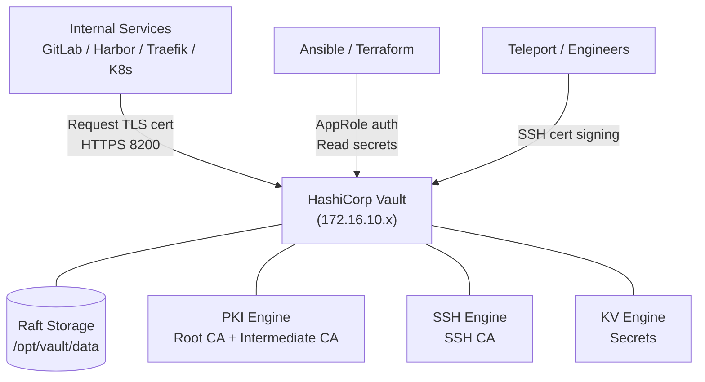

# HashiCorp Vault

HashiCorp Vault là secrets management và PKI platform, cung cấp cơ chế lưu trữ và cấp phát secret an toàn, quản lý certificate lifecycle, và kiểm soát truy cập theo policy.

Trong hệ thống, Vault đóng vai trò PKI Certificate Authority cho toàn bộ internal TLS (GitLab, Harbor, Traefik, Kubernetes API...), SSH Certificate Authority để cấp SSH cert thay thế static key, và secret store tập trung cho Ansible, Terraform, và các ứng dụng trên Kubernetes. Không có component nào trong hệ thống dùng self-signed cert hoặc static SSH key sau khi Vault được thiết lập.

# Prerequisites

- Ubuntu 24.04
- User có quyền `sudo`
- Squid Proxy đã hoạt động — cần tải HashiCorp APT package
- PowerDNS đã hoạt động — cần DNS record `vault.nghia.internal`
- aptly đã có HashiCorp repo hoặc cài trực tiếp qua Squid
- Port `8200` (API/UI) và `8201` (cluster) không bị firewall block

# Diagram



---

# Cài đặt

## Cấu hình proxy cho server

Thêm vào file `/etc/environment`:

```sh
http_proxy="http://<USERNAME>:<PASSWORD>@<SQUID_IP>:3128"
https_proxy="http://<USERNAME>:<PASSWORD>@<SQUID_IP>:3128"
no_proxy="localhost,127.0.0.1,172.16.10.0/24,192.168.100.0/24"
```

```shell
source /etc/environment
```

## Cập nhật hệ thống và cài đặt Vault

```shell
sudo apt update -y && sudo apt upgrade -y
sudo apt install -y gnupg curl jq

# Thêm HashiCorp repository
wget -O - https://apt.releases.hashicorp.com/gpg | sudo gpg --dearmor -o /usr/share/keyrings/hashicorp-archive-keyring.gpg

echo "deb [arch=$(dpkg --print-architecture) signed-by=/usr/share/keyrings/hashicorp-archive-keyring.gpg] https://apt.releases.hashicorp.com $(grep -oP '(?<=UBUNTU_CODENAME=).*' /etc/os-release || lsb_release -cs) main" | sudo tee /etc/apt/sources.list.d/hashicorp.list

sudo apt update && sudo apt install vault

vault version
```

## Tạo TLS certificate tự ký cho Vault listener

Vault yêu cầu TLS để hoạt động. Dùng self-signed cert cho bước khởi tạo ban đầu. Sau khi PKI engine được thiết lập, thay bằng cert do Vault CA cấp.

```shell
sudo mkdir -p /opt/vault/tls /opt/vault/data
sudo chown -R vault:vault /opt/vault

sudo openssl req -x509 -newkey rsa:4096 \
  -keyout /opt/vault/tls/vault.key \
  -out /opt/vault/tls/vault.crt \
  -sha256 -days 365 -nodes \
  -subj "/CN=vault.nghia.internal" \
  -addext "subjectAltName=DNS:vault.nghia.internal,IP:<VAULT_IP>"

sudo chown vault:vault /opt/vault/tls/vault.key /opt/vault/tls/vault.crt
sudo chmod 600 /opt/vault/tls/vault.key
```

## Cấu hình Vault

Sửa file `/etc/vault.d/vault.hcl`:

```hcl
ui            = true
cluster_addr  = "https://<VAULT_IP>:8201"
api_addr      = "https://<VAULT_IP>:8200"
disable_mlock = false

storage "raft" {
  path    = "/opt/vault/data"
  node_id = "vault-node-1"
}

listener "tcp" {
  address       = "0.0.0.0:8200"
  tls_cert_file = "/opt/vault/tls/vault.crt"
  tls_key_file  = "/opt/vault/tls/vault.key"
}
```

## Thêm DNS record vào PowerDNS

```shell
sudo pdnsutil add-record nghia.internal vault A <VAULT_IP>
sudo pdnsutil rectify-zone nghia.internal

dig @<POWERDNS_IP> vault.nghia.internal A
```

## Khởi động Vault

```shell
sudo systemctl enable vault
sudo systemctl start vault
sudo systemctl status vault

# Kiểm tra port
sudo ss -tlnp | grep 8200
```

## Khởi tạo Vault

Thiết lập biến môi trường để CLI kết nối tới Vault. Vì đang dùng self-signed cert, cần `VAULT_SKIP_VERIFY=true` tạm thời.

```shell
export VAULT_ADDR="https://vault.nghia.internal:8200"
export VAULT_SKIP_VERIFY=true
```

Khởi tạo Vault — sinh unseal key và root token. Lưu output này ở nơi an toàn, không commit lên Git.

```shell
vault operator init -key-shares=5 -key-threshold=3
```

Output trả về 5 Unseal Key và 1 Root Token:

```
Unseal Key 1: <KEY_1>
Unseal Key 2: <KEY_2>
Unseal Key 3: <KEY_3>
Unseal Key 4: <KEY_4>
Unseal Key 5: <KEY_5>

Initial Root Token: <ROOT_TOKEN>
```

Cần 3 trong 5 key để unseal. Mỗi key nên được giữ bởi một người khác nhau.

## Unseal Vault

Chạy lệnh unseal 3 lần với 3 key khác nhau:

```shell
vault operator unseal <KEY_1>
vault operator unseal <KEY_2>
vault operator unseal <KEY_3>

# Kiểm tra trạng thái — Sealed phải là false
vault status
```

## Đăng nhập với Root Token

```shell
vault login <ROOT_TOKEN>
```

---

## Thiết lập PKI Secret Engine

PKI engine cung cấp Certificate Authority để cấp TLS cert cho tất cả internal services. Sử dụng hierarchy 2 tầng: Root CA → Intermediate CA.

### Root CA

Root CA có TTL 10 năm. Trong môi trường production thực tế, Root CA nên được tạo offline và import vào. Ở đây dùng Vault generate luôn cho lab.

```shell
vault secrets enable -path=pki pki
vault secrets tune -max-lease-ttl=87600h pki

vault write pki/root/generate/internal \
  common_name="nghia.internal Root CA" \
  ttl=87600h \
  key_bits=4096

vault write pki/config/urls \
  issuing_certificates="https://vault.nghia.internal:8200/v1/pki/ca" \
  crl_distribution_points="https://vault.nghia.internal:8200/v1/pki/crl"

# Export Root CA cert để distribute cho client
vault read -field=certificate pki/cert/ca > /tmp/root-ca.crt
```

### Intermediate CA

Intermediate CA có TTL 5 năm. Đây là CA sẽ thực sự cấp cert cho services.

```shell
vault secrets enable -path=pki_int pki
vault secrets tune -max-lease-ttl=43800h pki_int

# Tạo CSR từ Intermediate CA
vault write -format=json pki_int/intermediate/generate/internal \
  common_name="nghia.internal Intermediate CA" \
  key_bits=4096 \
  | jq -r '.data.csr' > /tmp/pki_int.csr

# Ký CSR bằng Root CA
vault write -format=json pki/root/sign-intermediate \
  csr=@/tmp/pki_int.csr \
  format=pem_bundle \
  ttl=43800h \
  | jq -r '.data.certificate' > /tmp/pki_int.pem

# Import cert đã ký vào Intermediate CA
vault write pki_int/intermediate/set-signed \
  certificate=@/tmp/pki_int.pem

vault write pki_int/config/urls \
  issuing_certificates="https://vault.nghia.internal:8200/v1/pki_int/ca" \
  crl_distribution_points="https://vault.nghia.internal:8200/v1/pki_int/crl"
```

### Tạo PKI Role

Role định nghĩa các ràng buộc khi cấp cert — domain nào được phép, TTL tối đa, v.v.

```shell
vault write pki_int/roles/nghia-internal \
  allowed_domains="nghia.internal" \
  allow_subdomains=true \
  allow_wildcard_certificates=true \
  allow_bare_domains=false \
  max_ttl=8760h \
  key_bits=2048 \
  signature_bits=256
```

Kiểm tra cấp cert thử:

```shell
vault write pki_int/issue/nghia-internal \
  common_name="test.nghia.internal" \
  ttl=24h
```

```shell
# Issue wildcard cert cho *.nghia.internal
# alt_names="*.nghia.internal" - SAN bắt buộc cho modern browsers/clients
vault write -format=json pki_int/issue/nghia-internal \
  common_name="*.nghia.internal" \
  alt_names="*.nghia.internal" \  
  ttl=8760h \
> /tmp/wildcard-cert.json

# Extract từng phần
jq -r '.data.certificate'   /tmp/wildcard-cert.json > wildcard.crt
jq -r '.data.private_key'   /tmp/wildcard-cert.json > wildcard.key
jq -r '.data.ca_chain[]'    /tmp/wildcard-cert.json > ca-chain.crt
```

### Phân phối Root CA cert cho client

Các node trong hệ thống cần trust Root CA để verify TLS cert của các services.

```shell
# Copy root CA cert sang các node client
sudo cp /tmp/root-ca.crt /usr/local/share/ca-certificates/nghia-internal-root-ca.crt
sudo update-ca-certificates
```

---

## Thiết lập SSH Secret Engine

SSH engine cấp SSH certificate thay vì dùng static public key. Cert có TTL ngắn, tự hết hạn sau thời gian quy định.

```shell
vault secrets enable -path=ssh-client-signer ssh

# Sinh SSH CA key pair
vault write ssh-client-signer/config/ca generate_signing_key=true

# Export public key để cấu hình trên các SSH server
vault read -field=public_key ssh-client-signer/config/ca \
  > /tmp/vault_ssh_ca.pub
```

Tạo role cho SSH signing:

```shell
vault write ssh-client-signer/roles/internal-access \
  key_type=ca \
  allowed_users="*" \
  allowed_extensions="permit-pty,permit-port-forwarding" \
  default_extensions='{"permit-pty": ""}' \
  ttl=1h \
  max_ttl=8h
```

Cấu hình SSH server trust Vault CA — thực hiện trên tất cả các node:

```shell
# Copy Vault SSH CA public key lên server
sudo cp /tmp/vault_ssh_ca.pub /etc/ssh/vault_ca.pub

# Thêm vào sshd_config
echo "TrustedUserCAKeys /etc/ssh/vault_ca.pub" | sudo tee -a /etc/ssh/sshd_config
sudo systemctl reload ssh
```

Ký SSH public key (engineer thực hiện khi cần SSH):

```shell
vault write ssh-client-signer/sign/internal-access \
  public_key=@$HOME/.ssh/id_ed25519.pub
```

---

## Thiết lập KV Secret Engine

KV v2 lưu trữ secret dạng key-value với versioning.

```shell
vault secrets enable -path=secret kv-v2

# Tạo secret thử
vault kv put secret/example \
  username="admin" \
  password="<EXAMPLE_PASSWORD>"

# Đọc lại
vault kv get secret/example
```

---

## Thiết lập AppRole Auth Method

AppRole cho phép application và automation tool (Ansible, Terraform) authenticate với Vault mà không dùng root token.

```shell
vault auth enable approle
```

### Policy cho Ansible

Tạo file policy `/tmp/ansible-policy.hcl`:

```hcl
# Đọc secret
path "secret/data/*" {
  capabilities = ["read", "list"]
}

# Cấp TLS cert
path "pki_int/issue/nghia-internal" {
  capabilities = ["create", "update"]
}
```

```shell
vault policy write ansible-policy /tmp/ansible-policy.hcl

vault write auth/approle/role/ansible \
  secret_id_ttl=24h \
  token_ttl=1h \
  token_max_ttl=4h \
  policies=ansible-policy

# Lấy Role ID và Secret ID để cấu hình Ansible
vault read auth/approle/role/ansible/role-id
vault write -f auth/approle/role/ansible/secret-id
```

### Policy cho Terraform

Tạo file policy `/tmp/terraform-policy.hcl`:

```hcl
# Đọc secret cần thiết cho provisioning
path "secret/data/terraform/*" {
  capabilities = ["read", "list"]
}

# Cấp TLS cert cho VM mới
path "pki_int/issue/nghia-internal" {
  capabilities = ["create", "update"]
}
```

```shell
vault policy write terraform-policy /tmp/terraform-policy.hcl

vault write auth/approle/role/terraform \
  secret_id_ttl=1h \
  token_ttl=20m \
  token_max_ttl=1h \
  policies=terraform-policy
```

---

## Cập nhật TLS của Vault dùng cert từ PKI

Sau khi PKI engine hoạt động, thay self-signed cert bằng cert do Vault CA cấp.

```shell
# Cấp cert mới cho vault.nghia.internal
vault write -format=json pki_int/issue/nghia-internal \
  common_name="vault.nghia.internal" \
  alt_names="vault.nghia.internal" \
  ip_sans="<VAULT_IP>" \
  ttl=8760h > /tmp/vault-cert.json

# Lưu cert và key
jq -r '.data.certificate' /tmp/vault-cert.json | sudo tee /opt/vault/tls/vault.crt
jq -r '.data.private_key' /tmp/vault-cert.json | sudo tee /opt/vault/tls/vault.key

sudo chown vault:vault /opt/vault/tls/vault.key /opt/vault/tls/vault.crt
sudo chmod 600 /opt/vault/tls/vault.key

# Reload Vault — không cần unseal lại
sudo systemctl reload vault
```

Sau bước này, bỏ `VAULT_SKIP_VERIFY=true` và cập nhật lại biến môi trường:

```shell
export VAULT_ADDR="https://vault.nghia.internal:8200"
unset VAULT_SKIP_VERIFY

vault status
```

---

## Unseal sau khi restart

Vault seal lại mỗi khi restart. Cần unseal thủ công với 3 trong 5 key:

```shell
vault operator unseal <KEY_X>
vault operator unseal <KEY_Y>
vault operator unseal <KEY_Z>
```

> Trong production, nên dùng Auto Unseal với cloud KMS (AWS KMS, GCP KMS) hoặc HSM để tránh dependency vào con người. Với lab này, unseal thủ công là đủ.
