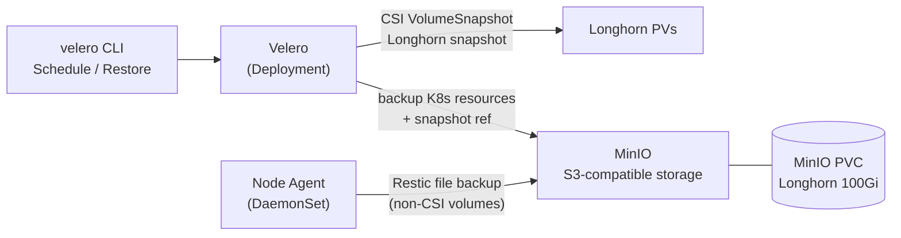

# Velero

Velero là công cụ backup và restore cho Kubernetes, cho phép sao lưu toàn bộ cluster state (resource YAML) và Persistent Volume data, đồng thời hỗ trợ migrate workload giữa các cluster.

Trong hệ thống, Velero backup định kỳ toàn bộ Kubernetes resource và PV data vào MinIO — S3-compatible storage chạy trên Longhorn. Khi cần khôi phục sau sự cố, Velero restore lại toàn bộ resource và dữ liệu từ backup. Velero dùng Longhorn CSI VolumeSnapshot để backup PV hiệu quả hơn Restic.

# Prerequisites

- Kubernetes cluster đã hoạt động
- Longhorn đã cài — cung cấp storage cho MinIO và CSI VolumeSnapshot
- Harbor đã hoạt động — pull Velero và MinIO images
- Longhorn VolumeSnapshotClass đã có — required cho CSI snapshot backup

# Diagram



---

# Cài đặt

## Pre-load images vào Harbor

```shell
# Velero và plugin — tag format bình thường
for img in \
  velero/velero:v1.14.0 \
  velero/velero-plugin-for-aws:v1.10.0; do
    img_name=$(echo $img | sed 's|.*/||' | cut -d: -f1)
    docker pull $img
    docker tag $img registry.nghia.internal/infra/${img_name}:$(echo $img | cut -d: -f2)
    docker push registry.nghia.internal/infra/${img_name}:$(echo $img | cut -d: -f2)
done

# MinIO — tag chứa dấu : nên phải xử lý riêng
MINIO_TAG="RELEASE.2024-11-07T00-52-20Z"
docker pull quay.io/minio/minio:${MINIO_TAG}
docker tag quay.io/minio/minio:${MINIO_TAG} registry.nghia.internal/infra/minio:${MINIO_TAG}
docker push registry.nghia.internal/infra/minio:${MINIO_TAG}

docker pull quay.io/minio/mc:${MINIO_TAG}
docker tag quay.io/minio/mc:${MINIO_TAG} registry.nghia.internal/infra/mc:${MINIO_TAG}
docker push registry.nghia.internal/infra/mc:${MINIO_TAG}
```

## Cài đặt MinIO

MinIO cung cấp S3-compatible storage để Velero lưu backup. Trong lab, MinIO chạy trên Kubernetes với Longhorn PVC. Trong production, nên dùng external storage (NAS, object storage riêng) để backup tồn tại độc lập với cluster.

Tạo namespace và Secret chứa MinIO credentials:

```shell
kubectl create namespace velero

kubectl create secret generic minio-credentials \
  --namespace velero \
  --from-literal=rootUser=minioadmin \
  --from-literal=rootPassword=<MINIO_ROOT_PASSWORD>
```

Lưu credentials vào Vault:

```shell
vault kv put secret/velero/minio \
  root_user="minioadmin" \
  root_password="<MINIO_ROOT_PASSWORD>"
```

Deploy MinIO:

```shell
kubectl apply -f - <<EOF
apiVersion: apps/v1
kind: Deployment
metadata:
  name: minio
  namespace: velero
spec:
  selector:
    matchLabels:
      app: minio
  template:
    metadata:
      labels:
        app: minio
    spec:
      containers:
        - name: minio
          image: registry.nghia.internal/infra/minio:RELEASE.2024-11-07T00-52-20Z
          args:
            - server
            - /data
            - --console-address
            - ":9001"
          env:
            - name: MINIO_ROOT_USER
              valueFrom:
                secretKeyRef:
                  name: minio-credentials
                  key: rootUser
            - name: MINIO_ROOT_PASSWORD
              valueFrom:
                secretKeyRef:
                  name: minio-credentials
                  key: rootPassword
          ports:
            - containerPort: 9000
            - containerPort: 9001
          volumeMounts:
            - name: data
              mountPath: /data
      volumes:
        - name: data
          persistentVolumeClaim:
            claimName: minio-pvc
---
apiVersion: v1
kind: PersistentVolumeClaim
metadata:
  name: minio-pvc
  namespace: velero
spec:
  storageClassName: longhorn
  accessModes:
    - ReadWriteOnce
  resources:
    requests:
      storage: 100Gi
---
apiVersion: v1
kind: Service
metadata:
  name: minio
  namespace: velero
spec:
  selector:
    app: minio
  ports:
    - name: api
      port: 9000
      targetPort: 9000
    - name: console
      port: 9001
      targetPort: 9001
EOF
```

Tạo bucket `velero` trong MinIO:

```shell
# Port-forward MinIO API
kubectl port-forward -n velero svc/minio 9000:9000 &

# Dùng mc CLI để tạo bucket
kubectl run mc-setup \
  --image=registry.nghia.internal/infra/mc:RELEASE.2024-11-07T00-52-20Z \
  --restart=Never \
  --namespace=velero \
  --env="MC_HOST_minio=http://minioadmin:<MINIO_ROOT_PASSWORD>@minio.velero.svc.cluster.local:9000" \
  -- sh -c "mc mb minio/velero && mc ls minio/"

kubectl logs mc-setup -n velero
kubectl delete pod mc-setup -n velero
```

## Thêm Velero Helm repo

```shell
helm repo add vmware-tanzu https://vmware-tanzu.github.io/helm-charts
helm repo update
```

## Cài đặt Velero

Tạo Secret chứa MinIO credentials cho Velero:

```shell
kubectl create secret generic velero-minio-credentials \
  --namespace velero \
  --from-literal=cloud="[default]
aws_access_key_id=minioadmin
aws_secret_access_key=<MINIO_ROOT_PASSWORD>
"
```

Tạo file `velero-values.yaml`:

```yaml
image:
  repository: registry.nghia.internal/infra/velero
  tag: "v1.14.0"

initContainers:
  - name: velero-plugin-for-aws
    image: registry.nghia.internal/infra/velero-plugin-for-aws:v1.10.0
    volumeMounts:
      - mountPath: /target
        name: plugins

configuration:
  backupStorageLocation:
    - name: default
      provider: aws
      bucket: velero
      default: true
      config:
        region: minio
        s3ForcePathStyle: "true"
        s3Url: "http://minio.velero.svc.cluster.local:9000"
        publicUrl: "http://minio.velero.svc.cluster.local:9000"

  volumeSnapshotLocation:
    - name: default
      provider: aws
      config:
        region: minio

  # Dùng CSI snapshot thay vì Restic cho PV backup
  defaultVolumeSnapshotLocations: "aws:default"

credentials:
  useSecret: true
  existingSecret: velero-minio-credentials

# Node Agent (Restic) — backup volume không hỗ trợ CSI snapshot
nodeAgent:
  enabled: true
  image:
    repository: registry.nghia.internal/infra/velero
    tag: "v1.14.0"

# CSI plugin — required cho Longhorn VolumeSnapshot
features: "EnableCSI"

# Cài CRDs tự động
installCRDs: true
```

```shell
helm install velero vmware-tanzu/velero \
  --namespace velero \
  --version 8.0.0 \
  --values velero-values.yaml

kubectl rollout status deployment/velero -n velero
kubectl get pods -n velero
```

## Cài đặt Velero CLI

```shell
# Tải binary từ GitHub (qua Squid proxy)
curl -fLO https://github.com/vmware-tanzu/velero/releases/download/v1.14.0/velero-v1.14.0-linux-amd64.tar.gz
tar xzf velero-v1.14.0-linux-amd64.tar.gz
sudo mv velero-v1.14.0-linux-amd64/velero /usr/local/bin/
velero version
```

Kiểm tra kết nối với MinIO backend:

```shell
velero backup-location get
# STATUS phải là "Available"
```

## Cấu hình Longhorn VolumeSnapshotClass

Velero CSI plugin cần VolumeSnapshotClass có annotation `velero.io/csi-volumesnapshot-class: "true"`:

```shell
# Kiểm tra VolumeSnapshotClass hiện có từ Longhorn
kubectl get volumesnapshotclass

# Thêm annotation cho Longhorn VolumeSnapshotClass
kubectl annotate volumesnapshotclass longhorn-snapshot-vsc \
  velero.io/csi-volumesnapshot-class="true"
```

Nếu chưa có VolumeSnapshotClass, tạo thủ công:

```shell
kubectl apply -f - <<EOF
apiVersion: snapshot.storage.k8s.io/v1
kind: VolumeSnapshotClass
metadata:
  name: longhorn-snapshot-vsc
  annotations:
    velero.io/csi-volumesnapshot-class: "true"
driver: driver.longhorn.io
deletionPolicy: Delete
parameters:
  type: snap
EOF
```

---

## Cấu hình Backup Schedule

Tạo schedule backup định kỳ — daily backup giữ 7 ngày, weekly backup giữ 4 tuần:

```shell
# Daily backup — toàn bộ cluster, giữ 7 ngày
velero schedule create daily-backup \
  --schedule="0 2 * * *" \
  --ttl 168h \
  --include-namespaces "*" \
  --default-volumes-to-fs-backup=false

# Weekly backup — toàn bộ cluster, giữ 30 ngày
velero schedule create weekly-backup \
  --schedule="0 1 * * 0" \
  --ttl 720h \
  --include-namespaces "*" \
  --default-volumes-to-fs-backup=false

# Xem danh sách schedule
velero schedule get
```

---

## Test backup và restore

### Test backup thủ công

```shell
# Backup toàn bộ namespace monitoring
velero backup create monitoring-backup \
  --include-namespaces monitoring \
  --wait

# Kiểm tra trạng thái backup
velero backup get
velero backup describe monitoring-backup --details
```

### Test restore

Giả lập sự cố bằng cách xóa namespace, sau đó restore từ backup:

```shell
# Xóa namespace test (giả lập sự cố)
kubectl delete namespace monitoring

# Đợi namespace bị xóa hoàn toàn
kubectl get namespace monitoring

# Restore từ backup
velero restore create \
  --from-backup monitoring-backup \
  --wait

# Kiểm tra restore
velero restore get
kubectl get pods -n monitoring
```

### Kiểm tra CSI VolumeSnapshot

```shell
# Xem VolumeSnapshot được tạo bởi Velero
kubectl get volumesnapshot -A

# Xem chi tiết backup bao gồm snapshot
velero backup describe monitoring-backup --details | grep -A5 "CSI"
```

---

## Xem log và trạng thái

```shell
# Xem tất cả backup
velero backup get

# Xem log của một backup
velero backup logs monitoring-backup

# Xem tất cả restore
velero restore get

# Xem log của Velero server
kubectl logs -n velero deployment/velero

# Xem log Node Agent (Restic)
kubectl logs -n velero -l name=node-agent -f
```

---

## Backup theo namespace cụ thể

Trong production, nên backup từng namespace quan trọng riêng biệt để kiểm soát TTL và restore granularity:

```shell
# Schedule backup cho argocd
velero schedule create argocd-backup \
  --schedule="0 3 * * *" \
  --ttl 168h \
  --include-namespaces argocd

# Schedule backup cho falco
velero schedule create falco-backup \
  --schedule="0 3 * * *" \
  --ttl 168h \
  --include-namespaces falco

# Schedule backup cho velero namespace (bao gồm MinIO data — lưu ý: MinIO chứa backup, nên backup MinIO PVC riêng qua Longhorn snapshot)
velero schedule create velero-config-backup \
  --schedule="0 4 * * *" \
  --ttl 168h \
  --include-namespaces velero \
  --exclude-resources persistentvolumeclaims,persistentvolumes
```
